# Muxin

Hello guys, I'm Muxin, I'm learning everything about Ethereum, especially for Ethereum Protocol. I'm good at Web development. Follow me on Twitter: <https://twitter.com/muxin_eth>, my telegram: <https://t.me/muxin_eth>.

## Notes

### 2024.5.6

Week 5

Pre-reading

- Ethereum roadmap
  - 以太坊路线图主要是概述以太坊未来将对协议作出的具体改进
  - 路线图主要给用户带来以下几点的 benefits
    - Cheaper transactions
    - Extra security
    - Better user experience
    - Future proofing
  - 路线图的制定主要是研究人员和开发人员多年来工作的结果，但是任何人也都可以参与进来，可以在论坛（https://ethresear.ch/、https://ethereum-magicians.org/）或 discord 发表想法和讨论，提出一些建议，当想法比较成熟的时候，就可以作为 https://eips.ethereum.org/ 提出，整个过程都是公开的
  - 路线图会随着时间而改变，会根据新的技术的出现而改变
  - 以太坊将在今后 6 个月内实施一些升级（例如质押提款） - 其他升级的优先性较低，可能在今后 5-10 年内不会实施（例如量子计算抗性）
  - 升级往往不会对终端用户产生影响，用户不需要积极参与升级，也不需要采取行动保护资产。节点运营商需要更新其客户端以准备升级。 某些升级可能导致应用程序开发者作出更改。 例如，历史数据到期升级可能需要应用开发者从新的来源获取历史数据。
  - 一些升级（more details: https://domothy.com/roadmap/）：
    - **The Merge**: upgrades relating to the switch from proof-of-work to proof-of-stake
    - **The Surge**: upgrades related to scalability by rollups and data sharding
    - **The Scourge**: upgrades related to censorship resistance, decentralization and protocol risks from MEV
    - **The Verge**: upgrades related to verifying blocks more easily
    - **The Purge**: upgrades related to reducing the computational costs of running nodes and simplifying the protocol
    - **The Splurge**: other upgrades that don't fit well into the previous categories.
  - 一些特定的技术升级：
    - [Danksharding](https://ethereum.org/en/roadmap/danksharding/) - Danksharding makes layer 2 rollups much cheaper for users by adding “blobs” of data to Ethereum blocks.
    - [Staking withdrawals](https://ethereum.org/en/staking/withdrawals/) - The Shanghai/Capella upgrade enabled staking withdrawals on Ethereum, allowing people to unlock their staked ETH.
    - [Single slot finality](https://ethereum.org/en/roadmap/single-slot-finality/) - Instead of waiting for fifteen minutes, blocks could get proposed and finalized in the same slot. This is more convenient for apps and much more difficult to attack.
    - [Proposer-builder separation](https://ethereum.org/en/roadmap/pbs/) - Splitting the block building and block proposal tasks across separate validators creates a fairer, more censorship resistant and efficient way for Ethereum to come to consensus.
    - [Secret leader election](https://ethereum.org/en/roadmap/secret-leader-election/) - Clever cryptography can be used to ensure that the identity of the current block proposer is not made public, protecting them from certain types of attack.
    - [Account abstraction](https://ethereum.org/en/roadmap/account-abstraction/) - Account abstraction is a class of upgrades that support smart contract wallets natively on Ethereum, rather than having to use complex middleware.
    - [Verkle trees](https://ethereum.org/en/roadmap/verkle-trees/) - Verkle trees are a data structure that can be used to enable stateless clients on Ethereum. These “stateless” clients will require a tiny amount of storage space but will still be able to verify new blocks.
    - [Statelessness](https://ethereum.org/en/roadmap/statelessness/) - Stateless clients will be able to verify new blocks without having to store large amounts of data. This will provide all the benefits of running a node with only a tiny fraction of today’s costs.
- 其他需阅读：
  - https://vitalik.eth.limo/general/2021/12/06/endgame.html
  - https://members.delphidigital.io/reports/the-hitchhikers-guide-to-ethereum
  - https://ethereum.org/en/community/research/#active-areas-of-ethereum-research
  - https://domothy.com/blobspace/

### 2024.5.5

Week 4

Consensus Layer Testing

- https://github.com/ethereum/consensus-specs/tree/dev/tests
- Written in Python, same as execution-spec-tests
- similar idea in terms of generating test fixtures in many different formats that all clients can consume
- self contained within the spec, hence the tests can be written and filled in the same repo
- Consensus Layer Testing Formats
  - https://github.com/ethereum/consensus-specs/tree/dev/tests/formats
  - the formats of CL is more than EVM’s, it’s useful for devs to test graularly every aspect of CL

Cross-Layer(Interop) Testing

- Involve testing a fully instantiated client, feeding information to it and verifying the correctness of its behavior
- Tools:
  - https://github.com/ethereum/hive
  - [https://github.com/eth](https://github.com/ethereum/hive)pandaops/assertoor
  - [https://github.com/](https://github.com/ethereum/hive)kurtosis-tech/ethereum-package
- Hive
  - a system for running integration tests against Ethereum clients
  - generic CI infrastructure is the tight integration of Ethereum clients and their features
    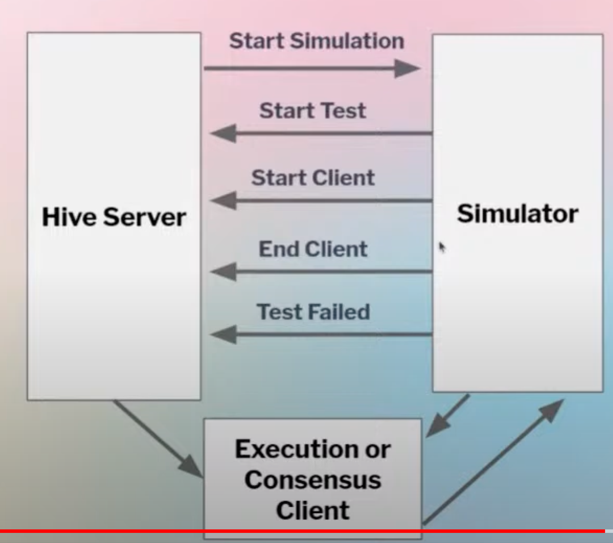
  - Different Hive simulators: https://github.com/ethereum/hive/tree/master/simulators
- Devnets
  - Limited node count chains that are used to verify proof of concept or early stages of hardforks
- Shadow-Forks
  - Limited node count forks that are configured to follow Ethereum mainnet, but have an early hardfork configuration time to test real network activity
- Public Testnets
  - Georli testnet(RIP)
  - Sepolia testnet(Launched Oct-23-2021)
  - Holesky testnet(Launched Sep-28-2023)

Security

- Potential issues
  - EL side
    - Valid invalidation: Execution client invalidates a block that fully complies with the Ethereum specification
    - Invalid validation: Execution client validates a block that doesn't comply with the Ethereum specification
    - DoS during block execution: A client takes too much time to process a block due to a transaction
  - CL side
    - Faulty clients and finalization
      - <33% faulty node majority: can cause missed slots but chain will still finalize
      - 33%+ faulty node majority: can cause delayed finality
      - 50%+ faulty node majority: can disrupt forkchoice
      - 66%+ faulty node majority: can finalize an incorrect chain
  - Bug bounties
    - https://ethereum.org/en/bug-bounty/
  - Public disclosures
    - https://github.com/ethereum/public-disclosures

### 2024.5.4

Week 4

Execution Layer Testing

- EVM testing
  - 主要目的是验证每个 execution client 都遵守规范，每一个 client 都给定相同的输入，期望得到相同的输出，保证相同的环境，prestate, 硬分叉激活规则
  - 主要测试的内容：
    - Pre-State
    - Environment
    - Transaction(s)
    - Post-State
- EVM testing - Tests Filling
  - 跟 client unit testing 不同的是，Tests Filling 是将测试源代码编译成任何 execution client 都可以使用的 fixture，所有不同格式的 test fixture 都是一个简单的 JSON 文件。
- EVM testing formats
  - State testing
    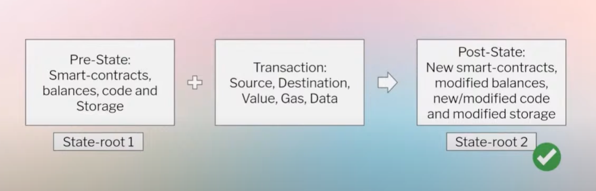
  - Fuzzy Differential State Testing
    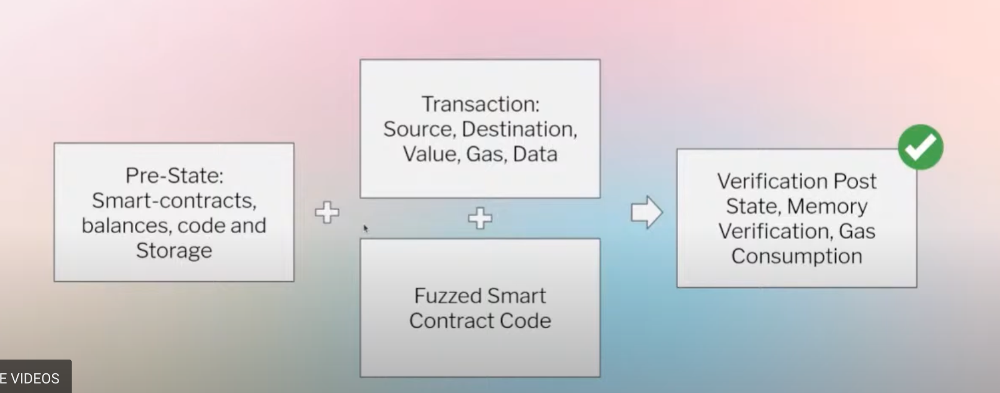
  - Blockchain Testing
    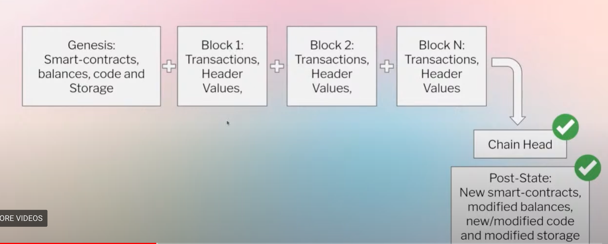
  - Blockchain Negative Testing
    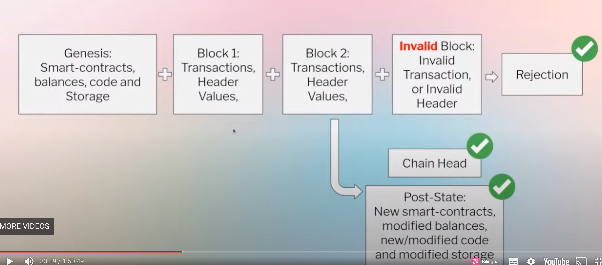
- EVM Testing - Tests Filling - ethereum/tests
  - https://github.com/ethereum/tests
  - Simple JSON and YAML source codes
  - Provides simple parametrization
  - Filled by Retesteth(Written in C++)
- EVM Testing - Tests Filling - Execution Spec Tests
  - https://github.com/ethereum/execution-spec-tests
  - Python source code
  - Powered by pytest and provides simple to complex parametrization
  - Still requires an actual client implementation to fill because of the transition function
    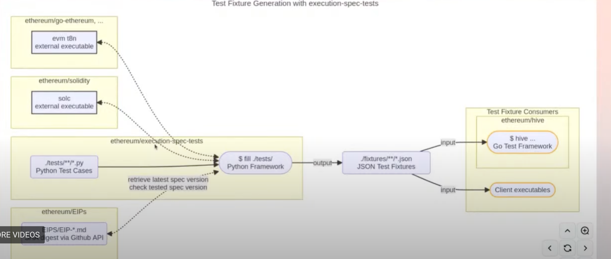
- FuzzyVM
  - https://github.com/MariusVanDerWijden/FuzzyVM
  - A framework to fuzz Ethereum Virtual Machine implementations. FuzzyVM creates state tests that can be used to differential fuzz EVM implementations against each other. It only focus on the test generation part, the test execution is handled by Go evmlab.
- Execution APIs testing
  - https://github.com/ethereum/execution-apis/tree/main/tests
  - To test all the execution APIs used to query the execution clients.

### 2024.5.3

Week 3

- Bitcoin solves the BFT with PoW approach

  - Bitcoin 被认为是第一个解决 Byzantine General Problem 的方案
    - 系统可以扩展到无限的节点数量
    - 开放、无许可加入
    - 用 PoW 机制达成共识
  - Bitcoin 的共识机制
    - Bitcoin 的状态机复制
    - 使用密码学来减少可能的状态空间
    - 用 PoW 来实现共识
      - 挖矿难度调整
        - 挖矿难度由网络总算力决定。如果更多的矿工加入网络并且 hash rate 增加，挖矿难度也会增加，反之亦然。
      - 挖矿难度调整的影响
        - 女巫保护：一个新块必须执行一定量的工作才能被视为有效
        - 共识算法：节点找到链头的方式是总结每个区块的挖矿难度，选出总难度最大的链
    - 发行 native 货币 BTC 进行激励
      - 给当前工作量最多的单链提供奖励来激励工作

- PoW to PoS
  - 相关的基础知识已经在预习中学习了
  - Justin Drake’s research on pragmatic signature aggregation with BLS: https://ethresear.ch/t/pragmatic-signature-aggregation-with-bls/2105
  - Some of the important things on the roadmap of Ethereum
    - SSF(single slot finality): Aim to get finality in a single slot
      - Vitalik post on SSF: https://notes.ethereum.org/@vbuterin/single_slot_finality
      - Roadmap blog: https://ethereum.org/en/roadmap/single-slot-finality/
    - SSLE(single secret leader election): Aim to have proposer selection in secret
      - Research link: https://ethresear.ch/t/simplified-ssle/12315
      - Roadmap blog: https://ethereum.org/en/roadmap/secret-leader-election/
    - Max EB(max effective balance): Aim to increase the effective balance of Ethereum validators at 32ETH
      - Research link: https://ethresear.ch/t/increase-the-max-effective-balance-a-modest-proposal/15801

### 2024.5.2

Week 3

- Blockchain enables a way to create digital scarcity
  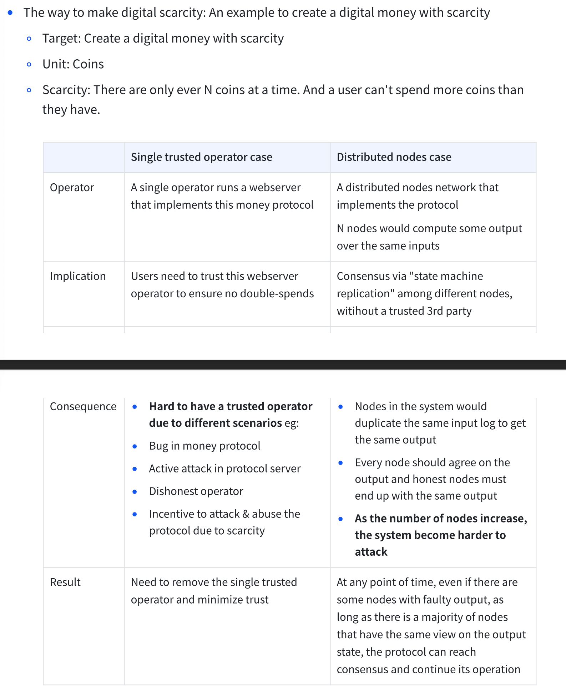
- Distributed networks deal with Byzantine fault tolerance(BFT)
  - 如果更多的节点会带来更高的安全性，我们就会希望有更多数量的节点，但是在开放的分布式的系统中，每一个节点都可能会因为各种原因出现问题，我们需要有一个确定的容错机制来让这个系统继续运行。
  - BFT 是能抵抗源自 Byzantine Generals’ Problem 的鼓掌类别的系统属性。这意味着，即使一些节点发生了故障或者恶意行为 BFT 系统也能继续运行。
  - Two- phase commit(2PC)
    - 1st Prepare Phase: One node will ask other nodes whether they can commit the proposed tx.
    - 2nd Commit Phase: The node will command other nodes to either commit or abort the proposed tx.

### 2024.4.29

Week 3

Pre-reading

Pos and Solar Punk future, Dany Ryan 2022

- after the merge, transition to PoS, we will have a more secure, more sustainable home, other than that, nothing changes.

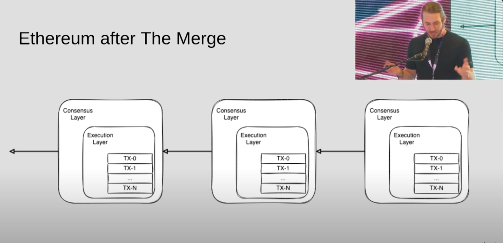

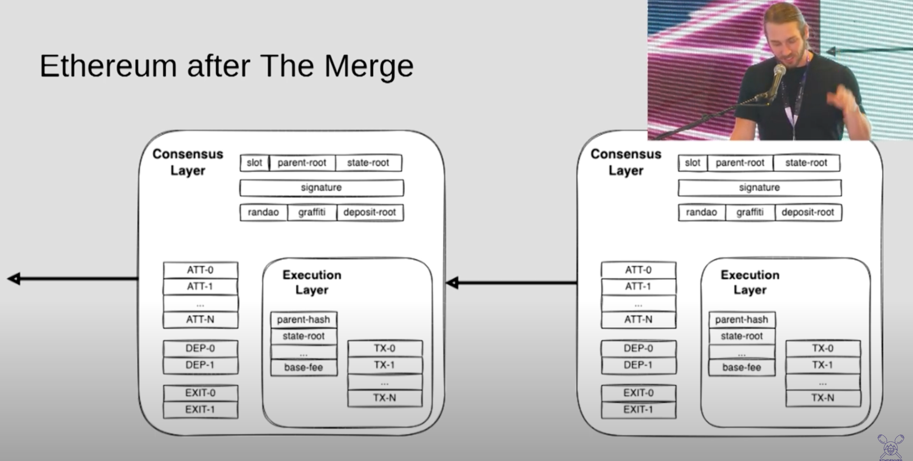

- 视频中将 the merge 比喻成 kintsugi，一种日本修复 broken 陶瓷的艺术。
- Ethereum post-merge client, the Ethereum client is the brain of the operation, the Beacon Node drives the execution engine via the Engine API. The User APIs doesn’t change.

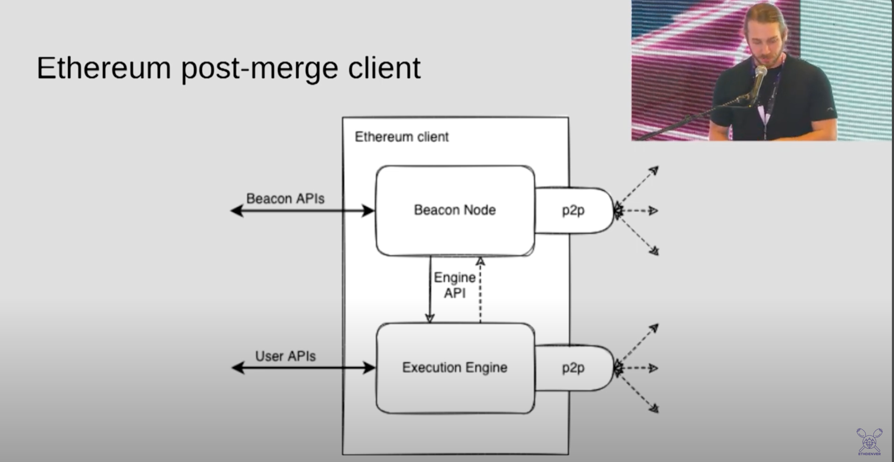

- Kintsugi CL+EL semantic mismatch
  - engine_executePayload
  - engine_forkchoiceUpdated: use the fork choice to find the tip of the block tree, and the tip defines what is canonical, defines the canonical history
- Why?
  - Security
    - Less Centralizing Crypto-Economy
      - Lack of economies of scale
      - Highly liquid and available
      - Purer function of return on capital
    - Higher Security Margin
      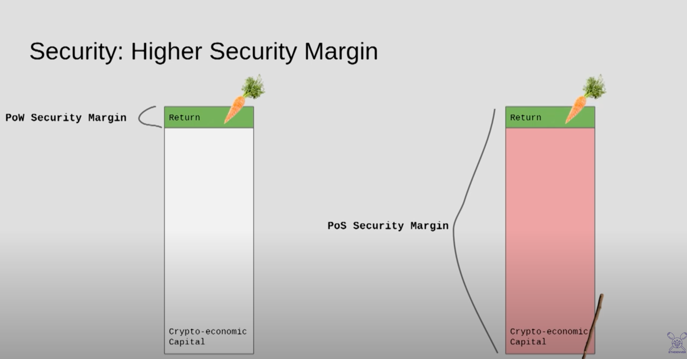
    - Better Emergency Recovery
      - In PoS: Attacking capital is either burned or can be socially intervened.
  - Sustainability
    - 99.96% energy reduction
    - PoS opens the door to more sophisticated consensus mechanisms.
    - (Dank)Sharding - Get more out of your consensus mechanism.
  - Scalability

### 2024.4.28

Week 3

Pre-reading:

Beacon Chain explainer

refs:

- https://ethos.dev/beacon-chain

- Slashable Offences
  - 有四种 slashing 条件：
    - A double proposal
      - a proposer proposing more than one block for their assigned slot
    - An LMD GHOST double vote
      - a validator attesting to two different Beacon Chain heads for their assigned slot
    - An FFG surround vote
      - a validator casting an FFG vote that *surrounds* or is *surrounded by* a previous FFG vote they made
    - An FFG double vote
      - a validator casting 2 FFG votes for any two targets at the same epoch
- Beacon Chain Validator Activation and Lifecycle
  - Each validator needs a balance of 32 ETH to get activated
  - The Beacon Chain deactivates (“forced exit”) all validators whose balance reaches 16 ETH
  - Validators can also “voluntary exit” after serving for 2,048 epochs, around 9 days
    

### 2024.4.27

Week 3

Pre-reading:

Beacon Chain explainer

refs:

- https://ethos.dev/beacon-chain

- Finality
  - 当一个 epoch 结束时，如果它的 checkpoint 得到了三分之二的 supermajority，这个 checkpoint 被证明是 justified。
  - 当一个 checkpoint B 是 justified，并且紧接着下一个 epoch 的 checkpoint 也是 justified 的，那么 checkpoint B 会变成 finalized。通常，一个 checkpoint 会在 两个 epoch 中变成 finalized，也就是 12.8 分钟。
  - block 确认源自 block 的 attestation，justification 和 finality。
    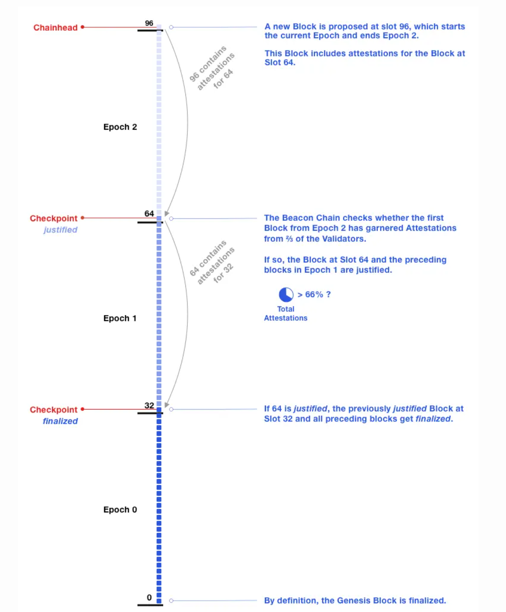
- Attestations: a closer look
  - 一个 attestation 包含了一个 LMD GHOST vote 和一个 FFG vote。
  - 所有的 validator 每一个 epoch 中提交一个 attestation。
  - 一个 attestation 有 32 个被纳入链上的机会。 这意味着 validator 可以在一个 epoch 内在链上包含两个 attestation。
  - 当 validator 在它分配的 slot 上把它的 attestation 包含在链上时，验证者将获得最多的奖励； 较晚的包含将获得递减的奖励。
- Staking Rewards and Penalties
  - attester rewards
    - validator make 大多数 validator 同意的 attestation 会获得奖励。在 finalized block 中的 attestation 会更有价值。
  - attester penalties
    - 如果 validator 没有作出 attest 或者他们 attest 的 block 没有 finalized 将会收到惩罚。
  - typical downside risk for stakers
    - 作为一名担心可能损失多少 ETH 的 validator，这几乎与你可以赚取多少 ETH 成正比。例如，如果一个 validator 有望在一年内通过参与认证获得 10% 的收益，那么一个（诚实的）validator 如果表现最差可能会损失 7.5%。
  - slashings and whistleblower rewards
    - slashing 是从超过 0.5 ETH 到 validator 整个质押的处罚。一个诚实、安全的 validator 不能因其他 validator 的行为而被 slashed。对于犯有 slashable 罪行的 validator，他们的余额至少会损失 1/32，并被停用（“强制退出”）。
  - proposer rewards
    - 得到 finalized 的 block 的 proposer 会获得可观的奖励。一直在线且表现良好的 validator 将获得总奖励的~1/8 提升，以提议带有新认证的 block。当发生 slashing 时，proposer 还会因在 block 中包含 slash 证据而获得小额奖励。目前，所有举报人奖励实际上都会流向 proposer。
  - inactivity leak penalty
    - 如果距离 finality 已经超过四个 epoch，那么 validator 将遭受 inactivity leak penalty，该惩罚将二次增加，直到一个 checkpoint 被最终确认。inactivity penalty(or “quadratic leak”) 确保了这种结果：如果 50% 的 validator 离线，区块将在 18 天后开始 finalizing。quadratic leak 将问题 validator 排出以强制退出，以便其他 validator 成为可以恢复 finality 的 2/3 多数派。inactivity leak 不会排出运行正常的 validator。在不活跃泄漏期间，认证奖励为零；validator 如常获得 proposer 和举报人的奖励。

### 2024.4.26

Week 3

Pre-reading:

Beacon Chain explainer

refs:

- https://ethos.dev/beacon-chain

- Validators and Attestations
  - 在每一个 epoch 中，一个 validator 会被伪随机的分配给一个 slot。
  - 大多数情况下，validator 是对区块进行投票的 attester，一个 attestation 就是一个 validator 的投票，会根据 validator 的 balance 加权。
  - 如果其他 validator 投票给这个 validator 的 proposed block，这个 validator 会收到奖励。
  - 当一个 slot 分配的 validator 没有 propose a block，那么这个 slot 就缺少了 block，可能的原因是这个 validator offline 了，或者没有跟 reset of network 同步，那么这个 validator 就没有奖励。
  - validator 之间也会互相监督，如果举报其他 validator 投票冲突或者提出多个区块可以或得奖励。
  - Beacon Chain 的主要内容是 validator address，validator state 以及 attestation 的注册表。
- Staking validators: semantics
  - validator 是虚拟的，由 staker 激活。在 PoW 中，用户通过购买硬件成为矿工，在以太坊中，用户通过质押 ETH 来激活和控制 validator。
  - 每个 validator 的最大余额为 32 个 ETH，但是质押着可以质押他们所有的 ETH，每质押 32 个 ETH，就将激活一个 validator。
  - validator 由使用 Beacon node 的 validator clients 执行。 Beacon node 具有跟踪和读取 Beacon Chain 的功能。 validator client 可以实现 beacon node 功能或调用 beacon node。 一个 validator client 可以执行多个 validator。
- Committees
  - 一个 committee 是一组 validator。每个 committee 要有至少 128 个 validator。攻击者控制 三分之二 committee 的概率不到万亿分之一。
  - Beacon Chain 通过一种称为 RANDAO 的伪随机过程来强制实现共识。在每一个 epoch，一个伪随机过程 RANDAO 为每一个 slot 选择 proposer（根据 validator balance 权重），并将 validator 分配到 committee。
  - validator 有可能在同一个 slot 中既是 proposer 也是 committee 中的一员，但这不是常态。
    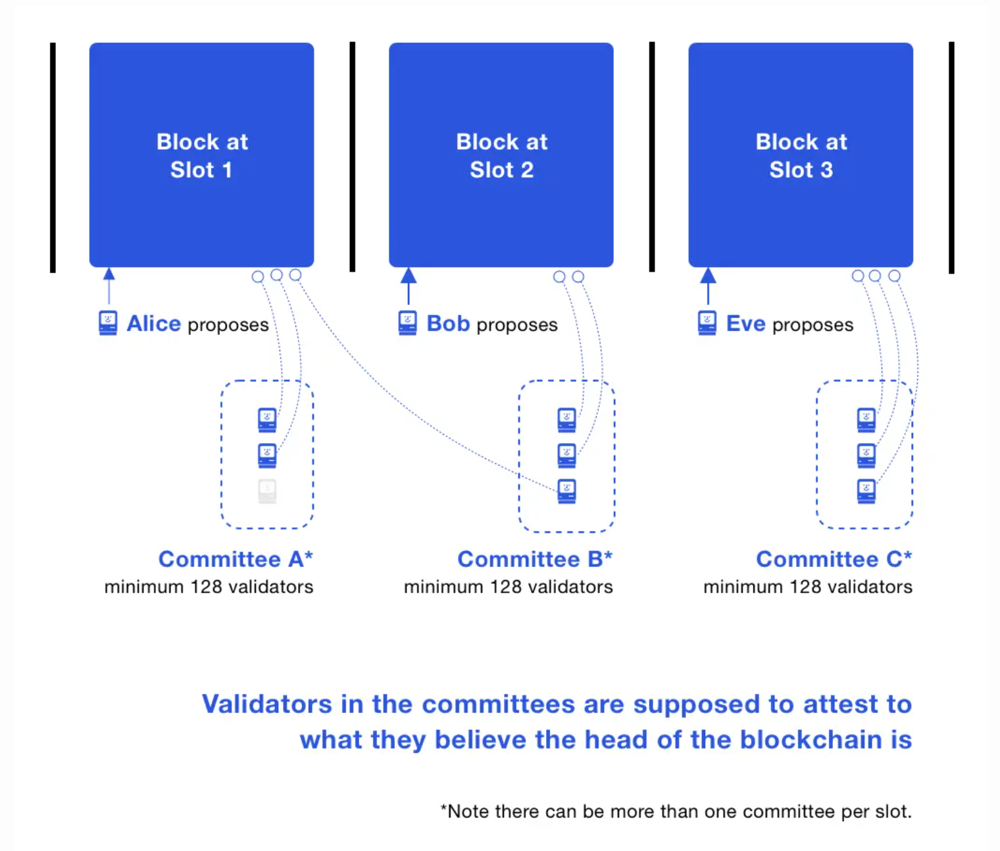
  - 在 committee 中的 validator 需要 attest 他们相信的 blockchain head 是哪个。
  - 对 Beacon Chain head attest 被叫做 LMD GHOST vote。
  - 每个 epoch，validator 只能加入一个 committee。 通常，validator 数量超过 8192 名：这意味着每个 slot 会有多个 committee。 所有 committee 的规模相同，并且至少有 128 名 validator。 当 validator 数量少于 4096 名时，安全概率会降低，因为 committee 的 validator 数量将少于 128 名。
  - 每个 epoch ，validator 都会均匀地分配到各个 slot，然后再细分为适当规模的 committee。 该 epoch 中的所有 validator 都向 Beacon Chain head 提供证明。shuffling 算法会增加或减少每个 slot 的 committee 数量，以使每个 committee 至少有 128 个 validator。
- Beacon Chain Checkpoints
  - checkpoint 是一个 epoch 中第一个 slot 的 block，如果这个块不存在，那么 checkpoint 就是前一个最近的块。每一个 epoch 总是会有一个 checkpoint block，一个 block 可以是多个 epoch 的 checkpoint。
  - 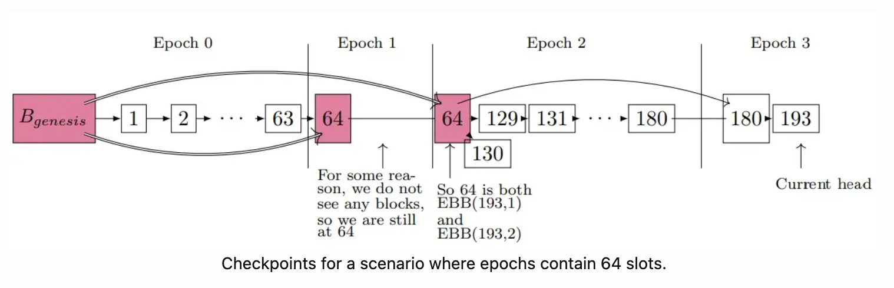
  - EBB means epoch boundary blocks，它可以被认为是 checkpoint 的同义词。
  - 当进行 LMD GHOST vote 时，validator 也会投票给当前 epoch 中的 checkpoint（称为 target）。 该投票称为 Casper FFG vote，还包括一个称为 source 的先前 checkpoint。
  - 只有分配给某个 slot 的 validator 才会对该 slot 进行 LMD GHOST vote。 然而，所有 validator 都为每个 epoch checkpoint 投 FFG 票。
  - 所有活跃 validator 总余额的 2/3 进行的投票被视为绝对多数（Supermajority）。 从教学角度来说，假设有三个活跃 validator：两个 validator 的余额为 8 ETH，一个 validator 的余额为 32 ETH。 绝对多数投票必须包含唯一 validator 的投票：尽管其他两个 validator 的投票可能与唯一 validator 不同，但他们没有足够的余额来形成绝对多数。
    - 这个例子有点不明白，一个 validator 要至少有 32 ETH，怎么会有 8 ETH 的情况呢？还是纯是为了举例子？纯是为了 Pedagogically？

### 2024.4.25

Week 3

Pre-reading:

Beacon Chain explainer

refs:

- https://ethos.dev/beacon-chain
- https://ethereum.org/en/roadmap/beacon-chain/#what-is-the-beacon-chain

什么是 Beacon Chain？

- Beacon Chain 是原始的 POS 区块链的名称，发布于 2020 年。它的创建是确保 POS 共识逻辑在以太坊主网上启用之前是健全和可持续的。最初，它是跟 POW 一起运行的。它是一条“空”的区块链，但关闭以太坊的 POW 并在以太坊上启用 POS 需要指示 Beacon Chain 接受 Execute Client 的交易数据，将其捆绑到区块中，然后使用基于 POS 的共识机制将其组织成区块链。同时，原始的以太坊客户端关闭了他们的挖矿、区块传播和共识逻辑，将所有这些交给了 Beacon Chain。这个事件被称为 The Merge。一旦发生了 The Merge，就不再存在两个区块链了。取而代之的是只有一个 POS 的以太坊，现在每个节点需要两种不同的客户端。The Beacon Chain 现在是 CL，是一组共识客户端的点对点网络，负责处理区块八卦和共识逻辑，而原始的客户端形成 EL，负责八卦和执行交易，并管理以太坊的状态。这两个层可以使用 Engine API 进行通信。

Slots and Epochs

- each slot is 12 seconds
  - 一个 slot 是一个区块被添加到 Beacon Chain 的机会。在系统正常运行时，每 12 秒就会添加一个区块。Validator 需要与时间大致同步。Beacon Chain 创世块位于 Slot 0。
- an epoch is 32 slots: 6.4 minutes

### 2024.4.22

Week 3

Pre-reading:

- Proof-of-stake(POS)
  - Crypto-economic security:
    - validator 应保持足够的硬件和连接性来参与区块验证和提案。
    - validator 会得到 ETH 回报，质押余额增加
    - 如果 validator is not available, 没有奖励
    - 如果有不诚实行为（在一个 slot 提出多个区块，提交相互矛盾的认证），质押将被销毁
  - Fork choice:
    - POS Ethereum 中使用的算法称为 [LMD-GHOST](https://arxiv.org/pdf/2003.03052.pdf)。它的工作原理是确定其历史记录中具有最大证明权重的分叉。
  - POS and security:
    - 跟 POW 一样，POS 中仍然存在 51% 的威胁。但是攻击者必须要获得 51% 的质押 ETH。
    - 51% 攻击只是其中一种恶意行为。 不良行为者可能会尝试长程攻击（尽管最终确定性小工具抵消了这种攻击向量）、短程“重组”（尽管提议者权重提升和认证期限可以缓解这种情况）、弹跳攻击和平衡攻击（也可以通过提议者权重提升来缓解，并且这些攻击只能在理想化的网络条件下演示）或雪崩攻击（被只考虑最新消息的分叉选择算法规则抵消）。
    - 总的来说，POS 在经济方面比 POW 更安全。
  - 优缺点：
    - 优点：
      - stake 使个人更容易参与其中保障网络的安全，促进去中心化。 validator 节点可以在普通笔记本电脑上运行。 质押池让用户可以在没有 32 个 ETH 的情况下质押。
      - POS 更加去中心化。 规模经济不像适用于 POW 挖矿那样适用于 POS。
      - POS 的加密经济安全性高于 POW
      - 需要发行较少的新 ETH 就可以激励网络参与者
    - 缺点：
      - 与 POW 相比，POS 仍处于起步阶段，并且经过的实践检验较少。
      - 实现 POS 比实现 POW 更加复杂。
      - 用户需要运行三种软件才能参与以太坊的 POS。
  - compare to POW:
    - 能效更高 – 无需在工作量证明计算中使用大量能源
    - 门槛更低、硬件要求下降 – 无需购买高性能硬件以便获得创建新区块的机会
    - 中心化风险降低 – 权益证明应该可以增加保护网络安全的节点
    - 由于能源需求低，发行较少的以太币就可以激励大家参与
    - 与工作量证明相比，对不当行为的经济处罚让 51% 攻击的代价变得更高
    - 如果 51% 攻击是为了攻破加密经济的防御，那么社区可以求助于诚实链的社交恢复

### 2024.4.21

Week 3

Pre-reading:

- Proof-of-stake(POS)
  - POS underlies Ethereum’s consensus mechanisum
  - switch from POW to POS in 2022: more secure, less energy-intensive, better for implementing new scaling solutions
  - validator: deposit 32 ETH, run 3 software: execution client, consensus client, validator client.
  - how a transaction gets executed in Ethereum POS:
    - A user creates and signs a transaction with their private key.
    - The transaction is submitted to an Ethereum execution client which verifies its validity.
    - If the transaction is valid, the execution client adds it to its local mempool (list of pending transactions) and also broadcasts it to other nodes over the execution layer gossip network.
    - One of the nodes on the network is the block proposer for the current slot, having previously been selected pseudo-randomly using RANDAO.
    - Other nodes receive the new beacon block on the consensus layer gossip network.
    - The transaction can be considered "finalized" if it has become part of a chain with a "supermajority link" between two checkpoints.

### 2024.4.20

Week 2

refs:

- https://epf.wiki/#/eps/week2
- https://ab9jvcjkej.feishu.cn/docx/BRDdd8kP9o00a2x6F4scRo0fnJh

P2P high-level

- execution layer operates on devp2p
- devp2p ⇒ sub-capability eth/68, eth/69, snap, whisper, les, wit
- devp2p protocol naming: eth/1 → eth/2 → eth/6.1 → eth/6.2, then it changed to eth/60, eth/61… now is eth/68

- Responsibilities
  - historical data
    - GetBlockHeader
    - GetBlockBodies
    - GetReceipts
  - pending transactions
    - Transactions
    - NewPooledTransactionHashes: it comes along with eth/66
      - sending the list of transaction type, hashes, sizes to peer.
      - the goal is to reduce the bandwidth of the EL by sending the full transactions only to a square root of the peer, instead of every peer.
    - GetPooledTransactions: the peer will respond with the full transaction values
  - state
    - snap sync: 2-phase protocol
      - the 1st phase is contiguous state retrieval
      - 2nd is healing phase in order to sync the state trie

### 2024.4.19

Week 2

refs:

- https://epf.wiki/#/eps/week2
- https://ab9jvcjkej.feishu.cn/docx/BRDdd8kP9o00a2x6F4scRo0fnJh

EVM high level intro

- EVM call frame
  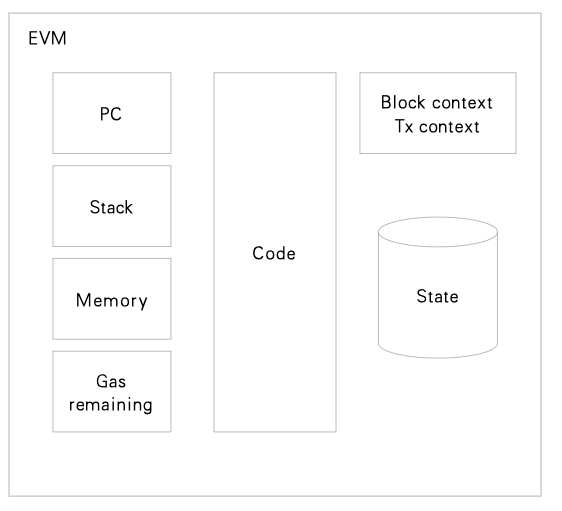
- 在这里可以看到 how does the stack machine works：https://www.evm.codes/playground
- different types of instructions:
  - arithmetic
  - bitwise
  - environment
  - control flow: https://github.com/lightclient/4788asm
  - stack ops
    - push, pop, swap
  - system
    - call, create, return, sstorage
  - memory
    - mload, mstore, mstore8

### 2024.4.18

Week2

refs:

- https://epf.wiki/#/eps/week2
- https://ab9jvcjkej.feishu.cn/docx/BRDdd8kP9o00a2x6F4scRo0fnJh

insertChain()

- verifyHeader(): checks whether a header conforms to the consensus rules of the stock Ethereum consensus engine.
  - verifyEIP1559Header(): verify some header attriibutes which were changed in EIP-1559
    - gas limit check
    - basefee check
- process():
  - usedGas: check the gas we used is qual to the gas used in the header
  - go through all the transactions in the block
    - ApplyTransaction - TransitionDb: a bunch of transaction level checking
  - Finalize(): implements consensus.Engine and processes withdrawals from beacon chain on top
  - return receipts
  - when the process is done, will update some metrics and then eventually write that block to state

扩展学习:

- EIP-1559: 它摆脱了 first-price auction（高价拍卖，出价高者获胜） 作为主要 gas fee 计算方法，而是下一个区块中包含的交易将收取离散的 “base fee”，对于想要优先处理交易的用户或 application，他们可以添加小费，这种小费被称为 priority fee，用于向矿工支付费用来加快纳入速度。

### 2024.04.16

Week2

refs:

- https://epf.wiki/#/eps/week2
- https://ab9jvcjkej.feishu.cn/docx/BRDdd8kP9o00a2x6F4scRo0fnJh

State Transition Function

code: https://github.com/ethereum/go-ethereum/blob/master/eth/catalyst/api.go

- newPayload function：CL asks EL to verify the block，参数：ExecutableData（the data necessary to execute on EL payload）
  - InsertBlockWithoutSetHead
  - VerifyHeader

还没看完，明天继续

### 2024.4.14

Week2

refs:

- https://epf.wiki/#/eps/week2
- https://ab9jvcjkej.feishu.cn/docx/BRDdd8kP9o00a2x6F4scRo0fnJh

Block Building:

Execution Layer

build():

- parameters:
  - env: it has all the information, timestamp, block number, previous block, base fee, etc.
  - pool: a list of ordered transactions
  - state
- returns:
  - Block
  - StateDB
  - error?
- process:
  - 是一个循环
  - keep tracking the gasUsed, 要 check 有没有到达 gas limit 并且 tx pool 是否为空
  - 从 tx pool 里 pop 一个 transaction 进行 execution - vm.Run(env, tx, state)，如果没有 error，gasUsed += gas，continue next transaction
  - 最后 retrun core.Finalize(env, txs, state), 这个 core.Finalize function 是将 a bunch of transaction 和 block 的其他一些信息做计算处理，生成一个完全简单的 block

### 2024.4.12

Week2

refs:

- https://epf.wiki/#/eps/week2
- https://ab9jvcjkej.feishu.cn/docx/BRDdd8kP9o00a2x6F4scRo0fnJh

Block validation:

Consensus Layer:

- [process_execution_playload](https://github.com/ethereum/consensus-specs/blob/dev/specs/deneb/beacon-chain.md#modified-process_execution_payload)
  先进行一系列的校验：verify paret hash 和 previous execution payload header 一致性、pre_randao、timestamp、commitments ≤ limit、execution payload，然后将 versioned_hashes 和 parent_beacon_block_root 传到 execution engine，CL 和 EL 的通信是通过 execution engine 实现的。
- [notify_new_payload](https://github.com/ethereum/consensus-specs/blob/dev/specs/deneb/beacon-chain.md#modified-notify_new_payload)
  将 execution playload 发送到 execution engine，然后 execution client 会执行 state transition function。

### 2024.4.11

缺席

### 2024.4.10

今天时间有限，学习了 Node 和 Client 的内容：

- Node：任何以太坊客户端软件的实例，它连接到其他也运行以太坊软件的计算机，形成一个网络。
- Client：以太坊的实现，它根据协议规则验证数据并保持网络安全。

一个 Node 需要运行两种客户端软件：consensus client 和 execution client。

- consensus client：实现权益证明共识算法，使网络能够根据来自 execution client 的验证数据达成一致。 此外还有名为“验证者”的第三种软件，它们可被添加到 consensus client 中，使节点能参与保护网络安全。
- execution client：侦听网络中广播的新交易，并在 EVM 中执行它们，并保存所有当前以太坊数据的最新状态和数据库。

client 可以使用不同的编程语言开发，但是需要遵循同一套规范。使用不同的编程语言实现 client，能够减少对单一代码库的依赖，避免单点故障，产生多样性，也能拓宽开发者社区。

几个可以追踪当前以太坊网络中节点的情况的网址：

- https://etherscan.io/nodetracker
- https://ethernodes.org/
- https://nodewatch.io/

Node 的类型：

- Full node：全节点对区块链进行逐块验证，包括下载和验证每个块的块体和状态数据。 全节点分多种类别——有些全节点从创世区块开始，验证区块链整个历史中的每一个区块。 另一些全节点则从更近期的区块开始验证，而且它们信任这些区块是有效的（如 Geth 的“快照同步”）。 无论验证从哪里开始，全节点只保留相对较新数据的本地副本（通常是最近的 128 个区块），允许删除比较旧的数据以节省磁盘空间。 旧数据可以在需要时重新生成。
- Archive node：归档节点是从创世块开始验证每个区块的全节点，它们从不删除任何下载的数据。这些数据以太字节为单位，这使得归档节点对普通用户的吸引力较低，但对于区块浏览器、钱包供应商和链分析等服务来说则很方便。
- Light node：轻节点只下载区块头，而不会下载每个区块。 这些区块头包含区块内容的摘要信息。 轻节点会向全节点请求其所需的任何其他信息。 然后，轻节点可以根据区块头中的状态根独自验证收到的数据。 轻节点可以让用户加入以太坊网络，无需运行全节点所需的功能强大的硬件或高带宽。 最终，轻节点也许能在手机和嵌入式设备中运行。 轻节点不参与共识（即它们不能成为矿工/验证者），但可以访问功能和安全保障和全节点相同的以太坊区块链。

### 2024.4.9

今天继续学习图解 EVM 的 PDF：https://takenobu-hs.github.io/downloads/ethereum_evm_illustrated.pdf

- account 是 address 和 account state 对应的一个 mapping。

- account state 包含了 nonce、balance、storage hash(?) 和 EVM code hash(?)。

  - EOA（externally owned account）是由 private key 控制的，它的 account state 不包含 storage 和 EVM code。
  - contract account 是由 EVM code 来控制的，它的 account state 是包含 storage 和 EVM code 的。

- world state 是 account state 的总集合，它记录了所有以太坊的账户信息，每一个以太坊节点中都会有一份相同的 copy。当某些 account state 发生了改变时，world state 也会随之发生改变，所以它是一份不断变化的数据。状态的变化是一个转移的过程，每当有新的交易产生时，就会导致 world state 从 σ𝑡 转移到 σ𝑡+1。

### 2024.4.8

今天学习了一下 EVM

参考资料：

- https://inevitableeth.com/home/ethereum/evm
- https://ethereum.org/en/developers/docs/evm/
- 图解 EVM（推荐！）：https://takenobu-hs.github.io/downloads/ethereum_evm_illustrated.pdf

EVM（Ethereum Virtual Machine）是以太坊的计算平台，是以太坊的核心组成部分，是智能合约的运行时环境，是图灵完备的分布式状态机（以太坊不是像 BTC 一样的分布式账本，除了保存所有账户和余额，它还保存了一个机器状态），是基于栈（stack）的虚拟机。它还提供了一个沙盒环境，保证了智能合约的执行是隔离的，不受外界因素影响，确保了安全性和稳定性。EVM 还内置了加密学函数，包括哈希和数字签名算法，使智能合约能够进行安全的加密操作。

EVM 兼容是指提供了类似 EVM 的代码执行环境，可以方便以太坊开发者将智能合约迁移至兼容链/平台，不用再重新开发一遍。比如：BSC、Polygon、Avalanche、HECO 等。

### 2024.4.7

今天做了一下以太坊官网上的 [quizzes](https://ethereum.org/en/quizzes/)，可以很明显的看出自己哪些内容需要学习，特别是 Using Ethereum 部分，今天就先整理一下错题。

1. 以太坊的共识层在被叫做共识层之前是被称作 Eth2 的，但是在升级之后如果有人拿 Eth2 来表示 Eth 的升级后版本，一般都是诈骗的。
2. 这道题问的是哪个选项是用来扩展以太坊的，Layer2 rollups 捆绑交易、Proto-Danksharding 为这些数据创建廉价的临时存储、Danksharding 共享存储负担，使所有 validator 都能访问。
3. Proto-Danksharding 是如何在 rollups 上降低 rollup transaction 花费的？
   Proto-Danksharding 创建了临时的 ”blob“ 存储，可以让 rollups 更加便宜的将结果发布到主网。

4. 对于 rollups 扩展以太坊的关键的下一步是什么？
   将 sequencers 和 provers 的责任分散到更多人的身上。对 rollup 的控制是从中心化开始的，因为这有助于启动，但也使 network 容易收到审查。将交易过程去中心化处理，使任何人都可以参与其中，对防止网络被妥协的可能性至关重要。

5. 如果你的节点离线了会发生什么？
   当你的节点不在线的时候，它将不能从节点同步接收到新的交易和区块，所以会跟链上的当前状态脱节。重新连接到网络将使你的节点软件重新同步，以便再次完全正常运行。

6. 一个 validator 要获得盈利的正常运行时间是多少？
   答案是大约 50%，处于离线状态的时间如果是 50%，仍然可以实现盈利，但是比那些更加可靠可用的 validator 要少。

7. 如果一个 validator 离线了会发生什么？
   当 validator 不可用时，会产生小额的 inactivity 惩罚，大约等于正确证明所获奖励的 75%。在罕见/极端情况下，如果 network 未完成最终状态（即超过 network 的 1/3 也处于离线状态），这些惩罚将显著增加。当 validator 恢复在线时，奖励会恢复，不会发生惩罚。

8. 运行被大多数其他 validator 使用的 client 会是你在该 client 存在软件错误的情况下面临被 slashed 的风险，而运行少数人使用的 client 可以防止这种情况发生。

### 2024.4.6

今天学习的是 Week 1 的内容

> Week 1 pre-reading 的这部分 https://inevitableeth.com/home/ethereum/world-computer 之前有看过，感觉里面介绍的每一个概念都需要好好深入学习，里面针对每一个概念也都有对应的 Deep Dive 的链接，我是想先尝试学习 protocol 的部分，如果涉及到了不懂的地方再回头补上。

没有看视频，学习内容来源：

- https://epf.wiki/#/eps/week1?id=study-group-week-1-protocol-intro
- https://twitter.com/EIPFun/status/1759938839890522603 感谢 Chloe 的整理

**1. Prehistory and Philosophy**

这里提到了 UNIX，它是一个重新定义了计算范式的操作系统和哲学。这个范式已经使用了 50 多年，从未真正改变过。其模块化的基本概念对以太坊的设计和贝尔实验室的开放协作环境有重要意义。可以看一下这个视频（from Dennis Ritchie and Ken Thompson）：https://yewtu.be/watch?v=tc4ROCJYbm0。

这里还提到了自由软件运动是以太坊和所有加密货币的基础。以太坊的开放、独立和协作开发文化深深植根于 FOSS（Free and Open Source Software），以太坊需要在软件中透明地实现，为用户提供充分的自由。扩展阅读在后面，需要了解一下什么是 free software，以及它的重要性。

非对称密码学的发明标志着密码学应用新范式的诞生。

**2. Ethereum Protocol Design**

目前的协议规范是由 Python 实现的，包括了：Exection specs 和 Consensus specs，并且会在 EIP 社区中进行变更的跟踪。每次网络升级也都会进行协议的更新，但是总会遵循这几个原则：Simplicity, Universality, Modularity, Non-discrimination, Agility。

**3. Implementations and Development**

执行层（EL）和共识层（CL）的实现称为客户端，运行此客户端并连接到网络的计算机称为节点。并且以太坊是允许使用不用语言来实现，经过时间的洗礼，有些也已经废弃了，这里是列表https://ethereum.org/en/developers/docs/nodes-and-clients/#execution-clients。有关 EL 和 CL 会在之后进行详细的学习。

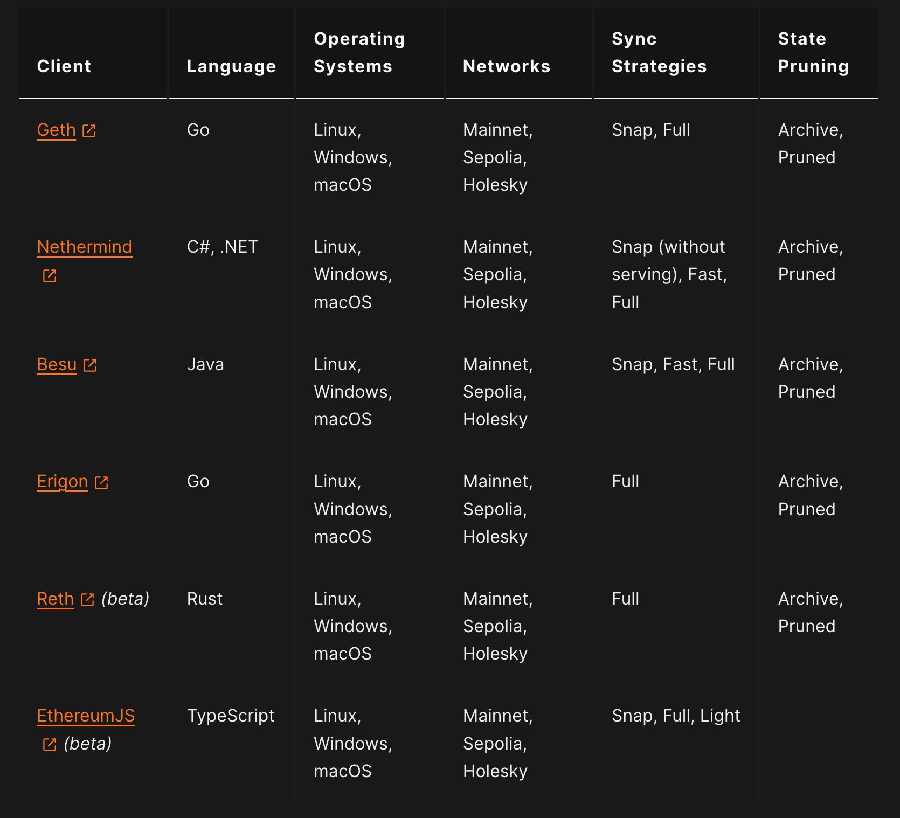

**4. Testing**

由于有定期的变更和多个客户端的实现，测试对于 network 安全来说是非常重要的，根据不同的场景/客户端也会有不同的测试工具。 包括 state transition testing, fuzzing, shadow forks, RPC tests, client unit tests and CI/CD 等。

**5. Coordination**

以太坊不像中心化的公司，它是完全去中心化、公开的组织，任何人都可以参与贡献，每个人都可以参与到以太坊中自己最感兴趣的部分，其中开发的（新的 feature 或 changes）流程是：idea - research - development - testing - adoption，如果大家有问题、idea、以及获取最新的 update，都可以去社区内定期的会议（ACD，可以在 https://github.com/ethereum/pm 查看 schedule 和 notes）、discord（https://discord.com/invite/qGpsxSA）、forum（https://twitter.com/EthMagicians，https://twitter.com/ethresearchbot）等。

里面提到的一些比较感兴趣需要额外学习的文档或书籍（TODO）：

- https://www.deusinmachina.net/p/history-of-unix
- https://yewtu.be/watch?v=Ag1AKIl_2GM
- https://www.gnu.org/philosophy/free-sw.html
- https://ethereum.org/en/whitepaper/#ethereum-whitepaper
- https://ethereum.github.io/yellowpaper/paper.pdf
- https://ethroadmap.com/
- https://archive.devcon.org/archive/
- https://www.camirusso.com/book 这本书看过中文翻译版本，翻译的比较混乱，有时间可以在看一下原版
- https://www.goodreads.com/book/show/55360267-out-of-the-ether
- https://www.routledge.com/Absolute-Essentials-of-Ethereum/Dylan-Ennis/p/book/9781032334189
- https://github.com/ethereumbook/ethereumbook
- 还有一个 Ethereum quiz，明天可以做一下

### 2024.4.5

今天学习了 Week 0 Pre-reading 的部分

**1. Cryptography**

之前没有系统的了解过，所以这次稍微花了点时间

密码学分为古典密码学和现代密码学：

- 古典密码学：主要关注信息的保密书写和传递，以及与其对应的破译方法，比较依赖于设计者和敌手的创造力与技巧，作为一种实用性艺术存在。简单来说加密就是把普通信息转换成难以理解的信息，解密就是相反的过程。比较常用在战争、宗教（加密观点，免遭迫害）、“情书”等。
  - Caesar cipher（凯撒密码）：使用的是替换法，每个字母被往后位移三个字母所替代。
  - Vigenère cipher（维吉尼亚密码）：使用的是多字符加密法，加密重复使用到一个关键词，用哪个字母取代端视轮替到关键字的哪个字母而定。
  - Enigma machine（恩尼格玛密码机）：是德国在第二次世界大战中的重要工具。
- 现代密码学：除了关注信息保密问题外，还涉及信息验证码、数字签名、分布式计算中产生的信息安全问题。
  - symmetric-key encryption（对称密钥加密）：消息被一个密钥 key 加密，消息发送者会把密钥 key 和加密后的消息发送给接收者，只要有密钥 key 就能将对应的加密消息解密。但问题是需要保证密钥 key 的安全性。
  - asymmetric encryption（非对称加密）：有一对加密密钥（公钥-由私钥按着一定规则生成，a large number）和解密密钥（私钥- a large and random number），用加密密钥加密后的消息只能通过解密密钥来解密，所以必须要知道两个密钥才能解密。
  - digital signature（数字签名）：类似于手写签名，使用了公钥加密技术，签名者生成一对密钥（公钥和私钥），私钥用于生成数字签名，公钥用于验证签名的真实性。数字签名具有完整性、认证性和不可否认性。
  - signal protocol（加密通信协议）：由 Signal Messenger 公司开发，被广泛用于各种即时通讯应用中，如 Signal、WhatsApp 和 Facebook Messenger。它提供了端到端加密，确保消息只能被发送方和接收方阅读，不会被中间人窃取和篡改。

Hashing：
Hash 是将任意长度的输入数据通过哈希函数转换成固定长度的输出数据的过程，对于不同的输入数据，哈希函数应该生成不同的哈希值，即使输入数据变化很小，生成的哈希值也会有大幅度变化，且哈希函数是单向的，你无法通过哈希值还原出原始输入数据。

**2. Merkle tree in Bitcoin**

在区块链中，每一个区块头部都包含了一个称为 Merkle 根的哈希值，它是由区块中所有交易数据构建的 Merkle 树的根节点的哈希值。在形成一个新的区块时，交易数据会被组织成 Merkle 树。首先，对每个交易数据进行单独的哈希运算得到叶子节点。然后，依次将相邻的叶子节点两两配对，并计算它们的哈希值。如此反复，直到只剩下一个根节点，即 Merkle 根。

当其他节点接收到新的区块时，它们可以通过比对区块头部中的 Merkle 根与交易数据中的哈希值来验证交易数据的完整性。只需获取到少量的数据和 Merkle 树的根节点，节点即可通过递归地比对哈希值验证整个区块中的交易数据是否被篡改。它只需要通过比对树的根节点来验证整个区块中的交易数据，而不需要获取整个区块的数据，所以提升了验证交易数据的高效性。

**3. P2P network**

点对点的分布式网络，没有中心化服务器，每个节点都是对等的，可以互相通信、交换资源和共享信息。在以太坊中主要应用在：区块传播、交易传播、状态同步、共识算法、发现节点等。

**4. Bittorrent**

一种用于文件共享的协议，它是一个基于 P2P network 的协议，旨在实现高效的大规模文件分发。简单来说，它使用分布式的方式进行文件传输，文件被划分成小块，这些小块由不同的节点共享和下载，提高了下载效率。

（文件的共享者会创建一个种子文件（.torrent ），它包含了文件的元数据信息、哈希值以及 tracker 地址等，每个节点都通过下载种子文件来获取文件的信息。Tracker 是一个服务器，用于协调各个节点之间的连接和数据传输。当用户想要下载某个文件时，他们的 Bittorrent 客户端会向 Tracker 发送请求，获取其他拥有相同文件的节点的信息。）
