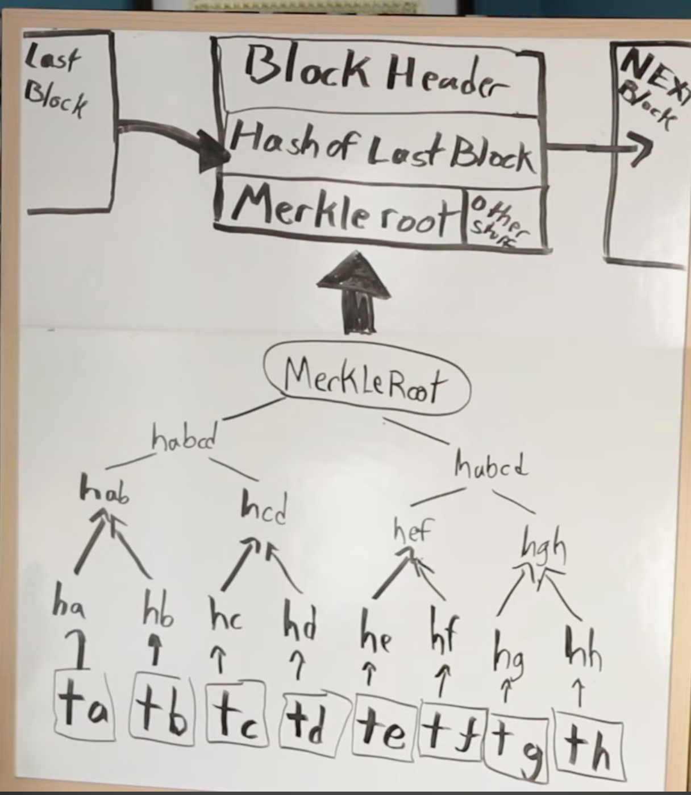

# Muxin

Hello guys, I'm Muxin, I'm learning everything about Ethereum, especially for Ethereum Protocol. I'm good at Web development. Follow me on Twitter: <https://twitter.com/muxin_eth>, my telegram: <https://t.me/muxin_eth>.

## Notes

### 2024.4.5

今天学习了 Week 0 Pre-reading 的部分

**1. Cryptography**

之前没有系统的了解过，所以这次稍微花了点时间

密码学分为古典密码学和现代密码学：

- 古典密码学：主要关注信息的保密书写和传递，以及与其对应的破译方法，比较依赖于设计者和敌手的创造力与技巧，作为一种实用性艺术存在。简单来说加密就是把普通信息转换成难以理解的信息，解密就是相反的过程。比较常用在战争、宗教（加密观点，免遭迫害）、“情书”等。
  - Caesar cipher（凯撒密码）：使用的是替换法，每个字母被往后位移三个字母所替代。
  - Vigenère cipher（维吉尼亚密码）：使用的是多字符加密法，加密重复使用到一个关键词，用哪个字母取代端视轮替到关键字的哪个字母而定。
  - Enigma machine（恩尼格玛密码机）：是德国在第二次世界大战中的重要工具。
- 现代密码学：除了关注信息保密问题外，还涉及信息验证码、数字签名、分布式计算中产生的信息安全问题。
  - symmetric-key encryption（对称密钥加密）：消息被一个密钥 key 加密，消息发送者会把密钥 key 和加密后的消息发送给接收者，只要有密钥 key 就能将对应的加密消息解密。但问题是需要保证密钥 key 的安全性。
  - asymmetric encryption（非对称加密）：有一对加密密钥（公钥-由私钥按着一定规则生成，a large number）和解密密钥（私钥- a large and random number），用加密密钥加密后的消息只能通过解密密钥来解密，所以必须要知道两个密钥才能解密。
  - digital signature（数字签名）：类似于手写签名，使用了公钥加密技术，签名者生成一对密钥（公钥和私钥），私钥用于生成数字签名，公钥用于验证签名的真实性。数字签名具有完整性、认证性和不可否认性。
  - signal protocol（加密通信协议）：由 Signal Messenger 公司开发，被广泛用于各种即时通讯应用中，如 Signal、WhatsApp 和 Facebook Messenger。它提供了端到端加密，确保消息只能被发送方和接收方阅读，不会被中间人窃取和篡改。

Hashing：
Hash 是将任意长度的输入数据通过哈希函数转换成固定长度的输出数据的过程，对于不同的输入数据，哈希函数应该生成不同的哈希值，即使输入数据变化很小，生成的哈希值也会有大幅度变化，且哈希函数是单向的，你无法通过哈希值还原出原始输入数据。

**2. Merkle tree in Bitcoin**

在区块链中，每一个区块头部都包含了一个称为 Merkle 根的哈希值，它是由区块中所有交易数据构建的 Merkle 树的根节点的哈希值。在形成一个新的区块时，交易数据会被组织成 Merkle 树。首先，对每个交易数据进行单独的哈希运算得到叶子节点。然后，依次将相邻的叶子节点两两配对，并计算它们的哈希值。如此反复，直到只剩下一个根节点，即 Merkle 根。

当其他节点接收到新的区块时，它们可以通过比对区块头部中的 Merkle 根与交易数据中的哈希值来验证交易数据的完整性。只需获取到少量的数据和 Merkle 树的根节点，节点即可通过递归地比对哈希值验证整个区块中的交易数据是否被篡改。它只需要通过比对树的根节点来验证整个区块中的交易数据，而不需要获取整个区块的数据，所以提升了验证交易数据的高效性。

**3. P2P network**

点对点的分布式网络，没有中心化服务器，每个节点都是对等的，可以互相通信、交换资源和共享信息。在以太坊中主要应用在：区块传播、交易传播、状态同步、共识算法、发现节点等。

**4. Bittorrent**

一种用于文件共享的协议，它是一个基于 P2P network 的协议，旨在实现高效的大规模文件分发。简单来说，它使用分布式的方式进行文件传输，文件被划分成小块，这些小块由不同的节点共享和下载，提高了下载效率。

（文件的共享者会创建一个种子文件（.torrent ），它包含了文件的元数据信息、哈希值以及 tracker 地址等，每个节点都通过下载种子文件来获取文件的信息。Tracker 是一个服务器，用于协调各个节点之间的连接和数据传输。当用户想要下载某个文件时，他们的 Bittorrent 客户端会向 Tracker 发送请求，获取其他拥有相同文件的节点的信息。）
