# Ray
Hi, I am ray, I know a bit about ethereum, and I am trying to become an expert in it.

- Twitter: https://twitter.com/rayjun0412
- tg: https://t.me/rayjun0412

## Notes

### 2024.4.3

Trying to understand POS more deeply

### 2024.4.5

*以太坊的 PoS 是什么，是如何工作的*

以太坊通过 The Merge 升级，将共识机制从工作量证明（PoW）转成了权益证明（PoS）。 如果想参与到以太坊的网络，需要质押 32 ETH（这个数额有可能会调整）成为 Validator。

Validator 负责处理交易、创建新的区块，验证现有的区块，以太坊的 PoS 协议是 Gasper，来自 Casper （权益证明算法）和LMD GHOST（分叉选择算法）的结合。

如果想要成为网络的 Validator，需要先到一个智能合约中质押 ETH，然后可以参与到网络新区块的创建、区块的验证，并在其中留下自己的签名，其他人从签名中获取地址，通过这个智能合约中的来检验 Validator 的身份，*Validator 的签名就是 Proof of Stake*。

如果 Validator 作恶，那么罚没质押的资金（不同的作恶情节有不同额度的罚没），如果被罚没之后资金量少于 16 ETH，那么就会被提出网络。。

区块链的共识其实就是让链的高度可以持续增加。有两种方式：
- 最长链模型
- BFT

而以太坊的 Casper 协议结合了这两种方式，在后续，将尝试用最简单的语言将 PoS 的机制解释清楚。

PoS 比 PoW 更节省能源，也更适合以太坊长远的规划。但是我觉得 PoS 算法太复杂了，没有 PoW 那么优雅，这是一个技术上的妥协，而且我认为 PoS 最大缺陷在于 permissionless 上比 PoW 要差，如果是 PoW 机制，任何人可以在任意时间加入网络开始挖矿，但是对于 PoS 来说，需要先质押 ETH， 然后才能参与网络，而质押 ETH 是一笔交易，需要先完成执行，然后上链。所以如果有很多人参与网络或者退出网络，通常需要有一个排队的过程。

### 2024.4.6
最长链模型是一个很经典的共识方法，由于网络的原因，链可能会出现分叉，每一个区块的创建者都可以在不同的分叉上构建新的区块，这其实是一个投票的过程，最终能够成为最长链的分叉将成为新的共识。


但是在以太坊中的最长链模型稍微有一些不一样，看下面的这种情况，产生了两个分叉，上面一个分叉在同一条链上，新产生了两个区块，下面的分叉有三个区块，但是三个区块都是新的分叉，如果按照传统的分叉模型，那么上面的分叉才是最长链。但是在以太坊中，得到更多 Validator 投票的分叉才会被认为是最长链 会认为下面的分叉得到的票数多，会把下面的分叉当做是最长链，新的区块会被添加到其中一个分叉上。


最长链的产生过程需要 Validator 投票，当前以太坊的新区块产生时间是 12s，是一个 slot，每 32 个 slot 是一个 epoch。每一个 epoch 可以看作是一轮 BFT 投票。BFT 投票通常是在验证者之间进行两轮投票，如果一方在两轮之后获得 2/3 的投票，那么就获得了最终的投票。


在第一轮中，验证者承诺投票，在第二轮中实际进行投票。这个投票必须进行两轮，如果只有一轮，攻击者会同时做出不透的投票，造成网络的分裂。在以太坊的投票中，第一轮投票之后，每个人都做出了投票，并且攻击者同时给双方投票，导致双方都超过了 67% 的投票，那么这些攻击者就将会因为双重投票而罚没质押的 ETH，如果低于 16 ETH，就会被踢出网络。


还有一种情况是验证者不参与投票，导致验证者的投票率不足，这种情况下，验证者也会因为不活跃而被罚没 ETH。


在极端的情况下，如果有超过 1/3 的节点下线，那么以太坊可以继续是用 GHOST 算法继续运行，而不会让网络崩溃。

ref: https://www.youtube.com/watch?v=5gfNUVmX3Es


### 2024.4.7

当前以太坊网络中的质押者接近 100 万，如果这些验证者同时对区块进行随机签名投票，那么网络中就会产生大量数据，整个网络可能会变得混乱以及不稳定。所以需要按照一定的规则将这些验证者组织起来。

每一个区块对应一个 slot，一个 slot 代表 12s，32 个 slot 组成一个 epoch。

在每个 epoch 中，所有在只能合约中质押的验证者都会被随机分成 committee，每个 committee 都会负责 epoch 中的一个 slot。一个 committee 会划分成 128 个子网，当前以太坊有近 100 万的 Validator，每个 slot 的 validator 超过了 3 万。每个 epoch 会提前两个 epoch 周期（13 分钟）分配完成，Validator 有充足的时间找到分配给他们的 slot。

Validator 的分配是基于一个 randao 的分配算法，randao 依赖 validator 的私钥签名来产生随机数，这里会是用 BLS 技术将所有的签名汇集到一起，最后产生一个随机数。只要至少有一个诚实的 validator，那么最后产生的结果就是随机的。

committee 中会随机一个 validator 来创建一个区块，这个 Validator 称之为 block proposer，其他的 validator 来证明这个区块是最新的区块。每个 epoch 中，每个 validator 只能证明一个区块，否则会被罚没 ETH。

Validator 的投票很重要，如果使用的是 PoW 协议，区块是很难被伪造的，直接是用最长链的原则就可以解决共识分叉的问题。转用 PoS 之后，情况就会变得复杂一些，因为区块很容易被伪造，那么最长链的判断依据就是 Validator 的投票，Validator 参与投票可以获得奖励。如果某个时间段内的 block proposer 没有创建新的区块，这个 committee 中其他 validator 只投票支持前一个区块。

在如此庞大的网络中传递 Validator 的签名依然是一个很大的负担，所以以太坊使用 BLS 技术来减少签名的数据量。

### 2024.4.8

虽然对 Validator 做出了有序的安排，但是 Validator 需要频繁的投票，会产生大量的数据。如果这些签名数据全部需要存储，那么会对以太坊网络造成很大的负担，而且这些数据会随着 Validator 数量的增长。所以需要一种签名算法，能够对这些签名数据进行聚合，让签名最终产生的结果大小不变。

BLS 的第一作者是斯坦福大学教授 Dan Boneh。BLS 算法不需要随机数，可以直接将区块中所有的签名聚合成一个，也避免了多名签名者之间的多余通信，而且最终的签名长度只有 32 字节。当然 BLS 签名算法也不全是优点，也有缺点，BLS 签名的验证复杂度更高。 

在以太坊共识的过程中，每个 committee 子网中的 validator 会生成 BLS 签名，然后区块的 proposer 会将这些 BLS 签名进行聚合，生成一个最终的 BLS 签名，最终在区块中通过一个 BLS 签名来代表超过 3 万 validator 的签名。

以太坊中将质押的最低设置为 32 ETH 就是为了防止产生的签名数量过多，因为签名本身的聚合也需要大量的计算，如果 validator 的数量过多，那么就会需要提升节点规格或者优化签名聚合技术，提升节点规则会降低网络的去中心化程度，而优化聚合技术也需要足够的时间。

### 2024.4.9
以太坊的 slot 和 epoch 构成了一个严格的时间表，所有的 validator 都需要严格按照这个时间表来投票。

在共识的过程中，一方面会选择最长链，另一方面需要决定区块中交易的顺序。 在一个 committee 中，会有一个 block proposer，其他的 validator 会对 block proposer 创建的区块进行投票。block proposer 在前 4 秒需要创建一个区块，在接下来的 4 秒内，每个 validator 都可以对区块投票，最后 4 秒，validator 的投票签名将是用 BLS 聚合，生成一个最终的签名，发给下一个 slot 中的 block proposer。

validator 实际在签名中过程中，会对两个事情进行投票，一个是最长链，一个是 checkpoint。checkpoint 的目的是在以太坊上确认一些坐标，告诉所有人，在 checkpoint 之前的区块是不会被撤销的。具体的做法是在当前的 epoch 中，往前找两个 epoch，并选择其中的一个历史区块，并决定是否将其作为不可逆的 checkpoint。因为每个 epoch 的时间大致是 6 分钟，那么在用户来看，产生 checkpoint 之后，也就是12分钟后，可以绝对保证交易不会被撤销。

checkpoint 的投票不是单独进行的，每次 validator 在为最新区块投票的时候，同时也在为 checkpoint 投票，投票的过程中，会有两个被选中的区块需要被投票，第一个称之为 source，另一个称之为 target。

由于 checkpoint 投票会决定两个 epoch 以前的区块，所以这里的 source 其实就是上一轮 epoch 的 target 投票。那么在两轮 epoch 之后，source 就会成为永久不会被逆转的 checkpoint，target 就会成为下一个 source。

### 2024.4.10
slot + epoch 和 checkpoint 的机制让所有的 validator 可以按照有序的方式来构建以太坊。正常情况下，每隔 12 秒就会有一个新的区块产生，每隔 32 个区块就会有一个新的 checkpoint 产生。但是这是一个庞大的分布式网络，validator 有可能会下线，网络有可能会分区，软件也有可能会发生错误。

有时候网络会发生共识分叉，但是只要有 2/3 的 validator 正常运行，那么区块就可以被正常的构建，那些没有正常的工作的 validator 可能会被损失一部分奖励。这也是之前 Lido 质押服务的质压率到33% 时，会有人担心，因为如果超过了 33%，就已经已经能威胁到网络的安全，如果 lido 的节点都运行了错误的软件，那么整个网络就会分叉。这也是为什么会鼓励客户端多样化的原因，如果大家都运行同样的客户端，那么如果出现软件 bug，那么影响面就会很大。

假设当前网络中有超过 1/3 的软件出现了 bug，没有一个分叉超过了 2/3 的投票，那么这两个分叉就会继续构建，这样就无法形成 checkpoint，两个分叉都认为对方没有按照规则来构建区块链，就会互相惩罚 validator，直到 validator 被踢出网络，这样就有可能会产生永久的分叉。

如果产生了永久的分叉，那么软件自身就解决不了这些问题了，就需要人为介入（**社会共识**）来解决这个共识问题，需要废弃一个分叉，当然被废弃的那个分支也可以继续运行，成为一条新链。这是一个很差的结果，因为软件的错误而导致了链的分叉。如果使用的 PoW 共识，就不会出现这样的问题，我认为 PoW 比 PoS 更好的原因有两个：第一个就是 permissionless，另一个就是不会出现这样的共识分叉。

总结一下，在 Ethereum 系统中，只要保证当前有超过 2/3 的软件在正常运行，那么网络就会正常运行，如果少于 2/3 的软件在正常运行，那么整个网络可能会走向分裂。

### 2024.4.11

Long range attack 是 PoS 共识中一种常见的攻击。攻击者会在一段时间内进行大量质押，然后突然停止质押。一旦他们定制质押，他们就会在停止质押之前创建一个秘密分叉。在这个分叉中，他们任然在质押。在这条链中，他们会继续或者区块奖励，并让其他 validator 因为不参与投票或被罚没资金，这样他们就创建了一条新的链，并与其他节点共享这条链。

对于这种类型的攻击，没有办法罚没攻击者的质押，因为他们在创建分叉之前就已经停止质押，因此很难惩罚他们。大多数节点不会接受这条新的链，因为这个条链已经分叉，并没有按时发布区块。但是对于新加入网络的节点或者长时间离线的节点，他们可能会加入这条新的链。

以太坊有一种解决这个问题的方式，新节点在加入时，需要向其他节点询问诚实链中最新区块，这里其实找到的就是 checkpoint，checkpoint 保证新加入的节点可以快速判断出来那条是诚实链。因为在上面说到，成为了 checkpoint 的区块是不可逆转的。

以太坊中通过罚没资金的方式给不诚实的 validator 带来了巨大的成本，从而极大地阻止了 validator 作恶的可能。

### 2024.4.12

真正随机数的产生非常困难，而对于以太坊来说，必须需要真正的随机数，否则链上 validator 的行为都是可以预测的，那么就没有人愿意真正信任以太坊，randao 让以太坊上可以产生真正的随机数。

这个随机性的产生核心是随机源是不可预测的，但是链上的 txId、blockHash、nonce 等数据都是可以预测的，所以不能使用这些数据。当前信标链中也一直在使用 randao 这个说法，randao 最早的起源已经不可追溯了，但参考了这个项目：https://github.com/randao/randao

这个算法的具体想法如下：
一个 DAO (去中心化的匿名组织)允许任何人加入，随机数是被所有的参与者一起合作生成的。首先，我们需要在区块链上创建一个 RANDAO 的智能合约，合约定义了参与规则。然后生成随机数的基本过程可以分为下面三个步骤：

第一步：收集有效的sha3(s) 
参与随机数生成的参与者首先需要在一个指定的时间区间(比如，6个区块的区间，大约72秒)发送 m ETH 作为抵押到智能合约 C，同时发送一个sha3(s)的值到智能合约C，s 是一个只有参与者自己知道的数字。

第二步:收集有效的s
在第一步结束后，那些提交了sha3(s)的参与者需要在指定的时间区间内发送s到智能合约C。智能合约C会检查sha3(s)和之前提交的值是否相同。 相同的 s 会被保存到种子集合用来最终生成随机数。

第三步:计算随机数，退回抵押和奖金
在所有的秘密数字 s 被成功收集后,智能合约 C 会使用函数f(s1,s2,...,sn)来计算随机数，随机数的结果会写入智能合约的存储，而且结果会被发送到所有之前请求随机数的其他智能合约上面。智能合约 C 会把第一阶段的抵押返回给参与者，然后奖金会被分成同等分发送给所有的参与者。奖金来源于请求随机值的其他智能合约。

### 2024.4.13
当然以太坊中 randao 的并不是完全按照这个实现的，而是在信标链中用很巧妙而且不增加额外工作量的方式来实现了这个算法。我觉得是比较优雅的。

randao 算法的随机性不是每次都重新生成随机数，而是累加产生随机数。信标链维护着 randao_mixes 的值，代表当前的随机性，每次会随着新区块的产生而，那么随着时间推移，RANDAO 中会累计所有区块产生的随机性。

每个区块中，都有一个 randao_reveal 的字段，每产生一个新的区块，randao_reveal 都会和 randao_mixes 值混合，产生一个新的 randao_mixes 值。


我们可以将 RANDAO 想象成一副纸牌，随着每个参与者轮流洗牌，它会随着时间的推移积累随机性。

这里有个问题，那就是 randao_reveal 的随机性怎么产生，这里就很巧妙的复用了 BLS 的签名，前面有说到通过 BLS 签名会把所有验证者的签名聚合，这个签名的产生几乎完全随机。randao_reveal 中存储的就是 BLS 签名。

这样即使每个区块的随机性比较弱，但是累计的随机性会很高。在当前 epoch N 产生的随机数会用来计算 N+2 epoch 中验证者的分布。

### 2024.4.14
randao 的计算是在共识层完成的。在 BeaconState 中，维护了一个 randaoMixes 的变量，这个变量在每个  slot 都会不一样：

```go
type BeaconState struct {
  //...
	slot                                primitives.Slot
	// ...
	randaoMixes                         customtypes.RandaoMixes
	// ...
}
```

每次在新产生区块的时候，都会使用区块的中 randaoReveal 变量来更新 randaoMixes 值：

```go
func ProcessRandao(
	ctx context.Context,
	beaconState state.BeaconState,
	b interfaces.ReadOnlySignedBeaconBlock,
) (state.BeaconState, error) {
	// ...
	// 获取区块中的 RandaoReveal 值
	randaoReveal := body.RandaoReveal()
	if err := verifySignature(buf, proposerPub, randaoReveal[:], domain); err != nil {
		return nil, errors.Wrap(err, "could not verify block randao")
	}
  // 更新 randaoMixes 值
	beaconState, err = ProcessRandaoNoVerify(beaconState, randaoReveal[:])
	if err != nil {
		return nil, errors.Wrap(err, "could not process randao")
	}
	return beaconState, nil
}

func ProcessRandaoNoVerify(
	beaconState state.BeaconState,
	randaoReveal []byte,
) (state.BeaconState, error) {
	// ...
	// 更新 randaoMixes 值
	if err := beaconState.UpdateRandaoMixesAtIndex(uint64(currentEpoch%latestMixesLength), [32]byte(latestMixSlice)); err != nil {
		return nil, err
	}
	return beaconState, nil
}
```

在需要对 Validator 重新排列的时候，就会使用 randaoMixes 来生成一个新的随机数种子：

```go
func Seed(state state.ReadOnlyBeaconState, epoch primitives.Epoch, domain [bls.DomainByteLength]byte) ([32]byte, error) {
	lookAheadEpoch := epoch + params.BeaconConfig().EpochsPerHistoricalVector -
		params.BeaconConfig().MinSeedLookahead - 1

  // 读取特定位置的 randaoMix 
	randaoMix, err := RandaoMix(state, lookAheadEpoch)
	if err != nil {
		return [32]byte{}, err
	}
	seed := append(domain[:], bytesutil.Bytes8(uint64(epoch))...)
	seed = append(seed, randaoMix...)

	seed32 := hash.Hash(seed)

	return seed32, nil
}

// 读取 RandaoMix 值
func RandaoMix(state state.ReadOnlyBeaconState, epoch primitives.Epoch) ([]byte, error) {
	return state.RandaoMixAtIndex(uint64(epoch % params.BeaconConfig().EpochsPerHistoricalVector))
}
```

看完这个实现，觉得太优雅了，利用 BLS 签名，既解决了签名聚合的问题，也解决了随机源的问题。

在完成 The Merge 升级之后，执行层的 block.difficulty 已经没有意义，就用来返回最新的 randao 值，在 solidity 0.8.18 之后，新增了 block.prevrandao 来返回最新的 randao 值。这两个变量返回的值是一样的，可以根据 solidity 的版本来决定使用哪个。


### 2024.4.15

每个 epoch 的 Validator 都会被重新分配，最终的分配结果会受两个因素的影响：1. 当前活跃 validator 数量，2. randao 的值。

在上面已经详细分析过了 randao 的产生机制，这个值决定了 validator 会以随机的方式来分配。当前以太坊的网络中接近百万的 validator，这些 validator 一定会被分配到某个 committee，那么这些 validator 具体是如何分配的？

首先可以确定的是每个 epoch 中有 32 个 slot，每个 slot 中至少有一个 committee，每个 committee 中至少有  128 个 validator。所以如果需要让以太坊网络运行起来，那么至少需要 4096 validator，这是最低要求。

但是 committee 基本不会单独运作，至少需要两个，所以至少要有 8192 个 validator，整个网络才能以比较安全的方式运行。

但是实际上现在有近百万的 validator，远超 8192，但是也需要将这些 validator 分配到每个 committee 中。

在当前的以太坊网络中，每个 slot 最多可以有 64 个 committee，每个 committee 中最多有 2048 个 validator。

如果每个 slot 中已经有了 64 个 comittee，那么就不会再增加 committee 的数量，而是增加其中的 validator 数量。如果此时每个 committee 中刚好是 128 个 validator，那么总的 validator 数量是 262144，这个数据少于 100 万，说明此时以太坊网络中每个 slot 有 64 个 committee，而且每个 committee 中的数量多于 128。

如果每个 committee 中的达到最多 2048 个validator，那么总的 validator 数量是 4194304，这个数据已经超过了当前以太币的发行总量，所以当前来看，validator 的数量是肯定会少于 4194304 个。

### 2024.4.16
Validator 的分配和每个 slot 中区块的 proposer 选择都是通过洗牌算法来实现。

对于这个问题，通常的解决办法可能是使用 Fisher-Yates 算法，这个算法用来将一个有限集合生成一个随机排列的方式，这个算法生成的随机排列是等概率的，而且不需要额外的空间，算法很高效。

但是这种算法需要对整个元素集合进行排列，而以太坊中的 validator 多达百万个，需要对所有的 validator 进行洗牌，然后对这些排列来分段，最后分成一个个 committee。如果只需要知道一个 committee 中的成员，这样做是非常低效的，特别是对于轻客户端，这样做的代价太大了。

所以最后是用了 swap-or-not 的洗牌算法。这个算法可以做到只处理感兴趣的目标列表子集，对于轻客户端来说，负担就小了很多。

```go
func ComputeShuffledIndex(index primitives.ValidatorIndex, indexCount uint64, seed [32]byte, shuffle bool) (primitives.ValidatorIndex, error) {
	//...
	// 根据 seed 来进行洗牌
	copy(buf[:32], seed[:])
	for {
		buf[seedSize] = round
		h := hashfunc(buf[:pivotViewSize])
		hash8 := h[:8]
		hash8Int := bytesutil.FromBytes8(hash8)
		pivot := hash8Int % indexCount
		flip := (pivot + indexCount - uint64(index)) % indexCount
		position := uint64(index)
		if flip > position {
			position = flip
		}
		binary.LittleEndian.PutUint64(posBuffer[:8], position>>8)
		copy(buf[pivotViewSize:], posBuffer[:4])
		source := hashfunc(buf)
		byteV := source[(position&0xff)>>3]

		bitV := (byteV >> (position & 0x7)) & 0x1
		if bitV == 1 {
			index = primitives.ValidatorIndex(flip)
		}
		if shuffle {
			round++
			if round == rounds {
				break
			}
		} else {
			if round == 0 {
				break
			}
			round--
		}
	}
	return index, nil
}
```

对于给定的`index`、`index_count`和值`seed`，这个方法始终返回相同的输出，这样每次能决定 validator 位置的变量就是 seed。

### 2024.4.17

所有投票的 BLS 最后会聚合到一起，放到区块中。聚合投票有三个好处：1. 减少下一个区块 proposer 验签的压力 2. 减少网络中数据的传数量 3. 减少签名所需要的存储空间。

投票的数据结构如下：

```go
type Attestation struct {
	state         protoimpl.MessageState
	sizeCache     protoimpl.SizeCache
	unknownFields protoimpl.UnknownFields

	AggregationBits github_com_prysmaticlabs_go_bitfield.Bitlist
	Data            *AttestationData                             
	Signature       []byte                                       
}
```

聚合的过程如下：

1. committee 中的 validator 对投票进行签名，并将签名广播到 committee 订阅的子网
2. committee 中的一部分 validator 被选为该 committee 的投票聚合器
3. 聚合器在网络上监听投票，将他们收到的与他们自己观点一致的投票聚合成一个投票
4. 聚合器会对聚合的结果生成一个证明，并签名
5. 最后，聚合器将聚合的投票广播到整个网络，下一个区块的 proposer 会接收这些签名


聚合器在设计的时候需要考虑三个方面：

1. 每个 committee 中应该选多少个聚合器，validator 本身有可能会掉线、有可能是恶意的，所以聚合器的数量不能太小，从概率上来说大概会有 16 个左右
2. 聚合器要保密，在聚合器发布聚合结果之前，没人知道聚合器是谁，以免聚合器被 ddos 攻击
3. 聚合器发布的声明要很容易被验证

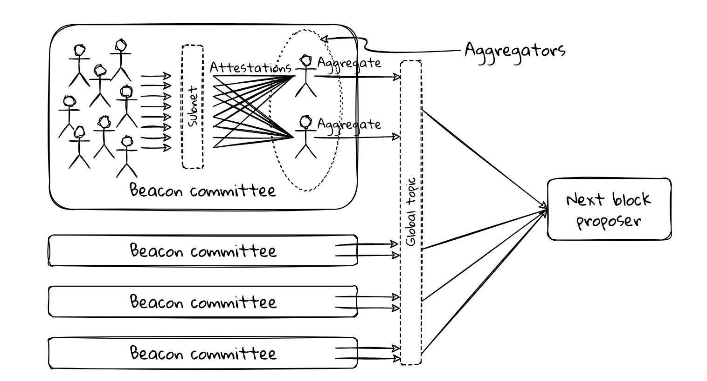

这里再一次利用 BLS 签名来巧妙地实现了保密。validator 通过是用私钥对当前的 slot 编号签名，然后对生成的 BLS 签名进行 Hash 处理，创建一个可验证的随机数，如果该随机数对另一个数取模为零，那么它就是聚合器。

```go
func IsAggregator(committeeCount uint64, slotSig []byte) (bool, error) {
	modulo := uint64(1)
	if committeeCount/params.BeaconConfig().TargetAggregatorsPerCommittee > 1 {
		modulo = committeeCount / params.BeaconConfig().TargetAggregatorsPerCommittee
	}

	b := hash.Hash(slotSig)
	return binary.LittleEndian.Uint64(b[:8])%modulo == 0, nil
}
```

因为私钥是不会被其他人知道的，在发布聚合证明之前，没人确定发布者是否是聚合器。

### 2024.4.18
在以太坊的共识层是用了 RLP 的序列化的方式，但是在共识层，使用了一种叫 SSZ（Simple Serialize）的序列化方法。

序列化在信标链上主要有三个作用：

1. 共识：所有的客户端能够是用相同的方式来序列化和反序列化数据
2. p2p 通信：节点之间需要通过网络通信，需要将数据序列化之后再网络是传播，节点接收到数据之后再反序列化成数据
3. 用户访问节点的 API 数据也需要序列化

执行客户端的 RLP 被认为太过于复杂，所以没有在共识层使用 。同样也没有是用现成的序列化方案，因为当前很多序列化方案太过于通用，这也有可能会造成一些问题。但是实际上，以太坊现在还是维护了 RLP 和 SSZ 两个序列化的方案。

以太坊协议的核心原则就是保持简单，每个协议的细节都应该全部记录 spec 文档中，其他人根据 spec 可以将软件实现出来。

ssz 还有另外一个很重要的特性，它与 Merkleization 配合地很好，可以很容易将数据处理成 Merkle 树。能够快速访问序列化中的特定数据，而无需反序列化整个数据。

### 2024.4.19
对于信标链来说，同样也使用 Merkle 的方式来构建数据。Merkle 树的作用早就被证明了，主要有两点好处：

1. 可以让链的数据校验更加高效，每次只要对数据有变更的地方重新计算，大大减少了计算量，更优雅。
2. 支持请客户端，轻客户端只需要有 Merkle 树根，就可以验证用户提供的数据是不是真实的。

计算 Merkle 树的过程称之为 **Merkleization，也就是  Merkle 化**。

信标链中的数据对象都通过 SSZ 来序列化，然后组织成 Merkle 树，SSZ 有自己的 Merkle 规范，给定一个 SSZ 对象，可以递归地遍历结构层，直到一个基本类型或者基本类型的集合，然后计算成 hash，最后整个对象就可以以一个 Merkle 树根的形式返回。

所以 SSZ 计算 Merkle 树的步骤如下：

- 对于基本类型或者基本类型的集合（列表和向量），直接计算 hash
- 对于复合类型的容器和集合，递归地计算内容的哈希树根

前面有说到 validator 的签名最终会被聚合成一个，以这个数据结构为例，来看一下被 Merkle 的过程：

```go
type IndexedAttestation struct {
	AttestingIndices []uint64        
	Data             *AttestationData 
	Signature        []byte 
}

type AttestationData struct {
	Slot            github_com_prysmaticlabs_prysm_v4_consensus_types_primitives.Slot          
	CommitteeIndex  github_com_prysmaticlabs_prysm_v4_consensus_types_primitives.CommitteeIndex 
	BeaconBlockRoot []byte                                                                      
	Source          *Checkpoint                                                                 
	Target          *Checkpoint                                                                 
}
```

在 Merkle 的过程中，数据被划分成 32 字节的块，如果不足 32 直接，会是用 0 来填充，完整 Merkle 的过程如下：
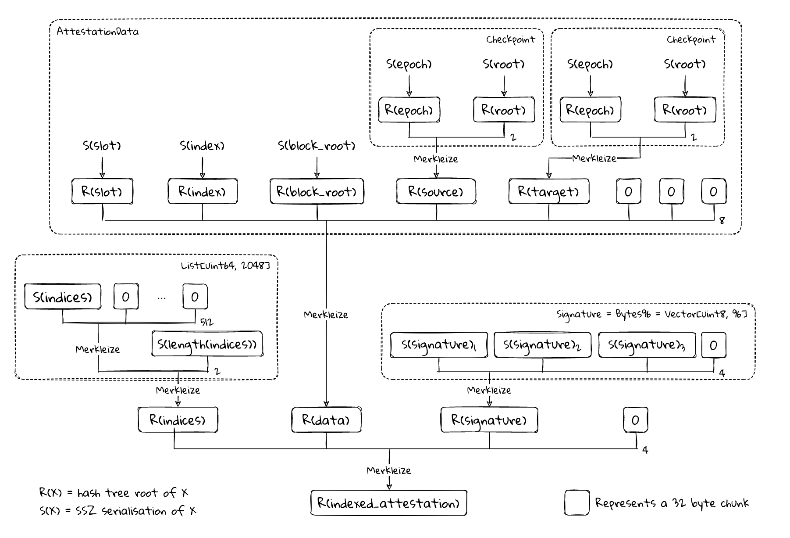

### 2024.4.20
BTC 用 PoW 机制解决了共识和激励的问题。在以太坊转向 PoS 之前，也是用的 PoW 机制，但是会稍微复杂一点，因为有了叔块和 EIP-1559 燃烧机制。

在转向 PoS 之后，复杂了很多，其中最重要的变化是，无法从构建区块的过程中排除掉恶意的攻击者及完成激励。PoS 中，用户质押的 token 数量表示对协议影响的量化。

在 PoS 中，无法通过难度调整来提高恶意攻击的成本，而转用用户的投入成本来表示，质押的 token 就像是一种保证金，如果能够诚实地工作保证金不变，而且可以拿到相应的奖励，如果作恶，那么就会罚没保证金。

总的来说，PoS 需要完成以下的事情：

- 对正确行为的激励，比如及时出块、发布证明和投票
- 对阻碍协议行为的处罚，比如掉线、不投票和发布证明
- 对看起来像是对协议的攻击行为的处罚，比如在同一个 slot 中重复对区块投票

真实协议要比这些简单的描述复杂的多，以太坊的安全就是建立这些激励和惩罚的措施之上。除了这些措施之外，还有很重要的一点就是提升客户端软件的多样性。

### 2024.4.21
如果想成为质押者，就需要在以太坊的存款合约中存入 32 个以太坊的交易。在这笔交易中，除了传入的 32 个 ETH，还需要有其他的参数：

- Validator 的公钥，作为在共识层上的身份
- 接受激励的提款地址
- 对公钥、提款地址和存款金额的签名
- 存款数据的 merkle 根，这些数据也是通过 ssz 的方式序列化，然后构建成 merkle 树

存款合约的主要代码如下：

```go
contract DepositContract is IDepositContract, ERC165 {
    uint constant DEPOSIT_CONTRACT_TREE_DEPTH = 32;
    uint constant MAX_DEPOSIT_COUNT = 2**DEPOSIT_CONTRACT_TREE_DEPTH - 1;

    bytes32[DEPOSIT_CONTRACT_TREE_DEPTH] branch;
    uint256 deposit_count;

    bytes32[DEPOSIT_CONTRACT_TREE_DEPTH] zero_hashes;

    constructor() public {
        for (uint height = 0; height < DEPOSIT_CONTRACT_TREE_DEPTH - 1; height++)
            zero_hashes[height + 1] = sha256(abi.encodePacked(zero_hashes[height], zero_hashes[height]));
    }

    function get_deposit_root() override external view returns (bytes32) {
        bytes32 node;
        uint size = deposit_count;
        for (uint height = 0; height < DEPOSIT_CONTRACT_TREE_DEPTH; height++) {
            if ((size & 1) == 1)
                node = sha256(abi.encodePacked(branch[height], node));
            else
                node = sha256(abi.encodePacked(node, zero_hashes[height]));
            size /= 2;
        }
        return sha256(abi.encodePacked(
            node,
            to_little_endian_64(uint64(deposit_count)),
            bytes24(0)
        ));
    }
 }
```

在 The Merge 之前，信标链不需要连接到执行层，这个存款的数据根就是用来证明参与者完成了存款。在 EIP-6110 升级之后，可以在链上显示公开验证者的存款，之后这个存款跟实际上就是多余的。

在完成存款之后，存款合约会生成一个 Event，里面包含了存款的一些详细信息。共识客户端可以通过执行层的 eth_getLogs RPC 方法来获取这些数据，通过传入存款合约地址、区块号和 Event 参数进行过滤，然后快速获取到存款的详细信息。

### 2024.4.22

在完成存款之后，就可以成为以太坊网络中的  validator，就拥有了这个系统的一部分权益，这个过程其实就是质押。

前面有说到，在从 PoW 转成 PoS 之后，整个以太坊网络需要一种新的机制让参与者有成本，这个机制就是让 Validator 质押。质押有三个关键的作用：

- 反女巫。因为以太坊网络是无许可的，任何人都可以参与到网络中来，质押让人无法批量的创建身份，保护了系统安全
- 质押提供了问责机制。网络要求参与者必须诚实地参与，不能做出对网络有害的行为，如果 validator 做出了有害的行为，那么就会被罚没质押的存款。
- 质押可以提供激励，validator 在参与质押之后，就更有动力保护这个网络

每个验证者需要质押 32 ETH 才能成为 validator，单在近期的 EIP-7251 中，已经提议将可以质押的 ETH 提升到 2048，以此来缓解快速增长的 validator 的数量，但最低的门槛还是 32 ETH。

32 是一个妥协的值，如果这个数量太高，那么有能力成为 validator 的人就会减少，但是在如果质押的门槛过低，那么 validator 的数量就会过多，那么对硬件的要求就会过高，那么就会加剧网络的中心化程度。

但很多第三方质押的的出现，比如 lido，降低了质押的门槛，让不够 32 ETH 的人可以参与网络的质押，在这样的情况下，可以提高质押的上限，这样也可以聚合多个 validator。

### 2024.4.23
每个 validator 都有两个余额记录，**实际余额**和**有效余额**。

- 实际余额：通过合约存入的存款 + 应计的奖励 - 罚款 - 提款，单位是 Gwei，实际余额在每个 epoch 中至少更新一次
- 有效余额：有效余额来源于实际余额，是实际余额的子集，但是变化的速度会很慢。单位是 ETH，有效余额主要用来实现经济治理和工程上的目标

如果 validator 在存款合约中存入了 64 ETH，那么他的实际余额为 64 ETH，而有效余额只有 32 ETH，这样可以让更多的资金去搭建更多的验证者节点。

当然每个阶段的情况不一样，当前验证者的数量已经足够多，现在已经在考虑是否提升有效余额的上限，来平衡验证者的数量问题，在提升有效余额之后，validator 在网络中的权益权重也会发生相应的变化，比如有效余额越多，那么成为 block proposer 的概率也会越大，获得的奖励也会越多，当然，收到的惩罚也会越重。

在工程上，利用有效余额，也可以降低网络的负担，在信标链中，一个很大的挑战是生成整个状态的hash 树根。解决这个问题的办法是在 validator 的余额中记录阶段性的变化，比如每个 epoch 记录一次，快速的变化记录在一个单独的列表中。

另外一个很重要方式是根据 **Hysteresis** 机制来更新有效余额。

- 初始时间，实际余额和有效余额均从 32 ETH 起
- 实际余额随着时间开始增加，有效余额上限为 32 ETH，因此不会更新
- 当实际余额低于 31.75 ETH 时，有效余额才会减少至 31 ETH
- 实际余额上升并在32 ETH附近振荡，但没有触发有效的余额更新，仍保持在31 ETH
- 最终实际余额升至32.25 ETH以上，有效余额更新为32 ETH
- 实际余额再次下降，但并未跌破31.75 ETH，因此有效余额仍为32 ETH

通过有效余额，可以实现信标链在经济和工程方面的稳定性。

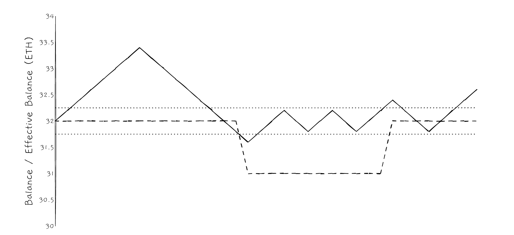


### 2024.4.24
成为以太坊网络的 validator 之后，可以获得奖励，这些奖励来自新发行的 ETH。

奖励基于有效余额来计算，有效余额中的每一个 ETH 被称之为一个 **increment，**如果有效余额是 32 ETH，那么当前这个 Validator 就有 32 个 increment，奖励具体的计算方式如下，其中 BaseRewardFactor 当前设置为 64：

```go
func BaseRewardPerIncrement(activeBalance uint64) (uint64, error) {
	if activeBalance == 0 {
		return 0, errors.New("active balance can't be 0")
	}
	cfg := params.BeaconConfig()
	return cfg.EffectiveBalanceIncrement * cfg.BaseRewardFactor / math.CachedSquareRoot(activeBalance), nil
}
```

如果有 50 万个 Validator，那么每年就会产生 665292 ETH，作为对比，在 PoW 机制下，每年新产生的 ETH 接近 500 万。

下面是随着 validator 数量增长新发行的 ETH 数量变化，在 validator 数量达到 100 万，发行的 ETH 数量接近 100 万ETH。

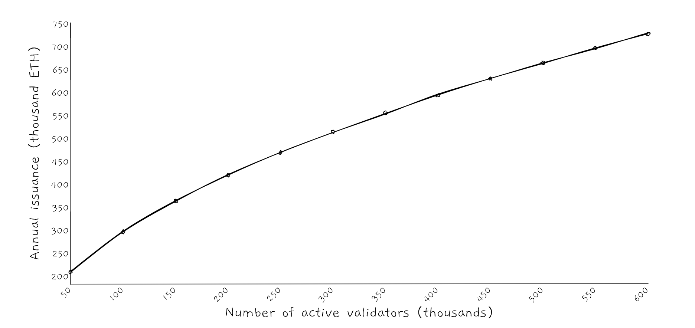

上面是新增的 ETH 的变化，但是实际上，在伦敦升级 EIP-1559 之后，所有交易的 baseFee 都会被燃烧，在网络繁忙的时候，燃烧的 ETH 甚至要多于要多于新增的 ETH。而且在合并之后，也不会再继续发布区块和叔块奖励。

在当前阶段，ETH 的总量甚至是通缩的，但是在未来，很有可能会达到新增供应量和销毁量的平衡，ETH 大规模新增的时期已经过去了。

### 2024.4.25
由于搭建全节点的成本越来越高，所以轻节点以后会是很重要的方向，轻节点可以运行在手机、甚至浏览器上，方便随时验证数据。但是轻节点本身不会保留完整的数据，也不会参与链的构建，只会和全节点保持链头的同步。在必要的时候，会去下载区块的实际内容。

节点的轻量级程度会根据具体的情况来看，比如最轻量级的是轻量级执行客户端和轻量级共事客户端的组合。但也会出现共识层和执行是完全节点的情况。

以太坊在完成 The Merge 升级之后，专门对轻量级客户端做了支持，除了会给每一个 slot 分配 committee 之外，还有一个特别的同步 committee。这个同步 comittee 每隔 1.1 天会随机选择一个512 个 validator 来作为成员。它的主要职责是为区块签名，并在聚合之后存储在区块头中。每个区块头还包含预计参加下一个区块签名的验证者列表

这样轻量级客户端可以快速查看同步 committee 是否已经为收到的数据签名，并且还可以通过比较收到的信息和上一个区块中得到的预期信息，来验证 同步 committe 是否合法。通过这个机制，轻客户端可以不断更新以太坊区块信息，而无需下载完整的区块的数据。

轻客户端的好处在于可以让更多人独立地访问以太坊，而且几乎不要求硬件配置。可以让用户有多种渠道去获取数据，然后交叉验证，这样作恶者的成本和难度会随着是用轻客户端的人增加而持续增加。

### 2024.4.26
Validator 有三种方式来获取奖励：

- 参与链的共识，并及时投票
    - 给 source checkpoint 点投票
    - 给 target checkpoint 点投票
    - 给链头区块投票
- 成为 block proposer，创建区块
- 成为 sync committees 的成员，给区块签名

其中 validator 参与投票的奖励是最稳定，也是占比最多的。成为 block proposer 和成为 syn ccommittees 成员的概率很低，大多数 validator 都获取不到相关的奖励。各项奖励发行的 ETH 比例如下：

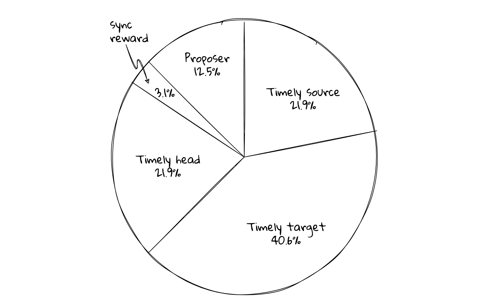

如果验证者的数量是 50 万，每个 validator 的有效余额都是 32 ETH，那么每个 epoch 大概会新产生 8.08 个 ETH，这些 ETH 将按照上面的比例划分给 validator。

上面是总体收益的分布情况，实际上到单个 validator 会产生一定的差异，因为 block proposer 和 sync committees 是随机分配的。但如果时间线拉的够长，所有 validator 的收益应该会接近。其实对于 block proposer 来说，除了上面的这些激励，他们还可以从交易中收取小费，还有可能获取到 MEV 收入，这些都有可能会大幅提升 validator 的收入，但是不会影响新 ETH 的发行，因为这些都来自已经存在的 ETH。

下面是50 万验证者规模下，不同 validator 收益的分布，新产生 ETH 的数量与 validator 是成比例的，如果 validator 的数量越多，那么新产生的 ETH 就会越多：

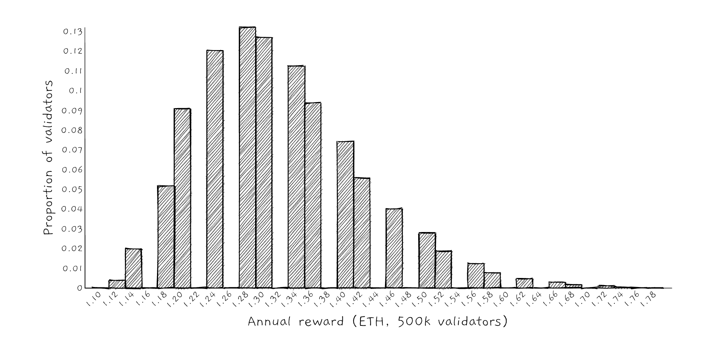

### 2024.4.27
Validator 在网络中有三个关键的里程碑，activation、exit 和 withdrawable。用户会在 activation 到 exit 之间可以获取奖励，在 activation 到 withdrawable 之间都有可能被减少资金。

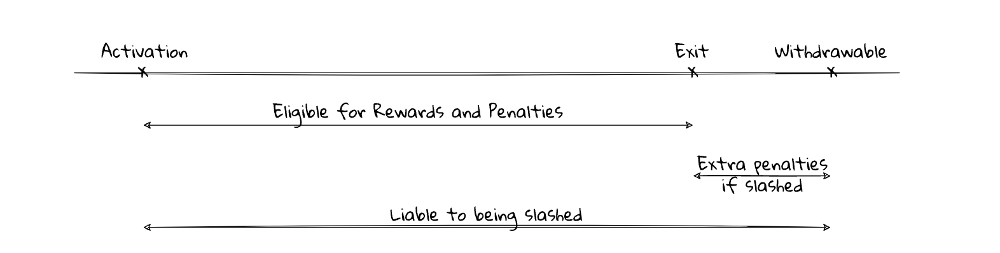

导致用户资金减少的形式有三种：

- penalties
- inactivity leak
- slashing

penalties 是程度最轻的一种。主要会因为两种情况而执行：

- 错过区块共识的投票：没有对 source checkpoint 和 target checkpoint 投票或者对 source checkpoint 的错误投票
- 错过 sync committees 的投票：错过这个投票，将减少获得和奖励一样多的惩罚，损失比较重，但概率比较小

其实 penalties 很算是很轻微的处罚，因为至少在线的时间超过 42.5%，那么就能获得正向的回报。

计算区块共识投票的奖励和处罚：

```go
func ProcessRewardsAndPenaltiesPrecompute(
	beaconState state.BeaconState,
	bal *precompute.Balance,
	vals []*precompute.Validator,
) (state.BeaconState, error) {
  //....
	balances := beaconState.Balances()
	for i := 0; i < numOfVals; i++ {
		vals[i].BeforeEpochTransitionBalance = balances[i]
		delta := attDeltas[i]
		balances[i], err = helpers.IncreaseBalanceWithVal(balances[i], delta.HeadReward+delta.SourceReward+delta.TargetReward)
		if err != nil {
			return nil, err
		}
		// 计算被 penalty 之后的余额
		balances[i] = helpers.DecreaseBalanceWithVal(balances[i], delta.SourcePenalty+delta.TargetPenalty)

		vals[i].AfterEpochTransitionBalance = balances[i]
	}

	if err := beaconState.SetBalances(balances); err != nil {
		return nil, errors.Wrap(err, "could not set validator balances")
	}

	return beaconState, nil
}
```

错误 sync committees 的处罚计算：
```go
func (s *Service) processSyncAggregate(state state.BeaconState, blk interfaces.ReadOnlyBeaconBlock) {
	// ...
	for validatorIdx, committeeIndices := range s.trackedSyncCommitteeIndices {
		if len(committeeIndices) > 0 {
			contrib := 0
			for _, idx := range committeeIndices {
				if bits.SyncCommitteeBits.BitAt(uint64(idx)) {
					contrib++
				}
			}

			balance, err := state.BalanceAtIndex(validatorIdx)
			if err != nil {
				log.Error("Could not get balance")
				return
			}

			latestPerf := s.latestPerformance[validatorIdx]
			balanceChg := int64(balance - latestPerf.balance)
			latestPerf.balanceChange = balanceChg
			latestPerf.balance = balance
			s.latestPerformance[validatorIdx] = latestPerf

			aggPerf := s.aggregatedPerformance[validatorIdx]
			aggPerf.totalSyncCommitteeContributions += uint64(contrib)
			s.aggregatedPerformance[validatorIdx] = aggPerf

			syncCommitteeContributionCounter.WithLabelValues(
				fmt.Sprintf("%d", validatorIdx)).Add(float64(contrib))
			//...
		}
	}
}
```

### 2024.4.28
如果在一定时间内（通常是 4 个 epoch），还没有产生新的 checkpoint，那么网络就会进入到 Inactivity leak 模式，在这个模式下，奖励和惩罚的规则都会修改：

- 正常的 validator 不会获得奖励，但不投票的 validator 的惩罚保持不变
- 任何被判断为不活跃的 validator 都会提高不活跃分数，从而导致额外的不活跃惩罚，并会随着时间呈二次方增长，这就是 Inactivity leak，也被称之为 quadratic leak
- block proposer 和 sync comittees 的奖励不变

这是为了解决当网络中超过 1/3 的验证者离线的情况下，让 checkpoint 继续产生的问题。因为当验证者不投票时，他们的余额会不断减少，最终当网络中活跃的验证者控制的权益达到了 2/3 时，系统又可以重新恢复正常。

之所以在 inactivity leak 模式下不提供奖励，是因为攻击者可能会通过审查和对其他验证器的 DDos攻击，故意使信标链陷入 inactivity leak,而攻击者继续正常证明。在这种情况下，需要增加攻击者的成本，为此在 inactivity leak 期间根本不奖励。

为了能够准确识别出网络中的不活跃者，会给每个 validator 记录 score，后续的处罚也是对于这个 score 来计算，score 的最小值为 0，score 的计算方式如下：

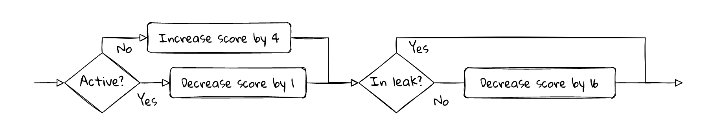

- 无论是否处在 inactivity leak 状态：
    - 如果 validator 不活跃，score 加 4
    - 如果 validator 活跃，score 减 1
- 如果在 inactivity leak 状态：
    - 那么 validator 的 score 会根据自身的活跃状态增加或者减少
- 如果不在 inactivity leak 状态：
    - 那么 validator 的 score 会减少 16

通过上面的机制，可以发现如果在 inactivity leak 发生时，只要保证 90%  以上的时间在线，就可以保证 score 接近于 0：

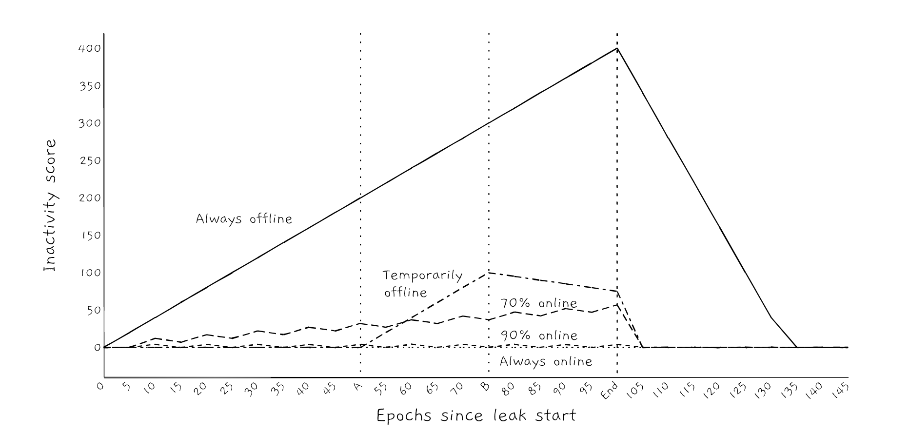

同样，在保证 90% 以上的在线时间时，那么基本就不会被处罚，如果持续离线，那么就可能会被持续处罚，如果被处罚到余额低于一定值，那么 validator 就会被踢出网络，目前是实际余额低于 16.75 的时候，就会发生踢出操作：


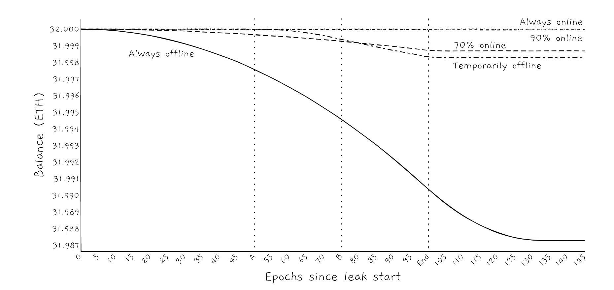

### 2024.4.29
如果 penalties 和 inactivity leak 的处罚的出发点都是 validator 不是故意的前提下，那么 slashing 就是为了惩罚故意作恶的行为，这种作恶已经可以被归结为攻击。slashing 罚没的资金也是量级最大的， validator 很可能在短时间内失去大量余额，然后被逐出网络。validator 被 slashing 的 ETH 都会被销毁，从而减少链上 ETH 总的发行量。

触发  slashing 的行为如下：

- 与 Casper FFG 共识有关：
    - 对同一个 target checkpoint 做出不同的投票（attestation）
    - 投票与历史投票冲突
- 与 LMD GHOST 共识有关：
    - 在同一个区块高度提议不同的区块
    - 使用相同的 source 和 target 来证明不同的头区块

总之，如果故意打乱共识过程，那么就会被 slashing。

slashing 的处罚会分为两种：

- **The initial penalty:** 如果 validator 的证据被网络确认，那么就会执行 slashing 有效余额，一次最多 1 ETH
- **The correlation penalty:**  在被 slashing 后的 18 天，validator 将执行第二次处罚

### 2024.4.30
以太坊网络已经成为了一个非常复杂的生态，复杂的生态需要多样性来支撑。在以太坊中，这里的多样性指的是多方面。而且以太坊对 33% 这个数字很敏感，它不希望有任何一种事务的占比超过 33%，比如：

- 运行客户端应该多样化，单个客户端的比例不要超过 33%，如果单个客户端出现 bug，那么整个网络都会有危险
- validator 应该多样化，不要让超过 33% 的 validator 被一方控制，这就是为啥 lido 质押率占比超过 33% 时，大家会觉得很危险
- 超过 33% 的 validator 不要部署在同一个基础设施上，比如 aws 上，这样如果 aws down 机，那么整个网络也会发生分叉

以客户端的多样性为例:

- 如果一种 client 上质押的 ETH 没有超过 33%，即使这个客户运行的节点因为 bug 而停止，那么整个网络的运行不会出现大的问题，最多是使用 这个 cleint 的节点需要升级或者替换到其他的节点
- 如果这种 client 的使用超过了 33%，而且出现了 bug，那么网络就会进入到 inactivity leak 状态，可能需要比较长的时间才能恢复
- 如果 client 的使用超过了 50% 并且出现了 bug，那么链就有可能永久分叉，即使这些出错的 客户端的 validator 回来，也会被罚没大量质押的 ETH
- 如果超过了 66%，那么对链来说，就是毁灭性的打击，如果要恢复，也只能通过社会共识回退到之前的某个时间点

多样性是以太坊维持安全和稳定的重要一环。

### 2024.5.1
在前面聊的共识依赖于 validator，而 validator 的增加和减少则依赖存款和取款。

- 存款：ETH 从执行层转移到共识层
- 取款：ETH 从共识层转移到执行层

任何人可以向存款合约中存入 32ETH 成为一个 validator，这是无许可的。在和约中存入 ETH 之后，那么在共识层也会产生相应的记录。

共识层的上的 ETH 以 validator 账户余额的形式存在，余额会因为存款和奖励变多，也会因为提款和惩罚变少，这个账户不能发起转账或者其他任何类型的交易，其中余额分为实际余额和有效余额，在上面已经详细说明。validator 余额变化至作为信标链状态的一部分，而不是在执行层的状态中跟踪。

执行层在完成存款之后，就会发出 receipt，共识层或获取到这些 receipt，并创建一个 validator 账户并计入余额，然后质押 ETH 的人就可以运行 validator 了。在成为 validator 之后，就会定期获得奖励，这些奖励将定期从 validator 的余额中扣除，存入提款凭证中指定的执行层地址，这就是提款地址。

当 validator 发出信号要退出时，剩下的余额都将从 validator 的账户中扣除并计入提款地址。


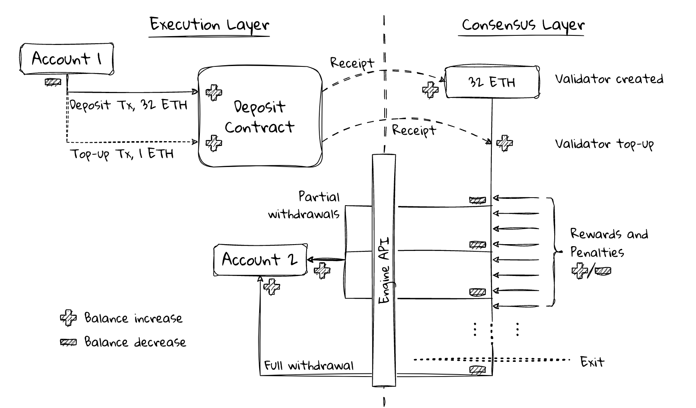

### 2024.5.2
每个 validator 本质上都是一对 BLS 公私钥，这个公私钥对和发送存款的钱包地址不是同一个，所以在运行 validator 的时候，都需要额外指定提款地址。

存款有以下三个主要的步骤：

- 生成公私钥对
- 生成充值数据，并使用生成的公私钥对签名
- 然后再使用普通的钱包来执行这笔充值的交易，比如使用 metamask 来执行这笔存款交易

充值数据结构如下：

```go
{
  // 根据助记词的 BLS 密钥生成的 BLS 公钥，是 validator 在共识层的身份标识
  "pubkey": "a70d57e5fd4615bd3110a709be82be7a8b966fe881290f2738e4d8d0b38f39fe...",
  // 提案地址
  "withdrawal_credentials": "0100000000000000000000000001020304050607080900010203040506070809",
  // 存入的以太坊数量
  "amount": 32000000000,
  // 使用 BLS 密钥对前三个字段的签名
  "signature": "a6821877521df6ea65e7458fd599ef6430d23f64789cf7d89a75658eccdaf841...",
  // 用于实际签名的数据，由前三个数段构成的 merkle 树
  "deposit_message_root": "047eb9f043b4cd464084c44db76ddb937e3fda11a63fde59a6149f74b8c50685",
  // 由前四个字段构成的 merkle 树，用来校验提交的数据和签名是否正确
  "deposit_data_root": "5a05c42ace9518a92c5ec950e6f58a6fd490a06b7619370d1b700d8d93b2cbbe",
  // 指定存款所用的链
  "fork_version": "00000000",
  "network_name": "mainnet",
  "deposit_cli_version": "2.5.0"
}
```

存款也分为两种情况：

- 初始存款
- 充值

如果是第一次存款，那么就需要按照上面所说的方式来构造公私钥对，然后构造存款数据，最后存款。

validator 在运行的过程中，可以会因为被惩罚导致有效余额不满 32 ETH，这样可能会让获得奖励变少，所以需要对 validator 充值。

充值和初始存款交易不同，充值不需要构造存款数据，直接使用 metamask 就可以充值，ethereum 提供了一个充值的页面：https://launchpad.ethereum.org/en/top-up，也就是说，你可以为任意一个 validator 充值。

### 2024.5.3
存款合约是运行在执行层的普通以太坊合约，任何希望运行 validator 的人都可以通过正常的以太坊交易将 32 ETH 存入到存款合约中。

存款合约除了接收  validator 的 ETH 之外，还有其他的数据：

- 存储 validator 的公钥，公钥是 validator 在共识层的主要标识，validator 的私钥将用于共识层的共识过程
- 指定执行的提款地址，在 validator 退出网络时，将用来接收全部余额
- 对公钥、提款地址和存款金额的签名，用来证明 validator 拥有这个密钥
- 存款数据的 merkle 树根，就是上面数据生成的 merkle 树根

充值信息从执行层到共识层有两种方式：

- 一种是在投票的过程中就存款合约的状态达成一致
- 一种是通过 eth_getLogs 方法去执行层查询 receipts

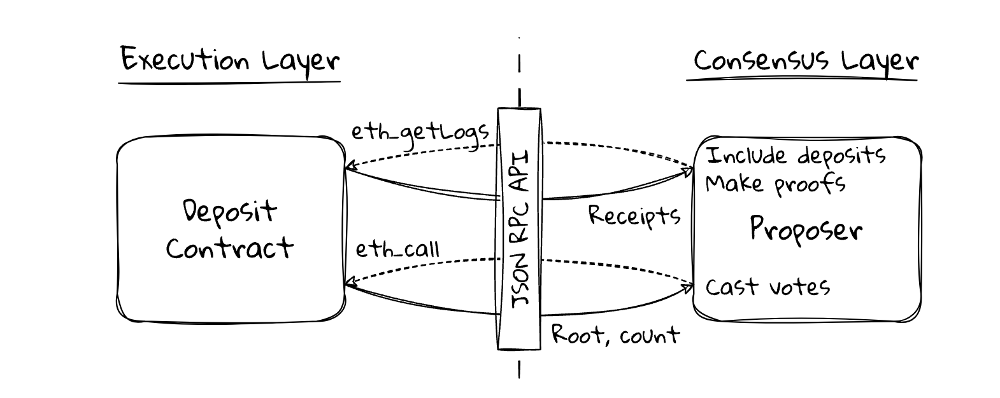

上面的这些数据其实就是上面的 json 结构中的数据，会在存款合约中存储，存款数据按照如下的结构来组织，用的是上面所说的 SSZ 序列方法：

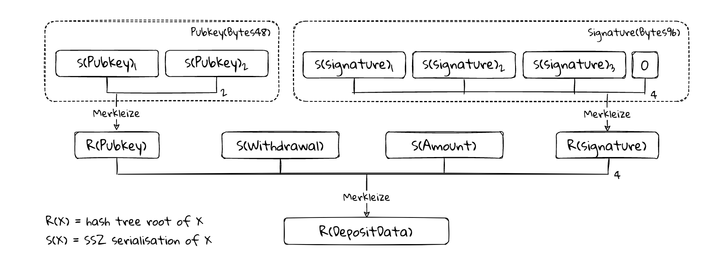

最开始存款合约由 Vyper 语言编写，后来才改成 solidity，并且在 2020-10-14 09:22:52 UTC 时间部署上线。其中有趣的是，这个合约是被匿名部署的，现在也不知道部署者是谁，而且这个匿名的金额是通过 Tornado Cash 处理的，现在这个产品都被封禁了，因为用来洗钱是在是太方便了。

### 2024.5.4
validator 的提款能力在上海的 Capella 升级中启用。在这次升级之前，所有的 validator 只能进行质押，所有的存款和奖励都只能被锁定在共识层内。

在合并之前提供提款能力会让整个过程变得很复杂，所以这个在完成 The Merge 升级之后才开放，提款采用的方案是推送提款，这些提款会自动执行，不需要质押的人做任何操作，这种方式用户体验更好，而且几乎不增加信标链状态的大小，它利用 The Merge 升级之后的 Engine API 作为执行层和共识层之间的桥梁。

在提款的时候需要有提款凭证，现在主要的提款凭证有两种：

- BLS 提款凭证：BLS 提款凭证最终都需要绑定一个 执行层提款凭证才能真正完成提款
- 执行层提款凭证：最终接收提款的地址

执行层提款凭证实际是一个地址，可以是 EOA 地址或者只能合约地址，如果是只能合约地址，它在接收到提款时不会执行任何代码。

在提款时，每个区块中最多可以进行 16 次共识层提款，validator 的提款按照编号顺序扫描，然后按照顺序处理，所以那些想要提款的人必须等待处理队列。

对于想提款的人，必须满足如下的条件之一：

- 如果 validator 已经退出，已经可以提现，并且余额非零，那么就可以有资格全额提款
- validator 的有效余额为 32 ETH，实际余额比这个高，那么就可以进行部分提款

完整的提款流程如下：

1. 通过 ExpectWithdrawals 方法在信标链信来收集提款列表
2. 信标块提议者通过 Engine API 将提款列表发送到执行客户端
3. 执行客户端返回一个 Paylaod，其中包括提款列表
4. block Proposer 将 Payload 合并到其信标块中并将其广播到网络
5. 收到区块后，所有共识节点从 Payload 中提取提款列表，并调用 ProcessWithdrawals 方法从 validator 的余额中扣减余额
6. 共识节点将 Payload 发送到执行客户端。执行客户端将与 Payload 的所有其他交易一起处理提款，并增加执行层提款凭证中的余额

