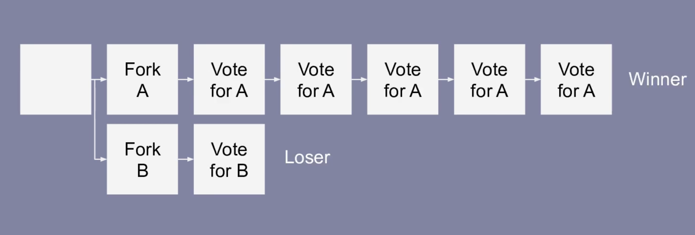
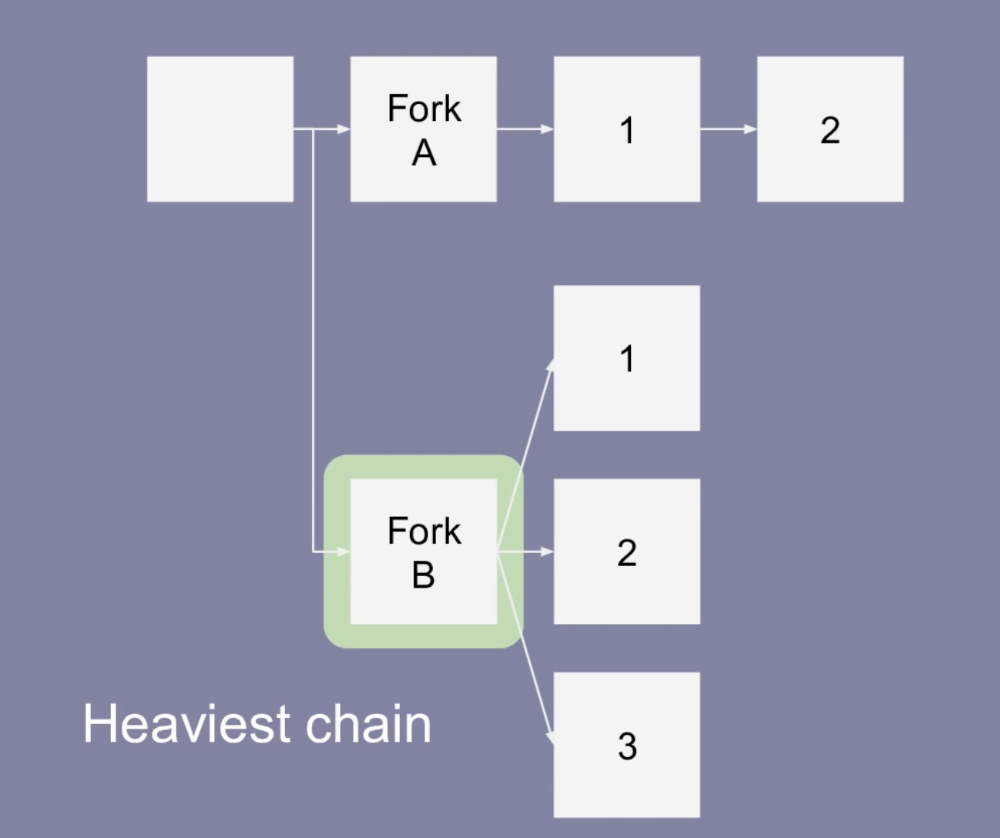
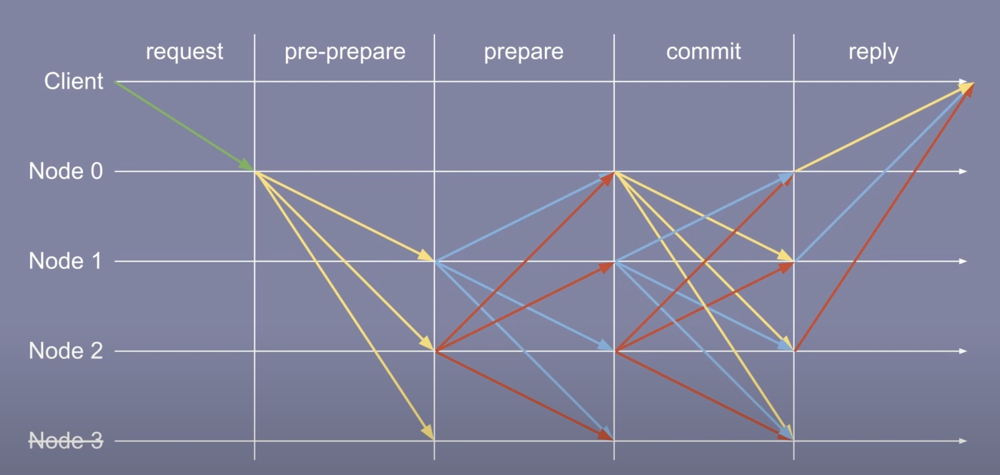
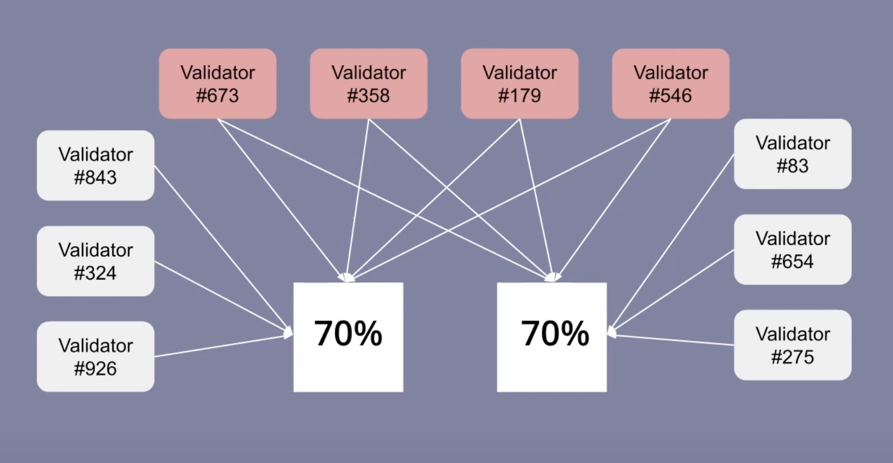
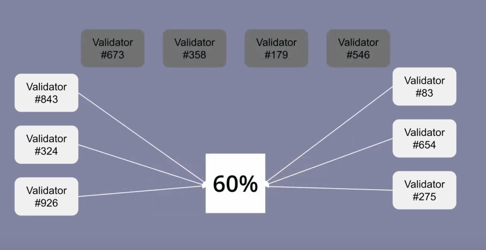

# Ray
Hi, I am ray, I know a bit about ethereum, and I am trying to become an expert in it.

- Twitter: https://twitter.com/rayjun0412
- tg: https://t.me/rayjun0412

## Notes

### 2024.4.3

Trying to understand POS more deeply

### 2024.4.5

*以太坊的 PoS 是什么，是如何工作的*

以太坊通过 The Merge 升级，将共识机制从工作量证明（PoW）转成了权益证明（PoS）。 如果想参与到以太坊的网络，需要质押 32 ETH（这个数额有可能会调整）成为 Validator。

Validator 负责处理交易、创建新的区块，验证现有的区块，以太坊的 PoS 协议是 Gasper，来自 Casper （权益证明算法）和LMD GHOST（分叉选择算法）的结合。

如果想要成为网络的 Validator，需要先到一个智能合约中质押 ETH，然后可以参与到网络新区块的创建、区块的验证，并在其中留下自己的签名，其他人从签名中获取地址，通过这个智能合约中的来检验 Validator 的身份，*Validator 的签名就是 Proof of Stake*。

如果 Validator 作恶，那么罚没质押的资金（不同的作恶情节有不同额度的罚没），如果被罚没之后资金量少于 16 ETH，那么就会被提出网络。。

区块链的共识其实就是让链的高度可以持续增加。有两种方式：
- 最长链模型
- BFT

而以太坊的 Casper 协议结合了这两种方式，在后续，将尝试用最简单的语言将 PoS 的机制解释清楚。

PoS 比 PoW 更节省能源，也更适合以太坊长远的规划。但是我觉得 PoS 算法太复杂了，没有 PoW 那么优雅，这是一个技术上的妥协，而且我认为 PoS 最大缺陷在于 permissionless 上比 PoW 要差，如果是 PoW 机制，任何人可以在任意时间加入网络开始挖矿，但是对于 PoS 来说，需要先质押 ETH， 然后才能参与网络，而质押 ETH 是一笔交易，需要先完成执行，然后上链。所以如果有很多人参与网络或者退出网络，通常需要有一个排队的过程。

### 2024.4.6
最长链模型是一个很经典的共识方法，由于网络的原因，链可能会出现分叉，每一个区块的创建者都可以在不同的分叉上构建新的区块，这其实是一个投票的过程，最终能够成为最长链的分叉将成为新的共识。



但是在以太坊中的最长链模型稍微有一些不一样，看下面的这种情况，产生了两个分叉，上面一个分叉在同一条链上，新产生了两个区块，下面的分叉有三个区块，但是三个区块都是新的分叉，如果按照传统的分叉模型，那么上面的分叉才是最长链。但是在以太坊中，得到更多 Validator 投票的分叉才会被认为是最长链 会认为下面的分叉得到的票数多，会把下面的分叉当做是最长链，新的区块会被添加到其中一个分叉上。



最长链的产生过程需要 Validator 投票，当前以太坊的新区块产生时间是 12s，是一个 slot，每 32 个 slot 是一个 epoch。每一个 epoch 可以看作是一轮 BFT 投票。BFT 投票通常是在验证者之间进行两轮投票，如果一方在两轮之后获得 2/3 的投票，那么就获得了最终的投票。



在第一轮中，验证者承诺投票，在第二轮中实际进行投票。这个投票必须进行两轮，如果只有一轮，攻击者会同时做出不透的投票，造成网络的分裂。在以太坊的投票中，第一轮投票之后，每个人都做出了投票，并且攻击者同时给双方投票，导致双方都超过了 67% 的投票，那么这些攻击者就将会因为双重投票而罚没质押的 ETH，如果低于 16 ETH，就会被踢出网络。



还有一种情况是验证者不参与投票，导致验证者的投票率不足，这种情况下，验证者也会因为不活跃而被罚没 ETH。



在极端的情况下，如果有超过 1/3 的节点下线，那么以太坊可以继续是用 GHOST 算法继续运行，而不会让网络崩溃。

ref: https://www.youtube.com/watch?v=5gfNUVmX3Es


### 2024.4.7

当前以太坊网络中的质押者接近 100 万，如果这些验证者同时对区块进行随机签名投票，那么网络中就会产生大量数据，整个网络可能会变得混乱以及不稳定。所以需要按照一定的规则将这些验证者组织起来。

每一个区块对应一个 slot，一个 slot 代表 12s，32 个 slot 组成一个 epoch。

在每个 epoch 中，所有在只能合约中质押的验证者都会被随机分成 committee，每个 committee 都会负责 epoch 中的一个 slot。一个 committee 会划分成 128 个子网，当前以太坊有近 100 万的 Validator，每个 slot 的 validator 超过了 3 万。每个 epoch 会提前两个 epoch 周期（13 分钟）分配完成，Validator 有充足的时间找到分配给他们的 slot。

Validator 的分配是基于一个 randao 的分配算法，randao 依赖 validator 的私钥签名来产生随机数，这里会是用 BLS 技术将所有的签名汇集到一起，最后产生一个随机数。只要至少有一个诚实的 validator，那么最后产生的结果就是随机的。

committee 中会随机一个 validator 来创建一个区块，这个 Validator 称之为 block proposer，其他的 validator 来证明这个区块是最新的区块。每个 epoch 中，每个 validator 只能证明一个区块，否则会被罚没 ETH。

Validator 的投票很重要，如果使用的是 PoW 协议，区块是很难被伪造的，直接是用最长链的原则就可以解决共识分叉的问题。转用 PoS 之后，情况就会变得复杂一些，因为区块很容易被伪造，那么最长链的判断依据就是 Validator 的投票，Validator 参与投票可以获得奖励。如果某个时间段内的 block proposer 没有创建新的区块，这个 committee 中其他 validator 只投票支持前一个区块。

在如此庞大的网络中传递 Validator 的签名依然是一个很大的负担，所以以太坊使用 BLS 技术来减少签名的数据量。

### 2024.4.8

虽然对 Validator 做出了有序的安排，但是 Validator 需要频繁的投票，会产生大量的数据。如果这些签名数据全部需要存储，那么会对以太坊网络造成很大的负担，而且这些数据会随着 Validator 数量的增长。所以需要一种签名算法，能够对这些签名数据进行聚合，让签名最终产生的结果大小不变。

BLS 的第一作者是斯坦福大学教授 Dan Boneh。BLS 算法不需要随机数，可以直接将区块中所有的签名聚合成一个，也避免了多名签名者之间的多余通信，而且最终的签名长度只有 32 字节。当然 BLS 签名算法也不全是优点，也有缺点，BLS 签名的验证复杂度更高。 

在以太坊共识的过程中，每个 committee 子网中的 validator 会生成 BLS 签名，然后区块的 proposer 会将这些 BLS 签名进行聚合，生成一个最终的 BLS 签名，最终在区块中通过一个 BLS 签名来代表超过 3 万 validator 的签名。

以太坊中将质押的最低设置为 32 ETH 就是为了防止产生的签名数量过多，因为签名本身的聚合也需要大量的计算，如果 validator 的数量过多，那么就会需要提升节点规格或者优化签名聚合技术，提升节点规则会降低网络的去中心化程度，而优化聚合技术也需要足够的时间。

### 2024.4.9
以太坊的 slot 和 epoch 构成了一个严格的时间表，所有的 validator 都需要严格按照这个时间表来投票。

在共识的过程中，一方面会选择最长链，另一方面需要决定区块中交易的顺序。 在一个 committee 中，会有一个 block proposer，其他的 validator 会对 block proposer 创建的区块进行投票。block proposer 在前 4 秒需要创建一个区块，在接下来的 4 秒内，每个 validator 都可以对区块投票，最后 4 秒，validator 的投票签名将是用 BLS 聚合，生成一个最终的签名，发给下一个 slot 中的 block proposer。

validator 实际在签名中过程中，会对两个事情进行投票，一个是最长链，一个是 checkpoint。checkpoint 的目的是在以太坊上确认一些坐标，告诉所有人，在 checkpoint 之前的区块是不会被撤销的。具体的做法是在当前的 epoch 中，往前找两个 epoch，并选择其中的一个历史区块，并决定是否将其作为不可逆的 checkpoint。因为每个 epoch 的时间大致是 6 分钟，那么在用户来看，产生 checkpoint 之后，也就是12分钟后，可以绝对保证交易不会被撤销。

checkpoint 的投票不是单独进行的，每次 validator 在为最新区块投票的时候，同时也在为 checkpoint 投票，投票的过程中，会有两个被选中的区块需要被投票，第一个称之为 source，另一个称之为 target。

由于 checkpoint 投票会决定两个 epoch 以前的区块，所以这里的 source 其实就是上一轮 epoch 的 target 投票。那么在两轮 epoch 之后，source 就会成为永久不会被逆转的 checkpoint，target 就会成为下一个 source。

### 2024.4.10
slot + epoch 和 checkpoint 的机制让所有的 validator 可以按照有序的方式来构建以太坊。正常情况下，每隔 12 秒就会有一个新的区块产生，每隔 32 个区块就会有一个新的 checkpoint 产生。但是这是一个庞大的分布式网络，validator 有可能会下线，网络有可能会分区，软件也有可能会发生错误。

有时候网络会发生共识分叉，但是只要有 2/3 的 validator 正常运行，那么区块就可以被正常的构建，那些没有正常的工作的 validator 可能会被损失一部分奖励。这也是之前 Lido 质押服务的质压率到33% 时，会有人担心，因为如果超过了 33%，就已经已经能威胁到网络的安全，如果 lido 的节点都运行了错误的软件，那么整个网络就会分叉。这也是为什么会鼓励客户端多样化的原因，如果大家都运行同样的客户端，那么如果出现软件 bug，那么影响面就会很大。

假设当前网络中有超过 1/3 的软件出现了 bug，没有一个分叉超过了 2/3 的投票，那么这两个分叉就会继续构建，这样就无法形成 checkpoint，两个分叉都认为对方没有按照规则来构建区块链，就会互相惩罚 validator，直到 validator 被踢出网络，这样就有可能会产生永久的分叉。

如果产生了永久的分叉，那么软件自身就解决不了这些问题了，就需要人为介入（**社会共识**）来解决这个共识问题，需要废弃一个分叉，当然被废弃的那个分支也可以继续运行，成为一条新链。这是一个很差的结果，因为软件的错误而导致了链的分叉。如果使用的 PoW 共识，就不会出现这样的问题，我认为 PoW 比 PoS 更好的原因有两个：第一个就是 permissionless，另一个就是不会出现这样的共识分叉。

总结一下，在 Ethereum 系统中，只要保证当前有超过 2/3 的软件在正常运行，那么网络就会正常运行，如果少于 2/3 的软件在正常运行，那么整个网络可能会走向分裂。

### 2024.4.11

Long range attack 是 PoS 共识中一种常见的攻击。攻击者会在一段时间内进行大量质押，然后突然停止质押。一旦他们定制质押，他们就会在停止质押之前创建一个秘密分叉。在这个分叉中，他们任然在质押。在这条链中，他们会继续或者区块奖励，并让其他 validator 因为不参与投票或被罚没资金，这样他们就创建了一条新的链，并与其他节点共享这条链。

对于这种类型的攻击，没有办法罚没攻击者的质押，因为他们在创建分叉之前就已经停止质押，因此很难惩罚他们。大多数节点不会接受这条新的链，因为这个条链已经分叉，并没有按时发布区块。但是对于新加入网络的节点或者长时间离线的节点，他们可能会加入这条新的链。

以太坊有一种解决这个问题的方式，新节点在加入时，需要向其他节点询问诚实链中最新区块，这里其实找到的就是 checkpoint，checkpoint 保证新加入的节点可以快速判断出来那条是诚实链。因为在上面说到，成为了 checkpoint 的区块是不可逆转的。

以太坊中通过罚没资金的方式给不诚实的 validator 带来了巨大的成本，从而极大地阻止了 validator 作恶的可能。

### 2024.4.12

真正随机数的产生非常困难，而对于以太坊来说，必须需要真正的随机数，否则链上 validator 的行为都是可以预测的，那么就没有人愿意真正信任以太坊，randao 让以太坊上可以产生真正的随机数。

这个随机性的产生核心是随机源是不可预测的，但是链上的 txId、blockHash、nonce 等数据都是可以预测的，所以不能使用这些数据。当前信标链中也一直在使用 randao 这个说法，randao 最早的起源已经不可追溯了，但参考了这个项目：https://github.com/randao/randao

这个算法的具体想法如下：
一个 DAO (去中心化的匿名组织)允许任何人加入，随机数是被所有的参与者一起合作生成的。首先，我们需要在区块链上创建一个 RANDAO 的智能合约，合约定义了参与规则。然后生成随机数的基本过程可以分为下面三个步骤：

第一步：收集有效的sha3(s) 
参与随机数生成的参与者首先需要在一个指定的时间区间(比如，6个区块的区间，大约72秒)发送 m ETH 作为抵押到智能合约 C，同时发送一个sha3(s)的值到智能合约C，s 是一个只有参与者自己知道的数字。

第二步:收集有效的s
在第一步结束后，那些提交了sha3(s)的参与者需要在指定的时间区间内发送s到智能合约C。智能合约C会检查sha3(s)和之前提交的值是否相同。 相同的 s 会被保存到种子集合用来最终生成随机数。

第三步:计算随机数，退回抵押和奖金
在所有的秘密数字 s 被成功收集后,智能合约 C 会使用函数f(s1,s2,...,sn)来计算随机数，随机数的结果会写入智能合约的存储，而且结果会被发送到所有之前请求随机数的其他智能合约上面。智能合约 C 会把第一阶段的抵押返回给参与者，然后奖金会被分成同等分发送给所有的参与者。奖金来源于请求随机值的其他智能合约。

### 2024.4.13
当然以太坊中 randao 的并不是完全按照这个实现的，而是在信标链中用很巧妙而且不增加额外工作量的方式来实现了这个算法。我觉得是比较优雅的。

randao 算法的随机性不是每次都重新生成随机数，而是累加产生随机数。信标链维护着 randao_mixes 的值，代表当前的随机性，每次会随着新区块的产生而，那么随着时间推移，RANDAO 中会累计所有区块产生的随机性。

每个区块中，都有一个 randao_reveal 的字段，每产生一个新的区块，randao_reveal 都会和 randao_mixes 值混合，产生一个新的 randao_mixes 值。


我们可以将 RANDAO 想象成一副纸牌，随着每个参与者轮流洗牌，它会随着时间的推移积累随机性。

这里有个问题，那就是 randao_reveal 的随机性怎么产生，这里就很巧妙的复用了 BLS 的签名，前面有说到通过 BLS 签名会把所有验证者的签名聚合，这个签名的产生几乎完全随机。randao_reveal 中存储的就是 BLS 签名。

这样即使每个区块的随机性比较弱，但是累计的随机性会很高。在当前 epoch N 产生的随机数会用来计算 N+2 epoch 中验证者的分布。

### 2024.4.14
randao 的计算是在共识层完成的。在 BeaconState 中，维护了一个 randaoMixes 的变量，这个变量在每个  slot 都会不一样：

```go
type BeaconState struct {
  //...
	slot                                primitives.Slot
	// ...
	randaoMixes                         customtypes.RandaoMixes
	// ...
}
```

每次在新产生区块的时候，都会使用区块的中 randaoReveal 变量来更新 randaoMixes 值：

```go
func ProcessRandao(
	ctx context.Context,
	beaconState state.BeaconState,
	b interfaces.ReadOnlySignedBeaconBlock,
) (state.BeaconState, error) {
	// ...
	// 获取区块中的 RandaoReveal 值
	randaoReveal := body.RandaoReveal()
	if err := verifySignature(buf, proposerPub, randaoReveal[:], domain); err != nil {
		return nil, errors.Wrap(err, "could not verify block randao")
	}
  // 更新 randaoMixes 值
	beaconState, err = ProcessRandaoNoVerify(beaconState, randaoReveal[:])
	if err != nil {
		return nil, errors.Wrap(err, "could not process randao")
	}
	return beaconState, nil
}

func ProcessRandaoNoVerify(
	beaconState state.BeaconState,
	randaoReveal []byte,
) (state.BeaconState, error) {
	// ...
	// 更新 randaoMixes 值
	if err := beaconState.UpdateRandaoMixesAtIndex(uint64(currentEpoch%latestMixesLength), [32]byte(latestMixSlice)); err != nil {
		return nil, err
	}
	return beaconState, nil
}
```

在需要对 Validator 重新排列的时候，就会使用 randaoMixes 来生成一个新的随机数种子：

```go
func Seed(state state.ReadOnlyBeaconState, epoch primitives.Epoch, domain [bls.DomainByteLength]byte) ([32]byte, error) {
	lookAheadEpoch := epoch + params.BeaconConfig().EpochsPerHistoricalVector -
		params.BeaconConfig().MinSeedLookahead - 1

  // 读取特定位置的 randaoMix 
	randaoMix, err := RandaoMix(state, lookAheadEpoch)
	if err != nil {
		return [32]byte{}, err
	}
	seed := append(domain[:], bytesutil.Bytes8(uint64(epoch))...)
	seed = append(seed, randaoMix...)

	seed32 := hash.Hash(seed)

	return seed32, nil
}

// 读取 RandaoMix 值
func RandaoMix(state state.ReadOnlyBeaconState, epoch primitives.Epoch) ([]byte, error) {
	return state.RandaoMixAtIndex(uint64(epoch % params.BeaconConfig().EpochsPerHistoricalVector))
}
```

看完这个实现，觉得太优雅了，利用 BLS 签名，既解决了签名聚合的问题，也解决了随机源的问题。

在完成 The Merge 升级之后，执行层的 block.difficulty 已经没有意义，就用来返回最新的 randao 值，在 solidity 0.8.18 之后，新增了 block.prevrandao 来返回最新的 randao 值。这两个变量返回的值是一样的，可以根据 solidity 的版本来决定使用哪个。


### 2024.4.15

每个 epoch 的 Validator 都会被重新分配，最终的分配结果会受两个因素的影响：1. 当前活跃 validator 数量，2. randao 的值。

在上面已经详细分析过了 randao 的产生机制，这个值决定了 validator 会以随机的方式来分配。当前以太坊的网络中接近百万的 validator，这些 validator 一定会被分配到某个 committee，那么这些 validator 具体是如何分配的？

首先可以确定的是每个 epoch 中有 32 个 slot，每个 slot 中至少有一个 committee，每个 committee 中至少有  128 个 validator。所以如果需要让以太坊网络运行起来，那么至少需要 4096 validator，这是最低要求。

但是 committee 基本不会单独运作，至少需要两个，所以至少要有 8192 个 validator，整个网络才能以比较安全的方式运行。

但是实际上现在有近百万的 validator，远超 8192，但是也需要将这些 validator 分配到每个 committee 中。

在当前的以太坊网络中，每个 slot 最多可以有 64 个 committee，每个 committee 中最多有 2048 个 validator。

如果每个 slot 中已经有了 64 个 comittee，那么就不会再增加 committee 的数量，而是增加其中的 validator 数量。如果此时每个 committee 中刚好是 128 个 validator，那么总的 validator 数量是 262144，这个数据少于 100 万，说明此时以太坊网络中每个 slot 有 64 个 committee，而且每个 committee 中的数量多于 128。

如果每个 committee 中的达到最多 2048 个validator，那么总的 validator 数量是 4194304，这个数据已经超过了当前以太币的发行总量，所以当前来看，validator 的数量是肯定会少于 4194304 个。

### 2024.4.16
Validator 的分配和每个 slot 中区块的 proposer 选择都是通过洗牌算法来实现。

对于这个问题，通常的解决办法可能是使用 Fisher-Yates 算法，这个算法用来将一个有限集合生成一个随机排列的方式，这个算法生成的随机排列是等概率的，而且不需要额外的空间，算法很高效。

但是这种算法需要对整个元素集合进行排列，而以太坊中的 validator 多达百万个，需要对所有的 validator 进行洗牌，然后对这些排列来分段，最后分成一个个 committee。如果只需要知道一个 committee 中的成员，这样做是非常低效的，特别是对于轻客户端，这样做的代价太大了。

所以最后是用了 swap-or-not 的洗牌算法。这个算法可以做到只处理感兴趣的目标列表子集，对于轻客户端来说，负担就小了很多。

```go
func ComputeShuffledIndex(index primitives.ValidatorIndex, indexCount uint64, seed [32]byte, shuffle bool) (primitives.ValidatorIndex, error) {
	//...
	// 根据 seed 来进行洗牌
	copy(buf[:32], seed[:])
	for {
		buf[seedSize] = round
		h := hashfunc(buf[:pivotViewSize])
		hash8 := h[:8]
		hash8Int := bytesutil.FromBytes8(hash8)
		pivot := hash8Int % indexCount
		flip := (pivot + indexCount - uint64(index)) % indexCount
		position := uint64(index)
		if flip > position {
			position = flip
		}
		binary.LittleEndian.PutUint64(posBuffer[:8], position>>8)
		copy(buf[pivotViewSize:], posBuffer[:4])
		source := hashfunc(buf)
		byteV := source[(position&0xff)>>3]

		bitV := (byteV >> (position & 0x7)) & 0x1
		if bitV == 1 {
			index = primitives.ValidatorIndex(flip)
		}
		if shuffle {
			round++
			if round == rounds {
				break
			}
		} else {
			if round == 0 {
				break
			}
			round--
		}
	}
	return index, nil
}
```

对于给定的`index`、`index_count`和值`seed`，这个方法始终返回相同的输出，这样每次能决定 validator 位置的变量就是 seed。

