# StephenKuo

Hi, I'm Stephen, a c/c++ engineer, hoping to keep up

## Notes

### 2024.4.5
只有一点点基础，慢慢来希望能把整个协议搞懂
#### Week0 pre-reading
##### Cryptography
- Hashing
  哈希算法，就是哈希表用到的算法，数字分析，取随机数，直接取址什么的。不同的输入可以得到不同的输出，结果不可逆，算法越复杂发生碰撞的概率就越小。
- Public key cryptography
  也叫asymmetric cryptography非对称
  需要公钥和私钥，公钥用来加密，私钥用来解密，也可以用来签名
  
#####  merkle tree
- merkle tree
  用哈希值搭建起来的二叉树，每个节点都是哈希值
  - 叶节点 对于每个区块，每一笔交易数据，进行哈希运算，就是叶节点
  - 中间节点 子节点两两匹配，形成新的字符，再进行哈希运算
  - 根节点 
- 作用
  - 快速比较大量数据
  - 快速定位修改
  - 零知识证明
  
  如何向他人证明拥有某个数据 D0 而不暴露其它信息。挑战者提供随机数据 D1，D2 和 D3，或由证明人生成（需要加入特定信息避免被人复用证明过程）。
  证明人构造如图所示的默克尔树，公布 N1，N5，Root。验证者自行计算 Root 值，验证是否跟提供值一致，即可很容易检测 D0 存在。整个过程中验证者无法获知与 D0 相关的额外信息。
##### Networking, p2p and distributed systems
  - p2p:个人先从服务器上下载一部分文件，然后开始从其他用户(peer)那里下载其他片段。
  - 分布式系统是由一组通过网络进行通信、为了完成共同的任务而协调工作的计算机节点组成的系统。参考https://www.cnblogs.com/xybaby/p/7787034.html
##### Software development basics
solidity 和 solc 编译器

#### Week1 notes
参考了Chloe的笔记，感谢🙏
- The prehistory and philosophy behind Ethereum
  - Unix系统，定义了计算范式，模块化，开源化，协作化
  - Foss运动，软件的四项基本自由，运行自由，学习自由，重新分发自由，修改自由
  - 非对称加密
  - Cypherpunks，建立开放分布系统，不会被政府破坏
- What is Ethereum?
  - Definition & Specs
    whitepaper定义为s "A Next-Generation Smart Contract and Decentralized Application Platform"，下一代智能合约和去中心化应用平台。Yellowpaper定义为"A Secure Decentralized Generalized Transaction Ledger"， 安全的去中心化通用交易账本
- Ethereum is constantly changing
  - 通过EIP(Ethereum Improvement Proposa)进行更改,通过社区而不是个人或entity
  - 多次分叉
- Ethereum的设计原则
  Simplicity, Universality, Modularity, Non-discrimination, Agility, Sandwich/ Encapsulated complexity, Freedom, Neutrality, Generalization, No features, and Non-risk aversion

东西好多明天再学😭

### 2024.4.6
#### Week1 notes-1
##### The Design Itself
- 执行层 执行交易、处理交易数据、账户状态
  1. EVM (Ethereum Virtual Machine): 以太坊的计算平台，提供标准化环境，不同客户端的每次执行都发生在同一环境中
  2. State (data) & Transactions：以太坊是状态机，根据新交易和状态转换函数改变状态，用Merkle Patricia Trie存储
  3. P2P层：执行客户端之间的通信，实现交易传播
  - JSON-RPC API:执行层API, which is connected to user or web3 Dapps like Uniswap etc.
  
- Engine API:执行层和共识层之间的通信，执行层与共识层通信以同步到当前的规范块
- 共识层 共识逻辑、Fork choice、区块传播
  1. Fork choice：Fork choice算法决定链的头部和当前的规范区块
  2. LMD GHOST (Latest Message Driven - Greedy Heaviest Observed SubTree): Fork choice 由 LMD GHOST 管理，规则选择具有最大累计权重（确认次数）的分叉
  3. P2P：共识客户端之间的通信，可以实现区块传播
  4. Blob：EIP-4844 提出的新数据结构
  5. RANDAO：信标链的随机性
- Beacon API： 共识层的API，主要与validators连接。validator 连接到共识客户端以了解其状态，提供证明
  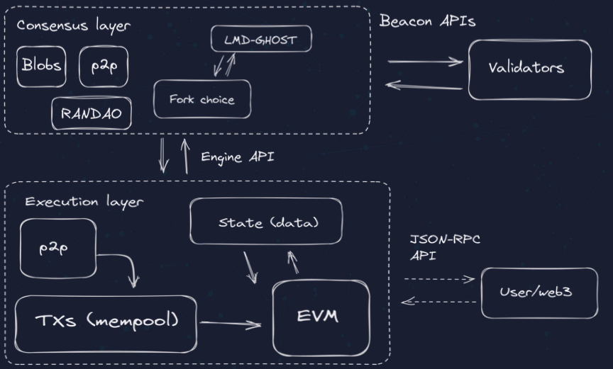
### POS & POW
Proof of Work（POW）和Proof of Stake（POS）是两种常见的共识算法，用于验证和确认区块链网络中的交易，并决定谁有权创建新的区块。
- 工作原理：
  - POW：矿工需要通过解决复杂的数学问题（例如哈希函数的计算）来竞争创建新的区块。解决问题所需的计算工作量称为”工作证明”，获得工作证明的矿工将获得创建新区块的权利和奖励。也就是挖矿
  -  POS：参与者根据自身持有的数字货币数量（即权益）来决定谁有权创建新的区块。拥有更多权益的参与者将更有可能被选择为区块的创建者。
- 能源消耗
  -  POW：计算量大，消耗大
  -  POS：计算量小，消耗小
- 安全性
  -  POW：由于矿工需要投入大量的计算资源，攻击者要想攻击网络需要掌握超过50%的网络算力，使得攻击成本非常高。因此，POW算法在安全性方面具有较高的保障
  -  POS：在POS算法中，攻击者需要掌握网络上货币的大部分数量，才能对网络进行攻击。这使得POS相对于POW来说，安全性较弱。
- 去中心化程度
  -  POW：POW算法允许任何人参与挖矿，从而实现了网络的分散化和去中心化。矿工可以通过竞争来创建新的区块，而不依赖于特定的权益。
  -  POS：POS算法中，创建新区块的权益是基于参与者所持有的货币数量，这可能导致权益更多的参与者具有更大的影响力。因此，相对于POW来说，POS可能在一定程度上缺乏完全的去中心化。
### 4.7
#### Week2 notes
再次感谢Chloe🙏，令人敬佩
##### 区块验证 Block validation
  共识层 Consensus Layer
  可以从共识层规范中了解共识层如何理解执行层
- Function process_execution_payload：
  - 由beacon chain验证这一个block是否有效，将CL向前移动
  - CL执行一些检查(incl. parent hash, previous randao, timestamp, max blobs per block, etc.)，把payload发送到EL进行更深入的验证
  - CL和EL之间的交流通过执行引擎
  - Spec link: https://github.com/ethereum/consensus-specs/blob/dev/specs/deneb/beacon-chain.md#modified-process_execution_payload
- Function notify_new_payload
  - CL 没有实现，因为它只是将执行负载发送到执行引擎，然后执行客户端将执行状态转换功能。
  - Spec link: https://github.com/ethereum/consensus-specs/blob/dev/specs/deneb/beacon-chain.md#modified-notify_new_payload
  
### 4.8
#### Week2 notes
接上文
  Excution layer (EL): Simple illustration written in Go
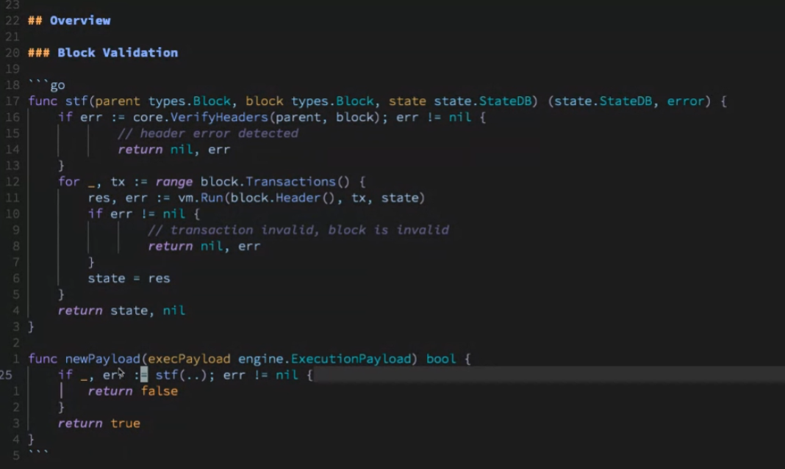

状态转换函数 State transition function (STF)
状态转换函数的工作流程大致如下：

1. **验证交易**：首先验证交易的有效性，包括签名的验证和交易发起者账户余额是否足够支付交易费用。
2. **执行交易**：然后根据交易的内容执行相应的操作。这可能包括转移以太币、执行智能合约代码或创建新的智能合约。
3. **更新状态**：执行交易后，更新全局状态以反映交易的结果。这可能包括改变账户的余额、更新存储的数据或更改智能合约的代码。
4. **收取交易费**：最后从交易发起者的账户中扣除交易费用，并将其作为奖励发给矿工或验证者。

- 所需参数
  - Parent block:(需要验证从父块到当前块的转换逻辑)
  - Current block
  - StateDB:(最后一个已知的有效状态，它存储与父块相关的所有状态数据)
- 返回结果
  - 更新状态数据库(StateDB):包括当前block的信息
  - Error(函数失败，状态数据库未更新)
- step 1：验证headers
  - 可能导致error
    - Gas limit 变化超过前一个block的 1/1024
    - block编号不连续
    - EIP-1559 基本费用未正确更新
    - etc.
- Step 2: 如果头文件正确执行交易
  - 范围覆盖block tx，通过 VM 执行每个 tx，如果 tx 正确则更新状态
  - 可能导致error
    - 有一个无效的tx，则整个block无效，并且状态不会更新
- Wrap function eg. newPayload
  - 需要的参数 
    - 执行负载（Execution payload）
  - 返回的结果
    - Return bool to the beacon chain
    - beacon chain 再call STF
- Q&A
- Why put block.header() into the vm.Run?
  - There are 2 pieces of context needed when executing the tx
    - The state: eg. Contract code, storage within the account etc.
    - The block context: eg. Parent hash, previous randao, base fee etc.
- The STF is called by the CL and gets returned whether it's valid. If it's not valid, what happens to CL?
  - The block is gonna be rejected.
##### Block building
illustration written in Go
### 4.9
###### Build Function
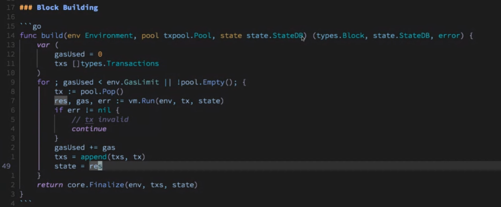
- 所需参数
  - 环境：时间戳、区块号、当前块、base fee
  - Tx pool：维护交易列表，按其价值排序​
  - 状态数据库
- 返回结果
  - block
  - 更新过的状态数据库
  - error
- step 1：跟踪使用过的 Gas 并存储发送到该块的交易
  - 交易可以连续添加到区块中，直到达到gasUse限制。目前主网gas限制大概是30m
- step 2；从交易池中获取下一个最佳交易并执行
  - 用 Pop() 获取下一个最佳交易，通过 VM 执行，并附加所有已执行的交易
  - 如果由于交易无效而出现错误，则该过程将继续，直到没有 Gas 或交易池为空。​
- step 3:使用Finalize函数返回结果
  - Finalize 函数获取交易和有关该块的信息，并生成一个完全组装的块
##### Q&A
- Is the txpool ordered in any way? If not, how do we ensure maximal profit when using pool.Pop?
  - Orderd by the highest paying tx to the builder
  - Every time you call Pop(), you will get the tx that is giving you the most value per gas.
- When building the block, does the EL reject any tx before sending it to the CL?
  - The only time you reject a tx is when it's invalid. In general, the tx pool would verify if the tx is valid, so this situation doesn't occur too much. 
- Encrypted mempools: 1. How viable is that? 2. Since block txs are ordered by gas price, is gas unencrypted under such design?
  - It's a challenging problem and there are many ideas on how to do it. Some might have unencrypted gas, some even have unencrypted sender info, but that all leaks some kind of info. 
  - From Ethereum perspective, this might be solved in the future when an efficient way to encrypt mempool is figured out.
- Whether there are any erase conditions to worry about here? eg. Tx from the mempool being incl. In the block and then be deleted before you build another block
  - The tx pool is supposed to do the tx verification, so generally the txs are valid here. But the pool is not always in sync and might cause some tx to be invalid, and the erase condition could happen. 

### 4.10
##### 进一步了解STF、EVM 和 P2P 协议
###### State transition function(STF)
- newPayload函数
  - 共识层(CL)调用，执行层(EL)将对块信息进行一系列完整性检查。
  - 一直向下insertBlockWithoutSetHead函数，也就是实际入链的位置。
  - Link: https://github.com/ethereum/go-ethereum/blob/master/eth/catalyst/api.go
- insertBlockWithoutSetHead 函数
  - 该函数执行区块，运行验证，然后将区块和交易状态保存到数据库中。 与InsertChain 函数的主要区别是它不会进行规范链更新。仍然依赖于额外的 SetCananical 函数调用来完成整个过程。
  - Link: https://github.com/ethereum/go-ethereum/blob/master/core/blockchain.go
- insertChain函数
  - verifyHeaders 函数：检查 header 是否符合共识规则
    - 将验证多个项目，例如header的 EIP-1559 属性（以确保 Gas 限制在允许的范围内）、Gas 限制、使用的 Gas、时​​间戳等，并确保所有字段都正确。
    - 一旦验证了headers，就可以执行该块。
    -   - Link: https://github.com/ethereum/go-ethereum/blob/master/consensus/beacon/consensus.go
- Process 函数
  - 所需参数包括Block, stateDB, vm config
  - Geth中的状态转换通过state_processor
    - 流程与 STF 概述类似，但有更多细节。
    - Link: https://github.com/ethereum/go-ethereum/blob/master/core/types.go
    - Link: https://github.com/ethereum/go-ethereum/blob/master/core/state_processor.go
  - 一旦该过程完成， blockchain将更新更多指标并最终将block写入状态。
###### Q&A
- What's a Receipt?
  - A receipt is information about a transaction that can only be verified or determined after executing the transaction.
  - Link: https://github.com/ethereum/go-ethereum/blob/master/core/types/receipt.go
- Question regarding the environment of multiple transactions which result in multiple other transactions: How is the context environment that you use? How is it fetched?
  - EVM environment: 
    - Transaction level context: Might change within the block, eg. Gas price, blob etc.
    - Block level context: Fixed across the entire block, eg. Block number, base fee, time difficulty etc.
    - Link: https://github.com/ethereum/go-ethereum/blob/master/core/state_processor.go
  - EVM interpreter: 
    - ScopeContext: Change within the tx, eg. Memory, stack, contract
    - Link: https://github.com/ethereum/go-ethereum/blob/master/core/vm/interpreter.go
###### EVM
**EVM structure**
- 想象该区域是 EVM 调用帧，它在整个交易过程中发生变化。在 EVM 调用框架内，有：
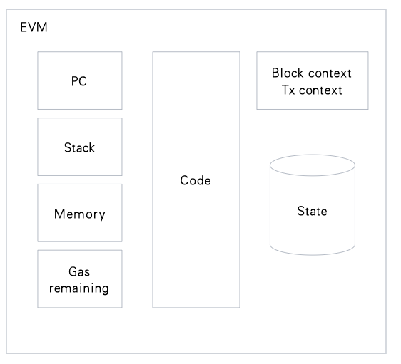
  - Code
  - PC (Program Counter): If PC is at 0, the interpreter will load the instruction at index is 0 in the code, then execute it. Then it would update the PC by 1 byte. 
  - Stack
  - Memory
  - Gas remaining
  - Block context & Tx context
  - State
### 4.11
**EVM 中不同类型的指令**
- 算数：加减、指数、乘法
- 位运算：bit-banging *这里应该是chloe的小错误*
- 环境：授予对块上下文和交易上下文的访问权限​。
- 控制流：对于更复杂的程序，eg.Branch (EIP 4788)
  - Link: https://github.com/lightclient/4788asm
- stack
- System: eg. call, create, return, sstorage etc.
- Memory: eg. mload, mstore, mstore8 etc.
###### Q&A
- How were the various instruction costs determined? Are they basically incentives to reduce the load of the network?
  - There is a target gas per second, which is a benchmark for the cost decision. Today a lot of the instructions just use what the gas cost of other similar types of instructions as the benchmark. 
###### P2P协议
- 执行层在devp2p上运行，devp2p是以太坊的定制协议
devp2p 协议命名的有趣历史：
**p2p 协议的职责：访问历史数据和待处理的交易以及状态​**
- 历史数据：从以太坊获取历史数据的3种方法
  - GetBlockHeaders：要求对等方返回块头消息
  - GetBlockBodies:通过hash请求块体数据
  - GetReceipts:要求对等方返回包含给定块哈希的收据的收据消息
- 待处理交易（还不在块中的）
  - Transactions：具体的交易方应确保包含在其交易队列中的
  - NewPooledTransactionHashes:向对等方发送交易类型、大小、交易哈希值的列表；如果对等方之前没有见过交易哈希值，那么它将调用 GetPooledTransactions 函数
    - 目标是通过仅将完整的交易发送到对等点的平方根而不是每个对等点来减少执行客户端的带宽
- State
  - Link: https://github.com/ethereum/devp2p/blob/master/caps/snap.md
  - Snap sync: 它可以被视为一个两阶段协议。第一个阶段是连续状态检索，第二个阶段是修复阶段，以同步状态树。
###### Q&A
- How do you know you are not downloading the wrong data from the wrong chain?
  - The process would be
    - Start with the weak subjectivity checkpoint, which will give a root
    - Get the block associated with the hash
    - Start snap against that block state
  - The state root you are snapping sync with is authenticated by you, so you assume it is correct and download the state. The data you get back would be a witness against the root. 
  - The only thing that could possibly happen is that the state was computed incorretly and you downloaded the corrupted state that the chain has accepted. That is extremely unlikely to happen as we have the economic majority verifying the chain. 
### 4.12
### week3
#### 区块链提供了一种创造数字稀缺的方法
- 为什么我们首先关心区块链？
  - 区块链创造了一种制造数字稀缺的方法，这是以前很难实现的。
  - 因此，数字稀缺性的这种特性可用于模拟数字领域中不同类型的物理资产，例如。金钱、代币、产权等
- 数字稀缺之道：创造稀缺数字货币的例子
  - Target:创建具有稀缺性的数字货币
  - unit:coins
  - Scarcity:一次只有 N 个硬币。用户不能花费比他们拥有的更多的硬币
  
|       | Single trusted operator case | Distributed nodes case     |
| :---        |    :----   |          :--- |
| Operator     | 单个操作员运行一个实现该货币协议的网络服务器 | 实现该协议的分布式节点网络​N 个节点将根据相同的输入计算一些输出
| Implication   |用户需要信任该网络服务器运营商以确保不会出现双重支出|通过不同节点之间的“状态机复制”达成共识，无需可信的第三方
| Consequence   | 由于不同的场景，很难有值得信赖的运营商，eg.货币协议中的bug  、协议服务器主动攻击、不诚实的Operator 、由于稀缺而攻击和滥用协议的动机| 系统中的节点将复制相同的输入日志以获得相同的输出  、每个节点都应该就输出达成一致，并且诚实的节点最终必须得到相同的输出 、随着节点数量的增加，系统变得更难被攻击  |
| result   | 需要删除单一可信Operator并最小化信任       | 输出错误的节点，只要有大多数节点对输出状态有相同的看法，协议就可以达成共识并继续运行   |

### 4.13
#### 分布式网络处理拜占庭容错（BFT）
##### 为什么需要拜占庭容错
- 如果更多的节点可以带来更高的安全性，那么我们希望拥有更多的节点。然而，在开放和分布式系统中，节点可能会出现问题（例如硬件故障、丢失消息、错误、攻击等），从而导致与共识不同的错误输出。
- 因此，我们需要有一定的容错能力才能使系统继续运行
##### 拜占庭容错是啥
- 拜占庭容错 (BFT) 是能够抵抗Byzantine Generals问题派生的故障类别的系统的属性。这意味着即使某些节点发生故障或恶意行为，BFT 系统也能够继续运行。
##### Two-phase commit (2PC)
1. 准备阶段：一个节点将询问其他节点是否可以提交提议的交易。
  在 Ethereun 中，具有包含新交易的更新状态的节点将向所有其他节点广播更新的状态。其他节点将确认收到。当达到 BFT（2/3 绝对多数）时，准备阶段就完成了。
1. 提交阶段：节点将命令其他节点提交或中止提议的交易。
  就以太坊而言，当达到 2/3 超级多数时，系统内的节点将更新到新状态。
##### 实用拜占庭容错（PBFT）
- PBFT共识算法允许分布式系统即使在少量节点表现出恶意行为的情况下也能达成共识。
- PBFT的问题
  - 由于节点之间需要大量的通信，它仅适用于较小的共识组大小（例如，如果系统中有 10 个节点，则需要 10^10 次消息传递来交换更新的状态并达到共识。）
  - 它还容易受到sybil attack ，其中一方可以创建或操纵网络中的大量节点，从而损害网络​
##### Q&A
- Do PBFT protocols have an upper bound of nodes? If yes, what is that, practically speaking?
  - The number of nodes doesn't have a hard cap, but there is a trade-off between high throughput and low latency. 

### 4.14
##### 比特币用PoW方式解决BFT
###### 比特币被认为是解决Byzantine Generals问题的第一个解决方案
- 系统可以扩展到无限的节点数量
- 开放且无需许可的参与
- 使用PoW机制达成共识
###### 比特币共识机制
- 比特币的状态机复制
  - 输入：交易（以区块形式组织）用于花费比特币
  - 输出：比特币账本的当前状态
- 使用密码学来减少可能的状态空间
  - 数字签名：使用密码学来验证交易的真实性
  - 父哈希：每个新块必须包含前一个块的哈希
- 使用PoW实现共识
  - 挖矿难度调整：
    - 比特币有挖矿难度的概念，指的是矿工解决数学方程并找到下一个区块的哈希值的难度。
    - 挖矿难度由网络总算力决定。如果更多的矿工加入网络，哈希率增加，挖矿难度就会增加，反之亦然。
  - 挖矿难度调整的影响：
    - Sybil 保护：新区块必须执行一定量的工作才能被视为有效
    - 共识算法：：节点寻找链头的方式是总结每个区块所做的挖矿难度，选出总难度最大的链
  - 发行本币BTC进行激励：
    - 为当前工作量最多的单链提供奖励以激励工作​
### 4.15
#### 以太坊从 PoW 转向 PoS
##### PoW -> PoS的本质
- 从系统中用于 Sybil 保护（工作）的外源信号切换到内源信号（权益）
- 背后的考量
  - PoW 的能源使用问题
  - PoW 的激励问题：与 PoW 相比，PoS 的协议内信号允许惩罚​​和奖励
##### 以太坊共识机制
- 验证者：协议内共识参与者
  - 成为共识验证者
    - 用户需要锁定32个ETH并将其发送到EVM中的存款合约中，这将在共识层级别看到。
  - 责任
    - 进行证明：即验证器对链的状态进行加密签名​
    - 不同类型的证明
      - LMD GHOST 投票：验证者对信标链头部进行证明
      - Casper FFG 投票：验证者在当前纪元中证明检查点
- 关键概念和术语
  - Slot
    - 每12秒就会有一个新的slot，每个slot都会有一个区块
    - 在槽内，它分为3个阶段，每个阶段耗时4秒。而一个时隙中最关键的时刻是 t=4 时的证明截止时间。([Paradigm blog](https://www.paradigm.xyz/2023/04/mev-boost-ethereum-consensus))
  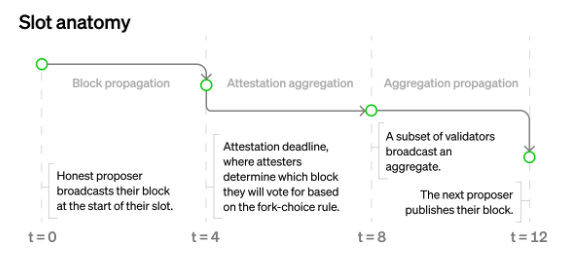
  - Epoch
    - 每个Epoch有 32 个slot。创建Epoch的原因是为了减少共识处理的频率，这样就不需要在每个slot中都发生
    - 较重的处理通常在纪元边界进行，包括。削减，奖励信息等。
    - Epoch boundary blocks（EBB）也可以被视为检查点的同义([The Beacon Chain Ethereum 2.0 explainer](https://ethos.dev/beacon-chain))
  - Committee
    - 网络内的验证者将在不同的委员会下随机洗牌。
    - 每个验证者将在每个时期进行一次证明。验证器分配的确切槽位由协议通过 RANDAO 确定。
  - Finality
    - 最终性意味着交易是无法更改的区块的一部分
    - 合理性：当一个epoch结束时，如果其检查点已经聚集了 2/3 的绝对多数，则该检查点就被合理化了。
    - 最终性：当一个检查点被证明合理时，之前已经证明合理的检查点将被最终确定
### 4.16
#### Q&A
  - Is there any significance of choosing 32 ETH? 
    - It's a choice under tradeoff. i.e. If the threshold is too low, there will be too many validators, thus it may take too long to reach consensus. And if the threshold is too high, there will be too few then the system becomes less secure.
    - Originally, the core dev was thinking of 1000 ETH as the threshold, then Justin Drake suggested the usage of BLS signature technology, which lowered the minimum capital required to 32 ETH.
    - Justin Drake's research on pragmatic signature aggregation with BLS: https://ethresear.ch/t/pragmatic-signature-aggregation-with-bls/2105
  - Why there is 12s in a slot?
    - The 12s is kind of arbitrary, which is inspired by the PoW time (14s on average).
  - Question about randomess of RANDAO and how validators shuffled randomly?
    - The randomness is achieve using the algorithm RANDAO that mixes a hash from the block proposer with a seed that gets updated every block. This value is used to select a specific validator from the total validator set. The validator selection is fixed two epochs in advance as a way to protect against certain kinds of seed manipulation. 
    - Although validators add to RANDAO in each slot, the global RANDAO value is only updated once per epoch. (Block proposal)
    - Github link: https://github.com/randao/randao
  - Gasper in the context of finality and finding the canonical chain?
    - Gasper is the combination of Casper-FFG and LMD-GHOST fork choice algorithm (Gasper)
      - Casper is the mechanism that upgrades certain to finalized, so that new entrants can be confident that they are syncing the canonical chain.
      - LMD-GHOST is the fork choice algorithm that uses accumulated votes to ensure that nodes can easily select the correct one when forks arise in the blockchain.
  - Brief explanation of PBS (proposer-builder separation)
    - PBS (proposer-builder separation):
      - MEV issue: MEV refers to validators max their profit by favourably ordering txs. Maximizing MEV requires sophisticated know-how and hardware & software, which could potentially lead to centralization as institutional operators usually outperform individual validators. 
      - PBS: Allow block proposer to outsource block construction, so that validators can continue running on consumer-grade hardware without missing out MEV exposed
      - Research link: https://ethresear.ch/t/why-enshrine-proposer-builder-separation-a-viable-path-to-epbs/15710
      - Roadmap blog: https://ethereum.org/en/roadmap/pbs/
    - Some of the important things on the roadmap of Ethereum
      - SSF (single slot finality): Aim to get finality in a single slot
        - Vitalik post on SSF: https://notes.ethereum.org/@vbuterin/single_slot_finality
        - Roadmap blog: https://ethereum.org/en/roadmap/single-slot-finality/
      - SSLE (single secret leader election): Aim to have proposer selection in secret
        - Research link: https://ethresear.ch/t/simplified-ssle/12315
        - Roadmap blog: https://ethereum.org/en/roadmap/secret-leader-election/
      - Max EB (max effective balance): Aim to increase the effective balance of Ethereum validators at 32 ETH
        - Research link: https://ethresear.ch/t/increase-the-max-effective-balance-a-modest-proposal/15801
### 4.18
### week 4
#### Execution Layer Testing
#### EVM testing
- 主要目的：验证每个执行客户端都遵守规范，否则会导致链中潜在的积极分叉
- 设置：为每个客户端提供相同的输入，并期望在相同的环境、预设、硬分叉激活规则的情况下从每个客户端获得相同的输出
- 测试的重要特性
  - Pre-state:以太坊链的整个组成，由具有余额、随机数、代码和存储的帐户组成
  - 环境：根据测试的类型，环境可以指定诸如时间戳、先前的 RANDAO、区块编号、先前的区块哈希值、总 Gas 限制、基本费用和硬分叉激活时间等内容。
  - Transaction(s)：发送到区块链的消息，在区块链上执行操作，其中包含源帐户和目标帐户、以太币值、gas 限制和数据
  - Post-state：由修改或创建的帐户组成的结果状态
#### EVM testing - Tests Filling
- Definition of Test filling: 将测试源代码编译成可供任何执行客户端使用的固定装置的过程
- Test filling vs Client unit testing:对于测试填充，可以在任何客户端实现中执行完全相同的测试。而对于客户端单元测试，不同的客户端团队之间可能会有所不同。
- 特性：所有不同格式的测试装置都是单个 JSON 文件，可供每个客户端使用
#### EVM testing formats
- state testing
  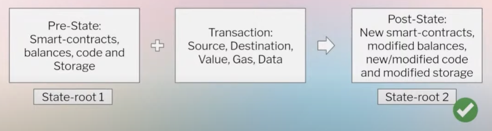
  - 使用状态根进行验证：给定相同的预状态和相同的交易，不同的客户端应该返回相同的状态根
    - 状态根：安全提交状态所有内容的加密计算
- 模糊微分状态测试
  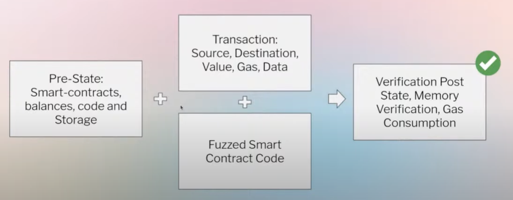
  - 在设计的交易之上，将使用 FuzzyVM 工具添加模糊智能合约代码。不同的客户端仍应返回相同的状态根
- Blockchain testing
- 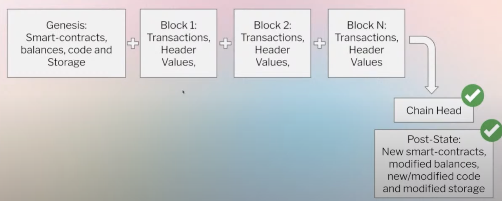
  - 由于我们在执行客户端上检查的所有内容并非都是 EVM 执行的一部分，例如前一个区块的执行结果、1559 基础费用等，因此还需要进行全区块测试来验证客户端的执行情况。
- Blockchain negative testing
  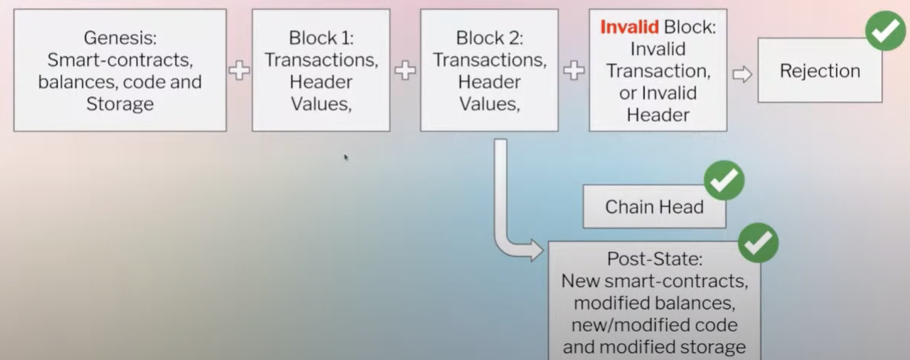
  - 在某个时刻添加无效块，以检查客户端是否可以出于设计目的拒绝无效块，返回到之前的有效块并将其声明为链头​
### 4.19
#### Tests Filling in details
##### ethereum/tests
- [Repo link](https://github.com/ethereum/tests)
- 特点
  - JSON 和 YAML 源代码
  - 提供简单的参数化
  - 由 Retesteth 填充（C++）
##### ethereum/execution-spec-tests
- [Repo link](https://github.com/ethereum/execution-spec-tests)
- 特点
  - Python源码
  - pytest 提供支持，并提供简单到复杂的参数化
  - 由于转换功能，仍然需要实际的客户端实现来填充
- 规范测试
  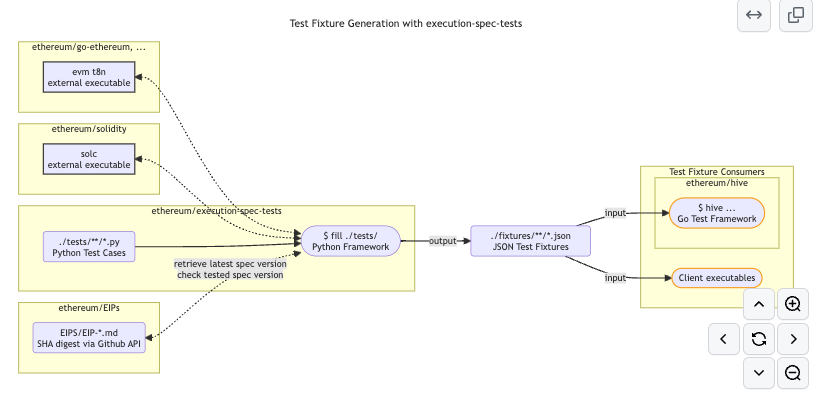
  - 从包含所有书面参数化的 Python 测试开始
    - 目前，从 Frontier 到 Cancun，每个分支都有一个 Python 测试
  - 三个依赖关系
    - Evm t8n：Geth sub-command evm t8n
      - 理由：由于测试用例是用Python编写的，开发人员需要执行客户端来提供实际的客户端实现
      - 命令输入：所有预状态、交易和环境
      - 输出：执行结果
    - Solidity: (开发人员在测试中越来越少使用)
      - 仅当开发人员无法通过字节码编写来完成非常复杂的代码时才使用 Solidity
    - EIP/ EIPs：开发人员编写测试时规范的主要来源​
  - Two main sub repos: Source & Tests
    - Src: https://github.com/ethereum/execution-spec-tests/tree/main/src
      - 框架的源代码，即开发人员用来填充测试的代码
      - src里没有测试
    - Tests: https://github.com/ethereum/execution-spec-tests/tree/main/tests
      - Incl. hardfork tests, from frontier to cancun
      - 由于 ethereum/execution-spec-tests 存储库是从上海升级激活的，上海和cancun对所有 EIP 进行了测试，而对于之前的 EIP，完整测试将在 ethereum/tests repo中
### 4.20
#### FuzzyVM
- [repo link](https://github.com/MariusVanDerWijden/FuzzyVM)
- fuzz EVM框架
  - FuzzyVM 创建状态测试，可用于相互区分fuzz EVM 实现
  - 它只关注测试生成部分，测试执行部分由[Go evmlab](https://github.com/holiman/goevmlab)处理
#### 执行 API 测试
- [repo link](https://github.com/ethereum/execution-apis/tree/main/tests)
- 测试用于查询执行客户端的所有执行 API
#### 共识层测试
- [repo link](https://github.com/ethereum/consensus-specs/tree/dev/tests)
#### 特点
- 在规范中独立，因此可以在同一个repo中编写和填写测试，而不依赖于任何共识层客户端
- 在生成所有客户端都可以使用的不同格式的测试fixture方面也有类似的想法
- python 实现
#### 共识层测试格式
- [repo link](https://github.com/ethereum/consensus-specs/tree/dev/tests/formats)
- 共识层测试格式比 EVM 的测试格式更多。对于开发人员来说，对共识层的各个方面进行精细测试非常有用。
### 4.21
#### 跨层（Interop）测试
##### 特点
- 涉及测试完全实例化的客户端、向其提供信息并验证其行为的正确性
- 总的来说，它正在构建从 Genesis 到某个点的链，然后验证执行层和共识层之间的所有交互是否都正确发生
##### Hive
- [repo link](https://github.com/ethereum/hive)
- Hive 是一个针对以太坊客户端运行集成测试的系统
  - Hive 与其他通用 CI 基础设施的不同之处在于以太坊客户端及其功能的紧密集成。
  - Hive的工作流程
    - 搭建Hive服务器并启动
    - Hive 服务器将启动给定的模拟器，其中包含有关如何运行测试的所有说明。模拟器的工作是知道何时开始和结束测试、如何、何时开始和结束客户端等。
  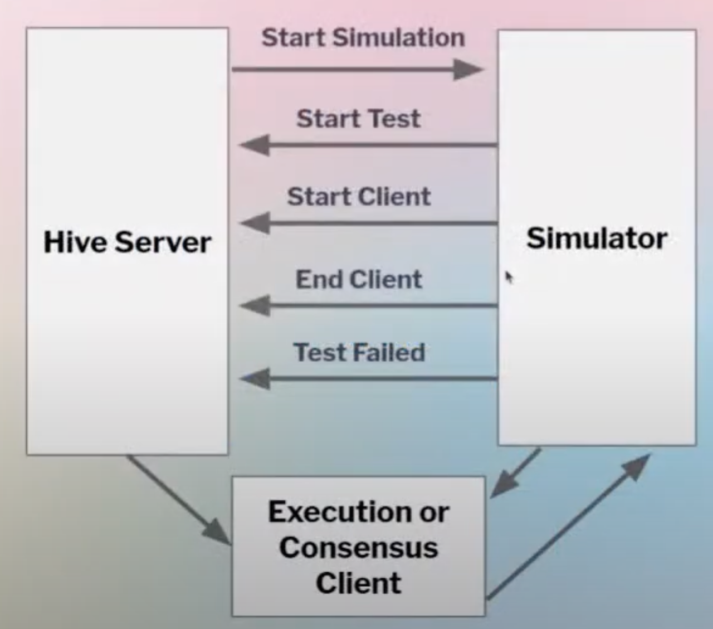
- 不同的 Hive 模拟器
  - [repo link](https://github.com/ethereum/hive/tree/master/simulators)
##### 开发网
- 用于验证概念证明或硬分叉早期阶段的有限节点数链
##### Shawdow forks
- 配置为遵循以太坊主网的有限节点数分叉，但具有早期硬分叉配置时间来测试真实网络活动
##### 公共测试网
- Goerli testnet (Deprecated)
- Sepolia testnet (Launched in Oct 23rd, 2021)
- Holesky testnet (Launched in Sep 28th, 2023)
##### 安全
###### 潜在问题
- EL side
  - 有效失效：执行客户端使完全符合以太坊规范的区块失效
  - 无效验证：执行客户端验证了不符合以太坊规范的块
  - 区块执行期间的 DoS：由于交易，客户端花费太多时间来处理区块​
- CL side
  - Faulty clients and finalization
  - <33% faulty node majority: can cause missed slots but chain will still finalize
  - 33%+ faulty node majority: can cause delayed finality
  - 50%+ faulty node majority: can disrupt forkchoice
  - 66%+ faulty node majority: can finalize an incorrect chain 
###### Bug bounties
- Link: https://ethereum.org/en/bug-bounty/
###### Public disclosures
- Link: https://github.com/ethereum/public-disclosures
### 4.22
#### Q&A
- As the EVM testing needs Geth implementation to fill the test, what if there is a bug in Geth's code or how to ensure there is no bug?
  - Ideally, devs don't want to depend on Geth's implementation. Devs are currently working on another specs-oriented repo, so that in the future the test filing will not be dependent on Geth. 
- Which is the most complex part to test in EL/ CL? How much time it takes to run all these tests?
  - Interopperability is the most complex part. 
  - EVM is also complex in its own way as there are lots of nuances during execution, which needs multiple back and forth testing.
  - Regarding the time, it depends on the hardware running the test. Currently, it takes 5-10 mins to run the execution spec test in parallel
- How to communicate bugs to the client teams?
  - It depends on the severity of the bug. If the bug affects any live network, it's gonna be handled with caution such as communicate to the specific dev or through special communication.
### 4.23
### Week 5 :EPFsg Ethereum Roadmap Notes
#### Merge: Better PoS

- Beacon chain 启动和合并
  - 目前它拥有近 100 万验证者，质押超过 3100 万枚 ETH（约 1100 亿美元）
  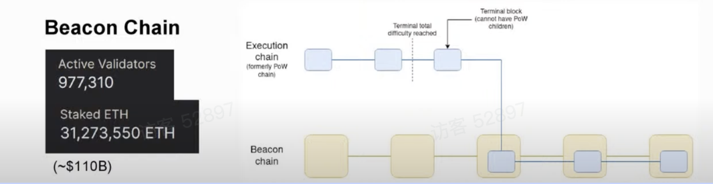
- 预热分叉 (Altair)：Sync committee/ Light client protocol
  - Sync committee
    - Altair 分叉引入了同步委员会，而不是让每个验证者验证每个时期的每个slot
    - 每个委员会有 512 名验证者，每 256 个 epoch（约 27 小时）轮换一次
    - [Altair link](https://github.com/ethereum/annotated-spec/blob/master/altair/sync-protocol.md#introduction)
  - Light client protocol
    - 同步委员会的目的是允许轻客户端跟踪信标块头的链
    - 关键特点
      - 轻量级：512 个签名用于检查 VS c.1m 验证器用于先前检查
      - 信任最小化而不是无信任
    - [有关轻客户端的更多链接](https://a16zcrypto.com/posts/article/an-introduction-to-light-clients/)
### 4.24
- Secret Leader Election (SLE)
  - 当前的问题
    - 领导者/提议者（即负责在每个时隙提议区块的验证者）会提前一点透露。因此，理论上它会受到DoS攻击。
  - SLE的解决方案
    - [EIP 7441](https://eips.ethereum.org/EIPS/eip-7441)将区块提议者选举升级为 Whisk
      - 将区块提议者选举机制升级为单一秘密领导者选举协议 Whisk
      - 允许当选的区块提议者在区块发布之前保持私密，以防止 DoS 攻击
    - 目前，SLE 的优先级相对较低。但如果发生此类 DoS 攻击，优先级可能会发生变化。
- Single Slot Finality(SSF)
  - 问题
    - 当前的最终确定时间是在 2 个 epoch（约 12.6 分钟）之后，因为需要检查和聚合的签名太多。
    - 开发人员希望将最终速度提高到 1 个slot（12 秒）
  - 解决方案
    - 通过 Max EB 减少验证者[EIP 7441](https://eips.ethereum.org/EIPS/eip-7441)
    - 更少的活跃验证器，例如，rotating cap
    - 更少的验证器 (8,192) + 分布式验证器技术 (DVT)
    - 更好的签名聚合方案
  - Vitalik 关于 SSF 之路的博客：https://notes.ethereum.org/@vbuterin/single_slot_finality
### 4.26
- 理想的量子安全签名：量子证明信标链
  - 问题
    - 以太坊信标链目前依赖 BLS 聚合将签名聚合为单个组合聚合。
    - 然而，当前的方法容易受到量子计算机的攻击，而且并不是SNARK友好。
  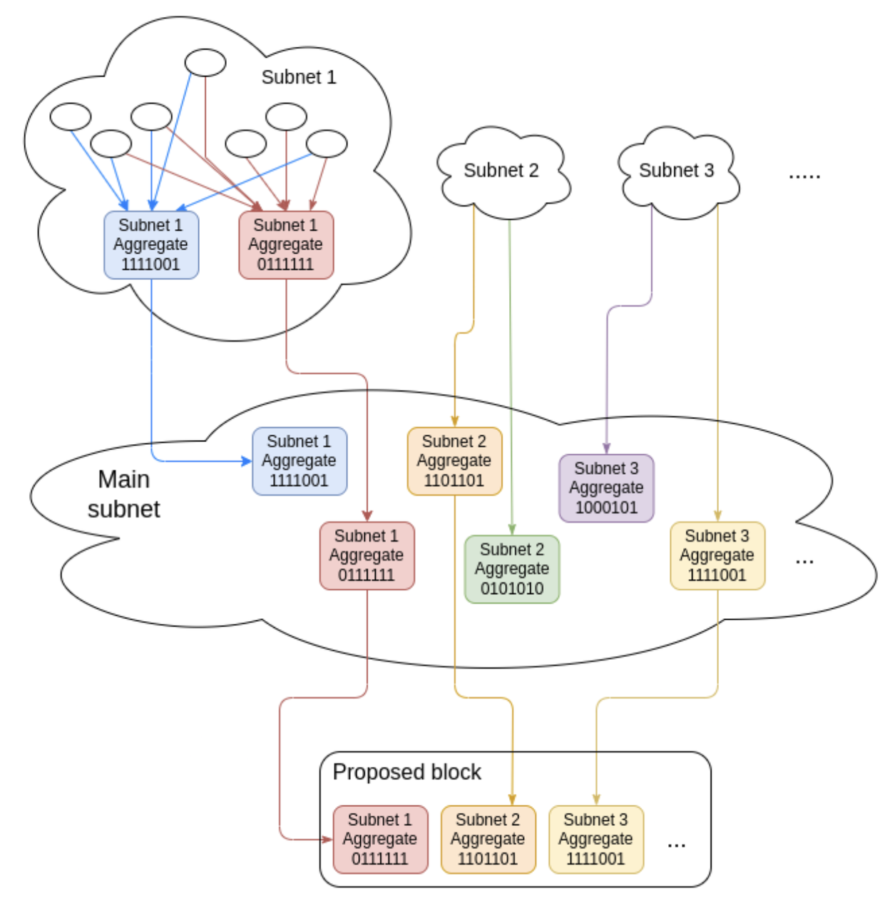
  - 更好的实现
    - 递归路由，其中​​聚合发生在多个层中。这使得网络具有高度非结构化和量子证明性。
    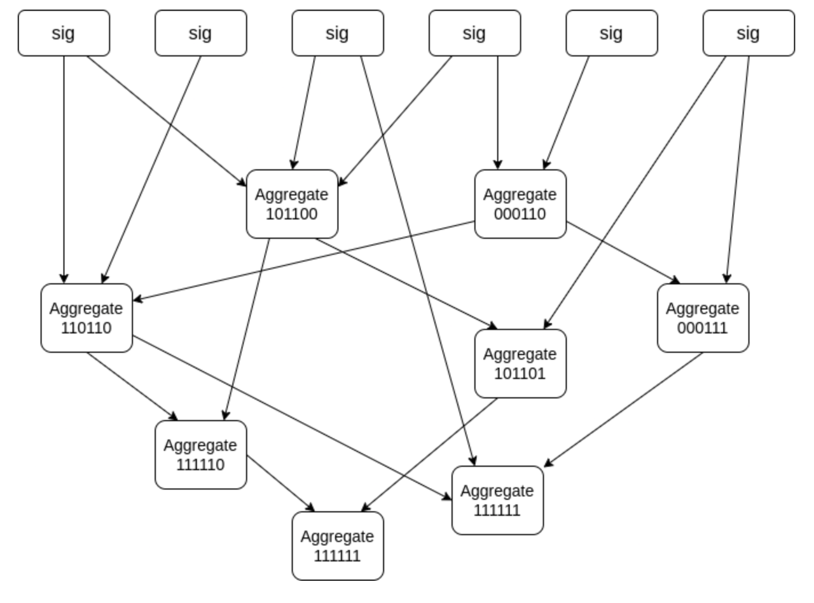
  - 又是一篇V神的vlog：https://hackmd.io/@vbuterin/stark_aggregation
#### Surge：更多数据可用于汇总
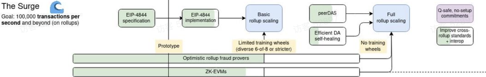
- 基本汇总缩放
  - 扩展以太坊
    - 安全扩展 L1 执行很困难，但扩展 L1 数据更容易
    - rollup 的作用是将 L1 数据转换为 L2 执行
  - 以 Rollup 为中心的路线图
    - 乐观汇总
      - 假设所有交易都是有效的
      - 如果没有通过欺诈证明，则去掉排序器
    - 零知识汇总
      - Sequencer证明交易有效
      - 经过 L1 验证的简洁证明
    - 所有汇总数据必须在 L1 上可用
    - 所有汇总都应该能够强制包含 L2 txn（即退出回到 L1）
  - 更多链接
    - V神的An Incomplete Guide to Rollups：https://vitalik.eth.limo/general/2021/01/05/rollup.html
    - V神发布的以 Rollup 为中心的以太坊路线图：https://ethereum-magicians.org/t/a-rollup-centric-ethereum-roadmap/4698
### 4.27
读了上面提到的V神的文章
- Limited training wheels on Rollups
  - 可升级/可变
  - 多重签名/有限治理
  - 许可元素
  - Rollups 的结束：像 L1 一样去信任，但至今仍然不是
  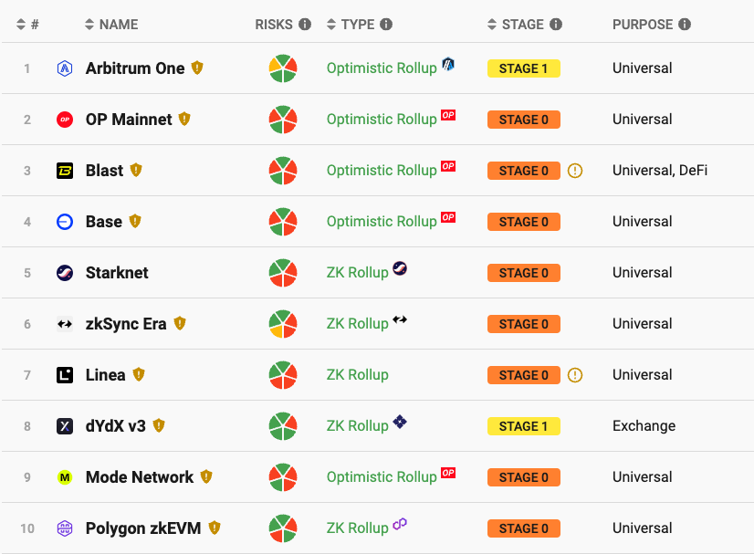
### 4.28
- 数据可用性采样(DAS)
  - 最终问题：证明数据可用
  - 方法
    - 一种方法是下载所有数据以证明其可用。然而，这并不能很好地扩展。
    - 另一种方法是获取数据并通过在多个点评估该方程来将其扩展为多项式方程。然后使用多项式承诺方案进行随机抽样。
      - 对于多项式方程，50%的数据&扩展可以恢复100%的数据。
      - 通过多项式承诺方案，可以通过一些样本检查来验证数据可用性，而无需承担下载所有数据的全部负担。
  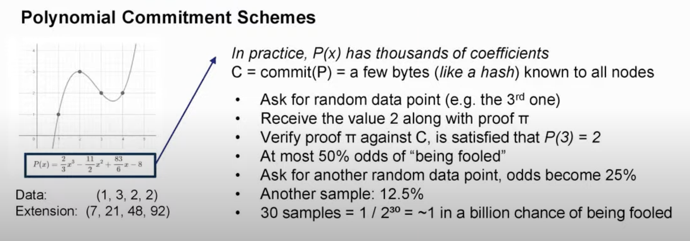
- EIP 4844 引入 blobspace
  - DAS
    - 还没有花哨的采样，因此每个节点都需要下载所有 blob
    - 但 EIP 4844 为使用 KZG 承诺方案的 DAS 奠定了基础
  - 保守初始值
    - 目标为 3 个 blob/块，最多 6 个 blob/块
    - Blob 的定价与 EIP 1559 类似，基本费用被销毁：如果区块有 3 个以上 Blob，价格就会上涨，反之亦然
  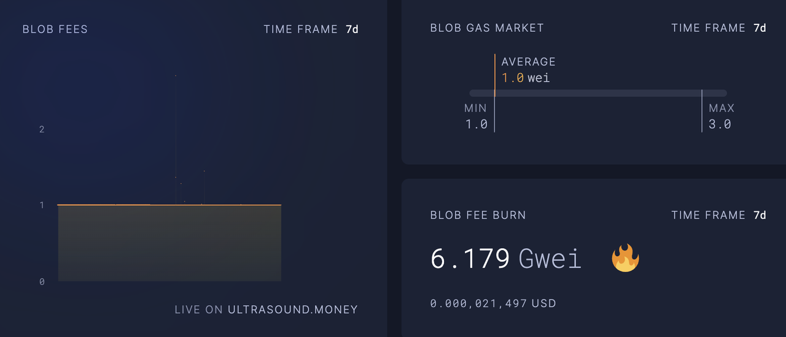
### 4.29
  - Quantum-proof blobspace
    - 问题
      - KZG 缺点：不具备量子证明，需要可信设置（>14 万贡献者）
    - 残局解法
    - 基于 STARK 或 Lattice 的热插拔 KZG
  - 跨汇总互操作性
    - 问题 ：汇总之间的流动性碎片
    - 解决
      - 建立汇总之间的标准
      - 基于汇总、预先确认、共享排序
### 4.30
#### Scourge：MEV 缺点较少
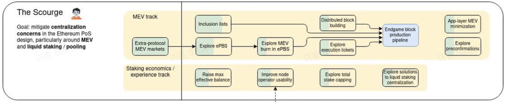
- MEV轨道
  - 提案者/构建者分离（PBS）
    - 当前的问题：MEV 是不可避免的，不受控制的 MEV 市场将伤害单独的利益相关者
    - 目标：最小化验证者必须做出的选择并减少对专门验证者的激励
    - 解决方案
      - 当前的解决方案：MEV boost 协议外，中继充当可信经纪人
      - 未来的解决方案：Enshrined PBS (ePBS)，它消除了中继并允许 MEV 燃烧以平滑质押收益率
      - 未来的解决方案：包含列表，它对构建者施加限制，并通过强制交易包含来减少审查
    - 残局区块生产
      - 中心化区块生产
      - 去中心化验证
      - 强大的反审查保护
  - V神在Endgame的blog： https://vitalik.eth.limo/general/2021/12/06/endgame.html
- Execution tickets
  - 处理 MEV 和单独质押者收益扭曲的解决方案
    - 提前出售提出区块的权利，就像买彩票一样
    - 更多的角色分离，例如证明和提议之间的角色分离
  - 关键features
    - 证明者保持简单，而提议者可以专业化（受包含列表的限制）
    - 无需许可的 degen MEV 彩票（门票成本 ~= 每个区块 MEV 的预期值）
  - EthResearch 执行票证：https://ethresear.ch/t/execution-tickets/17944
  - 应用层 MEV 最小化​
    - 考虑 MEV 开发更好的 Dapp
    - 例子：https://www.mev.wiki/solutions/mev-minimization
  - 预先确认
    - 从建造者处获得下一个区块包含保证
    - 与执行票和重新抵押计划完美搭配 
### 5.1
- 质押经济学
  - 提高最大有效余额 (MaxEB)
    - 当前 EB：最少 32 ETH，最多 32 ETH
    - MaxEB 之后：最少 32 ETH，最多 2048 ETH​
      - MaxEB 可以实现奖励自动复利，并且相同数量的权益可以减少验证者的数量
      - 验证器开销的降低可以减少网络上 P2P 消息的数量，并成为实现单时隙最终性的途径​
  - 探索总股份上限
    - 与开销/SSF相关
    - 正在进行的研究
      - 改变发行曲线（可能变为负值），股权目标
      - EthResearch on Endgame Stake 经济学：目标案例：https://ethresear.ch/t/endgame-staking-economics-a-case-for-targeting/18751
  - 流动性质押中心化
    - 正在进行的研究：供奉？削减上限的处罚？​
### 5.2
#### Verge：更容易验证
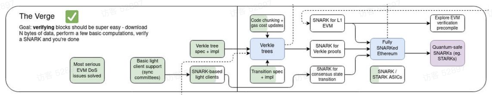
- Verkle trees
  - 状态 vs 历史
    - 状态：所有当前余额
    - 历史记录：所有过去的转账/交易
  - 当前的方法
    - Merkle-prove：接收新节点，计算中间节点，并检查状态根是否与块头匹配
    - 节点需要同步历史记录，计算状态，然后检查余额并验证新的交易。然而，随着状态规模的增长，Merkle 证明可能会变得更大且难以管理
  - 未来方法
    - Verkle-prove：每个节点都是对其子节点的多项式承诺。不再需要兄弟姐妹，因为证明只需要路径、中间节点和开放证明
    - Verkle树的特点
      - 更短的状态证明
      - 更宽的树：256 个兄弟姐妹 vs Merkle 树中的 16 个兄弟姐妹
      - ZK 友好的证明
      - 允许无状态验证器：不需要历史记录，即时同步
      - 轻客户端变得更轻
      - 降低开发人员对集中式索引器的依赖
    - 更多Verkle上的信息:[Verkle.info](https://verkle.info/)
### 5.3
- Fully SNARKed Ethereum
  - Snarkify 轻客户端协议（同步委员会过渡）
  - Snarkify 所有信标链转换（签名、余额变化等）
  - Snarkify 跨证明/区块见证的 verkle 状态
  - 最终对所有 EVM 执行进行 snarkify：zkRollups 正在 zkEVM 上工作，这可能会在未来带回核心协议。
- zkEVM 操作码/预编译
  - 验证 EVM 内部（或 EVM 执行证明内部）的 EVM 执行证明
### 5.4
#### Purge: Simpler protocol
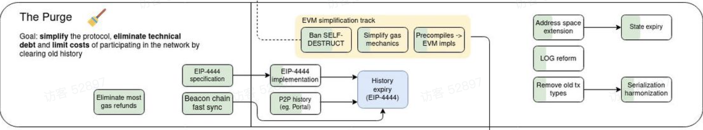
- History expiry (EIP 4444):  Autoprune history older than 1 year
  - Simplifies client codebases: No need to support earlier forks
  - Alleviate node storage requirements
  - History must reliably be accessible by other means eg. Portal network, torrents, block explorers, etc.
- State expiry
  - Lower priority now compared to PBS and Statelness
  - Requie many breaking changes eg. Address length
- Various harmonizations
  - Serialization: RLP for EL and SSZ for CL
  - Slowly phase out old tx types eg. pre-EIP 1559 legacy type 