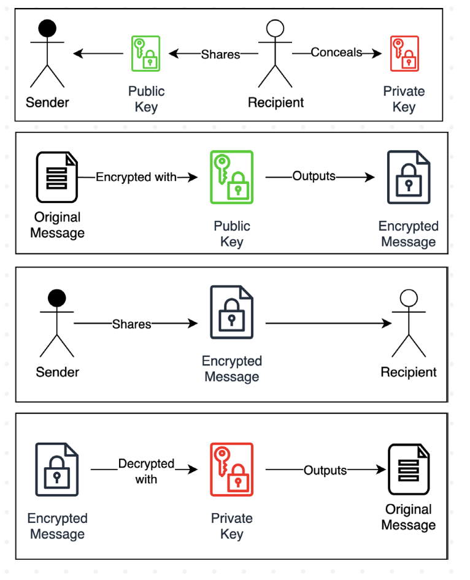

# StephenKuo

Hi, I'm Stephen, a c/c++ engineer, hoping to keep up

## Notes

### 2024.4.5
只有一点点基础，慢慢来希望能把整个协议搞懂
#### Week0 pre-reading
##### Cryptography
- Hashing
  哈希算法，就是哈希表用到的算法，数字分析，取随机数，直接取址什么的。不同的输入可以得到不同的输出，结果不可逆，算法越复杂发生碰撞的概率就越小。
- Public key cryptography
  也叫asymmetric cryptography非对称
  需要公钥和私钥，公钥用来加密，私钥用来解密，也可以用来签名
  
#####  merkle tree
- merkle tree
  用哈希值搭建起来的二叉树，每个节点都是哈希值
  - 叶节点 对于每个区块，每一笔交易数据，进行哈希运算，就是叶节点
  - 中间节点 子节点两两匹配，形成新的字符，再进行哈希运算
  - 根节点 
- 作用
  - 快速比较大量数据
  - 快速定位修改
  - 零知识证明
  
  如何向他人证明拥有某个数据 D0 而不暴露其它信息。挑战者提供随机数据 D1，D2 和 D3，或由证明人生成（需要加入特定信息避免被人复用证明过程）。
  证明人构造如图所示的默克尔树，公布 N1，N5，Root。验证者自行计算 Root 值，验证是否跟提供值一致，即可很容易检测 D0 存在。整个过程中验证者无法获知与 D0 相关的额外信息。
##### Networking, p2p and distributed systems
  - p2p:个人先从服务器上下载一部分文件，然后开始从其他用户(peer)那里下载其他片段。
  - 分布式系统是由一组通过网络进行通信、为了完成共同的任务而协调工作的计算机节点组成的系统。参考https://www.cnblogs.com/xybaby/p/7787034.html
##### Software development basics
solidity 和 solc 编译器

#### Week1 notes
参考了Chloe的笔记，感谢🙏
- The prehistory and philosophy behind Ethereum
  - Unix系统，定义了计算范式，模块化，开源化，协作化
  - Foss运动，软件的四项基本自由，运行自由，学习自由，重新分发自由，修改自由
  - 非对称加密
  - Cypherpunks，建立开放分布系统，不会被政府破坏
- What is Ethereum?
  - Definition & Specs
    whitepaper定义为s "A Next-Generation Smart Contract and Decentralized Application Platform"，下一代智能合约和去中心化应用平台。Yellowpaper定义为"A Secure Decentralized Generalized Transaction Ledger"， 安全的去中心化通用交易账本
- Ethereum is constantly changing
  - 通过EIP(Ethereum Improvement Proposa)进行更改,通过社区而不是个人或entity
  - 多次分叉
- Ethereum的设计原则
  Simplicity, Universality, Modularity, Non-discrimination, Agility, Sandwich/ Encapsulated complexity, Freedom, Neutrality, Generalization, No features, and Non-risk aversion

东西好多明天再学😭

### 2024.4.6
#### Week1 notes-1
##### The Design Itself
- 执行层 执行交易、处理交易数据、账户状态
  1. EVM (Ethereum Virtual Machine): 以太坊的计算平台，提供标准化环境，不同客户端的每次执行都发生在同一环境中
  2. State (data) & Transactions：以太坊是状态机，根据新交易和状态转换函数改变状态，用Merkle Patricia Trie存储
  3. P2P层：执行客户端之间的通信，实现交易传播
  - JSON-RPC API:执行层API, which is connected to user or web3 Dapps like Uniswap etc.
  
- Engine API:执行层和共识层之间的通信，执行层与共识层通信以同步到当前的规范块
- 共识层 共识逻辑、Fork choice、区块传播
  1. Fork choice：Fork choice算法决定链的头部和当前的规范区块
  2. LMD GHOST (Latest Message Driven - Greedy Heaviest Observed SubTree): Fork choice 由 LMD GHOST 管理，规则选择具有最大累计权重（确认次数）的分叉
  3. P2P：共识客户端之间的通信，可以实现区块传播
  4. Blob：EIP-4844 提出的新数据结构
  5. RANDAO：信标链的随机性
- Beacon API： 共识层的API，主要与validators连接。validator 连接到共识客户端以了解其状态，提供证明
  
### POS & POW
Proof of Work（POW）和Proof of Stake（POS）是两种常见的共识算法，用于验证和确认区块链网络中的交易，并决定谁有权创建新的区块。
- 工作原理：
  - POW：矿工需要通过解决复杂的数学问题（例如哈希函数的计算）来竞争创建新的区块。解决问题所需的计算工作量称为”工作证明”，获得工作证明的矿工将获得创建新区块的权利和奖励。也就是挖矿
  -  POS：参与者根据自身持有的数字货币数量（即权益）来决定谁有权创建新的区块。拥有更多权益的参与者将更有可能被选择为区块的创建者。
- 能源消耗
  -  POW：计算量大，消耗大
  -  POS：计算量小，消耗小
- 安全性
  -  POW：由于矿工需要投入大量的计算资源，攻击者要想攻击网络需要掌握超过50%的网络算力，使得攻击成本非常高。因此，POW算法在安全性方面具有较高的保障
  -  POS：在POS算法中，攻击者需要掌握网络上货币的大部分数量，才能对网络进行攻击。这使得POS相对于POW来说，安全性较弱。
- 去中心化程度
  -  POW：POW算法允许任何人参与挖矿，从而实现了网络的分散化和去中心化。矿工可以通过竞争来创建新的区块，而不依赖于特定的权益。
  -  POS：POS算法中，创建新区块的权益是基于参与者所持有的货币数量，这可能导致权益更多的参与者具有更大的影响力。因此，相对于POW来说，POS可能在一定程度上缺乏完全的去中心化。
### 4.7
TODO：继续研究pos和pow算法，有趣