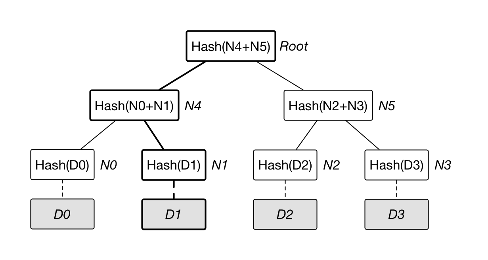

# StephenKuo

Hi, I'm Stephen, a c/c++ engineer, hoping to keep up

## Notes

### 2024.4.5
只有一点点基础，慢慢来希望能把整个协议搞懂
#### Week0 pre-reading
##### Cryptography
- Hashing
  哈希算法，就是哈希表用到的算法，数字分析，取随机数，直接取址什么的。不同的输入可以得到不同的输出，结果不可逆，算法越复杂发生碰撞的概率就越小。
- Public key cryptography
  也叫asymmetric cryptography非对称
  需要公钥和私钥，公钥用来加密，私钥用来解密，也可以用来签名
  
#####  merkle tree
- merkle tree
  用哈希值搭建起来的二叉树，每个节点都是哈希值
  - 叶节点 对于每个区块，每一笔交易数据，进行哈希运算，就是叶节点
  - 中间节点 子节点两两匹配，形成新的字符，再进行哈希运算
  - 根节点 
- 作用
  - 快速比较大量数据
  - 快速定位修改
  - 零知识证明
  
  如何向他人证明拥有某个数据 D0 而不暴露其它信息。挑战者提供随机数据 D1，D2 和 D3，或由证明人生成（需要加入特定信息避免被人复用证明过程）。
  证明人构造如图所示的默克尔树，公布 N1，N5，Root。验证者自行计算 Root 值，验证是否跟提供值一致，即可很容易检测 D0 存在。整个过程中验证者无法获知与 D0 相关的额外信息。
#### Networking, p2p and distributed systems
  - p2p:个人先从服务器上下载一部分文件，然后开始从其他用户(peer)那里下载其他片段。
  - 分布式系统是由一组通过网络进行通信、为了完成共同的任务而协调工作的计算机节点组成的系统。参考https://www.cnblogs.com/xybaby/p/7787034.html
#### Software development basics
solidity 和 solc 编译器

#### Week1 notes
参考了Chloe的笔记，感谢🙏
- The prehistory and philosophy behind Ethereum
  - Unix系统，定义了计算范式，模块化，开源化，协作化
  - Foss运动，软件的四项基本自由，运行自由，学习自由，重新分发自由，修改自由
  - 非对称加密
  - Cypherpunks，建立开放分布系统，不会被政府破坏
- What is Ethereum?
  - Definition & Specs
    whitepaper定义为s "A Next-Generation Smart Contract and Decentralized Application Platform"，下一代智能合约和去中心化应用平台。Yellowpaper定义为"A Secure Decentralized Generalized Transaction Ledger"， 安全的去中心化通用交易账本
- Ethereum is constantly changing
  - 通过EIP(Ethereum Improvement Proposa)进行更改,通过社区而不是个人或entity
  - 多次分叉
- Ethereum的设计原则
  Simplicity, Universality, Modularity, Non-discrimination, Agility, Sandwich/ Encapsulated complexity, Freedom, Neutrality, Generalization, No features, and Non-risk aversion

东西好多明天再学😭